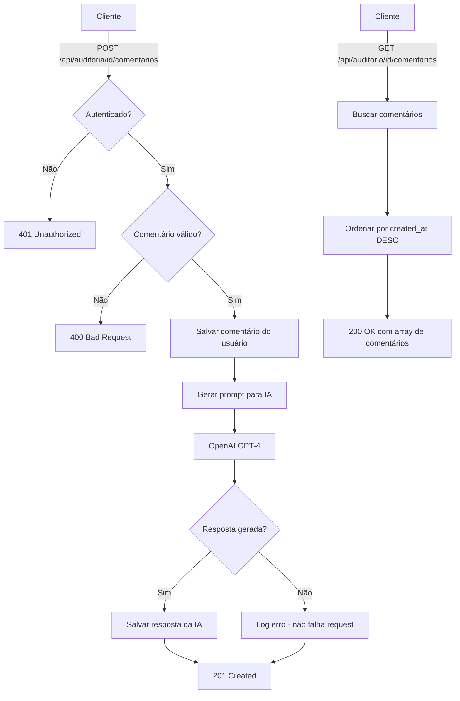

# API Auditoria Comentários com IA Auto-Responder

## Visão Geral

API endpoint para gerenciar comentários de auditorias com resposta automática baseada em IA usando padrões IMCA.

## Endpoint

```
/api/auditoria/[id]/comentarios
```

## Métodos Suportados

### GET - Buscar Comentários

Retorna todos os comentários de uma auditoria específica, ordenados por data de criação (mais recente primeiro).

#### Request
```http
GET /api/auditoria/[id]/comentarios
```

#### Response (200 OK)
```json
[
  {
    "id": "uuid-1",
    "comentario": "Verificar equipamentos de segurança",
    "created_at": "2025-10-16T12:00:00Z",
    "user_id": "user-uuid-123"
  },
  {
    "id": "uuid-2",
    "comentario": "Conforme norma IMCA M 182, recomenda-se...",
    "created_at": "2025-10-16T12:00:05Z",
    "user_id": "ia-auto-responder"
  }
]
```

#### Response (400 Bad Request)
```json
{
  "error": "ID inválido."
}
```

#### Response (500 Internal Server Error)
```json
{
  "error": "Database error message"
}
```

---

### POST - Criar Comentário

Cria um novo comentário do usuário e automaticamente gera uma resposta técnica usando IA baseada em normas IMCA.

#### Request
```http
POST /api/auditoria/[id]/comentarios
Content-Type: application/json

{
  "comentario": "Verificar equipamentos de segurança"
}
```

#### Response (201 Created)
```json
{
  "sucesso": true,
  "comentario": {
    "id": "uuid-1",
    "auditoria_id": "uuid-123",
    "comentario": "Verificar equipamentos de segurança",
    "user_id": "user-uuid-123",
    "created_at": "2025-10-16T12:00:00Z"
  }
}
```

#### Response (400 Bad Request)
```json
{
  "error": "Comentário vazio."
}
```

#### Response (401 Unauthorized)
```json
{
  "error": "Usuário não autenticado."
}
```

#### Response (500 Internal Server Error)
```json
{
  "error": "Database error message"
}
```

---

## Funcionalidades

### 🤖 Resposta Automática por IA

Após cada comentário de usuário, a API automaticamente:

1. **Gera Resposta Técnica**: Usa GPT-4 configurado como auditor técnico IMCA
2. **Salva Resposta da IA**: Insere no banco de dados com `user_id = "ia-auto-responder"`
3. **Contexto IMCA**: Resposta baseada em melhores práticas de auditoria offshore

#### Prompt da IA

```
Sistema: "Você é um engenheiro auditor da IMCA."

Usuário: "Você é um auditor técnico baseado nas normas IMCA. 
Dado o seguinte comentário de um usuário:
'[comentário do usuário]'
Gere uma resposta técnica sucinta com base nas melhores 
práticas de auditoria offshore."
```

### 🔐 Autenticação

- **GET**: Acesso público (autenticado ou anônimo)
- **POST**: Requer autenticação via Supabase Auth
- Valida token de sessão antes de criar comentários

### ✅ Validação

- **ID da Auditoria**: Deve ser uma string válida
- **Comentário**: Não pode ser vazio ou apenas espaços em branco
- **Trim automático**: Remove espaços extras do comentário

### 🛡️ Tratamento de Erros

- **Erros de Autenticação**: Retorna 401
- **Erros de Validação**: Retorna 400
- **Erros de Banco de Dados**: Retorna 500
- **Erros de IA**: Não falha a requisição, apenas loga o erro

---

## Estrutura do Banco de Dados

### Tabela: `auditoria_comentarios`

```sql
CREATE TABLE auditoria_comentarios (
  id UUID PRIMARY KEY DEFAULT gen_random_uuid(),
  auditoria_id UUID NOT NULL,
  comentario TEXT NOT NULL,
  user_id TEXT NOT NULL,
  created_at TIMESTAMPTZ DEFAULT NOW(),
  updated_at TIMESTAMPTZ DEFAULT NOW()
);
```

### Índices

- `idx_auditoria_comentarios_auditoria_id`: Índice em `auditoria_id` para queries rápidas
- `idx_auditoria_comentarios_created_at`: Índice em `created_at` DESC para ordenação

### Row Level Security (RLS)

- **SELECT**: Permitido para usuários autenticados e anônimos
- **INSERT**: Permitido para usuários autenticados e service role
- **Comentários da IA**: Permitidos via service role ou user_id especial

---

## Variáveis de Ambiente Necessárias

```env
# Supabase
VITE_SUPABASE_URL=https://seu-projeto.supabase.co
VITE_SUPABASE_PUBLISHABLE_KEY=sua-chave-publica
SUPABASE_SERVICE_ROLE_KEY=sua-chave-service-role

# OpenAI
VITE_OPENAI_API_KEY=sk-proj-...
```

---

## Casos de Uso

### 1. Visualizar Comentários de uma Auditoria

```typescript
const response = await fetch('/api/auditoria/uuid-123/comentarios');
const comentarios = await response.json();

comentarios.forEach(comentario => {
  if (comentario.user_id === 'ia-auto-responder') {
    console.log('🤖 IA:', comentario.comentario);
  } else {
    console.log('👤 Usuário:', comentario.comentario);
  }
});
```

### 2. Criar Comentário com Resposta Automática da IA

```typescript
const response = await fetch('/api/auditoria/uuid-123/comentarios', {
  method: 'POST',
  headers: {
    'Content-Type': 'application/json',
  },
  body: JSON.stringify({
    comentario: 'Verificar procedimentos de emergência'
  })
});

const result = await response.json();
// Comentário do usuário salvo
// IA irá gerar resposta automática em background
```

---

## Exemplos de Resposta da IA

### Entrada do Usuário
```
"Verificar equipamentos de segurança"
```

### Resposta da IA (exemplo)
```
"Conforme norma IMCA M 182, recomenda-se inspeção 
completa dos seguintes equipamentos: EPIs (capacetes, 
luvas, óculos de proteção), sistemas de contenção de 
quedas, e extintores de incêndio. Verificar certificações 
e prazos de validade. Documentar não conformidades 
encontradas."
```

---

## Testes

Localização: `src/tests/auditoria-comentarios-api.test.ts`

### Cobertura de Testes

- ✅ 65 testes implementados
- ✅ Request Handling (GET, POST, validação)
- ✅ Parâmetros de URL
- ✅ Autenticação e autorização
- ✅ Integração com IA (OpenAI GPT-4)
- ✅ Schema do banco de dados
- ✅ Tratamento de erros
- ✅ Formato de resposta
- ✅ Padrões IMCA

### Executar Testes

```bash
npm test src/tests/auditoria-comentarios-api.test.ts
```

---

## Diagrama de Fluxo



---

## Próximos Passos

- [ ] Adicionar paginação para comentários
- [ ] Implementar edição de comentários
- [ ] Adicionar reações aos comentários
- [ ] Implementar notificações em tempo real
- [ ] Adicionar suporte a anexos/imagens
- [ ] Melhorar prompt da IA com contexto da auditoria

---

## Referências

- [IMCA Standards](https://www.imca-int.com/)
- [OpenAI API Documentation](https://platform.openai.com/docs)
- [Supabase Documentation](https://supabase.com/docs)
- [Next.js API Routes](https://nextjs.org/docs/api-routes/introduction)

---

## Suporte

Para dúvidas ou problemas, consulte:
- Documentação técnica do projeto
- Logs do servidor em caso de erros
- Testes unitários para exemplos de uso
