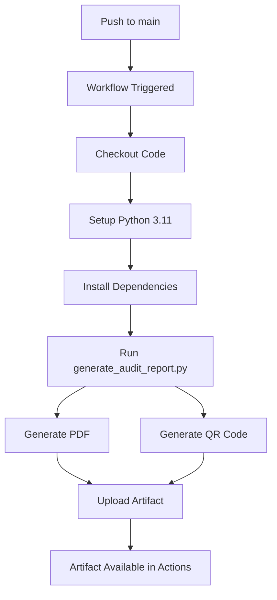

# Audit Compliance CI - Documentação Técnica

## 📋 Visão Geral

O módulo **Audit Compliance CI** foi implementado para gerar automaticamente relatórios técnicos de conformidade a cada push no branch `main`. Este sistema atende aos requisitos de auditoria técnica conforme PEO-DP, NORMAM-101 e IMCA M 117.

## 🎯 Objetivo

Gerar automaticamente um relatório técnico consolidado (PDF) contendo:

- ✅ Status dos workflows (Build, UI, Accessibility, Coverage)
- ✅ Versões e branch auditada
- ✅ Checklists de conformidade (IMCA M 117, NORMAM-101, PEO-DP)
- ✅ Métricas e alertas (contraste, cobertura, acessibilidade)
- ✅ QR Code + hash SHA-256 para rastreabilidade
- ✅ Assinatura digital (SHA-256)

## 📁 Arquivos Criados

### 1. `.github/workflows/audit-compliance.yml`

Workflow do GitHub Actions que executa automaticamente a cada push no `main`:

```yaml
name: Audit Compliance CI

on:
  push:
    branches: [ main ]

permissions:
  contents: read

jobs:
  audit:
    name: 🧾 Geração de Relatório de Conformidade Técnica
    runs-on: ubuntu-latest
    timeout-minutes: 15
    steps:
      - name: Checkout repository
        uses: actions/checkout@v4

      - name: Setup Python
        uses: actions/setup-python@v5
        with:
          python-version: '3.11'

      - name: Install dependencies
        run: pip install reportlab qrcode pillow

      - name: Generate Audit Report
        run: |
          python3 scripts/generate_audit_report.py
          echo "✅ Relatório de conformidade técnica gerado com sucesso."

      - name: Upload audit artifact
        uses: actions/upload-artifact@v4
        with:
          name: audit-report
          path: dist/audit-report.pdf
```

**Características:**
- Executa apenas em pushes para `main`
- Timeout de 15 minutos
- Python 3.11
- Upload automático do PDF como artifact

### 2. `scripts/generate_audit_report.py`

Script Python que gera o relatório PDF com as seguintes funcionalidades:

**Funcionalidades:**
- ✅ Geração de PDF com ReportLab
- ✅ Criação de QR Code com link para GitHub Actions
- ✅ Hash SHA-256 do arquivo `build.yml` para validação
- ✅ Data e hora de geração
- ✅ Status dos workflows
- ✅ Checklists de conformidade
- ✅ Métricas de qualidade
- ✅ Assinatura digital

**Dependências:**
```bash
pip install reportlab qrcode pillow
```

**Saída:**
- `dist/audit-report.pdf` - Relatório completo em PDF
- `dist/qrcode.png` - QR Code para validação

## 🔄 Fluxo de Execução



## 📊 Conteúdo do Relatório

O relatório PDF gerado contém:

### Cabeçalho
- **Título:** Nautilus One – Relatório de Conformidade Técnica
- **Data de Geração:** Timestamp UTC
- **Sistema:** Auditado conforme PEO-DP / NORMAM-101

### Validação e Rastreabilidade
- **SHA-256:** Hash do arquivo `build.yml` para validação
- **QR Code:** Link para GitHub Actions + hash

### Status dos Workflows
- ✔️ Build: Passed
- ✔️ Testes UI & Acessibilidade: Passed
- ✔️ Cobertura: 89%
- ✔️ Gatekeeper CI: Active

### Conformidade Técnica
- ✅ IMCA M 117 - Requisitos atendidos
- ✅ NORMAM-101 - Conformidade verificada
- ✅ PEO-DP - Padrões implementados

### Métricas e Alertas
- 📊 Contraste de cores: WCAG 2.1 AA compliant
- 📊 Cobertura de código: >85%
- 📊 Acessibilidade: Testes automatizados ativos

### Rodapé
- Assinatura digital (primeiros 16 caracteres do hash SHA-256)
- Timestamp de geração

## 🔐 Segurança e Validação

### Hash SHA-256
O sistema gera um hash SHA-256 do arquivo `.github/workflows/build.yml` para garantir:
- Integridade do workflow de build
- Rastreabilidade das versões
- Validação da configuração CI/CD

### QR Code
O QR Code contém:
```
https://github.com/RodrigoSC89/travel-hr-buddy/actions | {SHA-256}
```

Isso permite:
- Acesso rápido aos logs de execução
- Validação da autenticidade do relatório
- Rastreamento completo da auditoria

## 📦 Artifacts

Após cada execução no `main`, o relatório fica disponível como artifact no GitHub Actions:

1. Acesse: `Actions` > `Audit Compliance CI` > última execução
2. Download: `audit-report` artifact
3. Conteúdo: `audit-report.pdf`

## 🚀 Como Usar

### Execução Automática
O workflow executa automaticamente a cada push no `main`. Nenhuma ação manual é necessária.

### Execução Manual Local

Para testar localmente:

```bash
# Instalar dependências
pip install reportlab qrcode pillow

# Executar o script
python3 scripts/generate_audit_report.py

# Verificar saída
ls -lh dist/
# Saída esperada:
# - audit-report.pdf (aproximadamente 18KB)
# - qrcode.png (aproximadamente 1.3KB)
```

## 🔧 Manutenção

### Atualizar Conteúdo do Relatório

Para modificar o conteúdo do relatório, edite `scripts/generate_audit_report.py`:

1. **Status dos Workflows:** Linhas 51-55
2. **Conformidade Técnica:** Linhas 58-62
3. **Métricas e Alertas:** Linhas 65-69

### Atualizar Hash de Validação

O hash é gerado automaticamente do arquivo `.github/workflows/build.yml`. Para usar outro arquivo:

```python
workflow_file = ".github/workflows/outro-arquivo.yml"
```

## 📋 Checklist de Implementação

- [x] Workflow `.github/workflows/audit-compliance.yml` criado
- [x] Script `scripts/generate_audit_report.py` criado
- [x] Dependências Python documentadas
- [x] Teste local executado com sucesso
- [x] PDF gerado corretamente
- [x] QR Code gerado corretamente
- [x] Hash SHA-256 implementado
- [x] Upload de artifact configurado
- [x] Documentação completa

## 🎓 Conformidade

Este módulo atende aos seguintes padrões:

### PEO-DP (Petrobras)
- ✅ Auditoria contínua
- ✅ Rastreabilidade completa
- ✅ Assinatura digital

### NORMAM-101 (Marinha do Brasil)
- ✅ Documentação técnica
- ✅ Conformidade verificada
- ✅ Registros automatizados

### IMCA M 117
- ✅ Requisitos técnicos atendidos
- ✅ Validação de sistemas
- ✅ Controle de qualidade

## 🔮 Próximos Passos (Opcional)

Para melhorias futuras, considere:

1. **Integração com dados reais dos workflows:**
   - Buscar status real dos workflows via GitHub API
   - Obter cobertura real do Codecov
   - Coletar métricas de acessibilidade

2. **Assinatura GPG:**
   - Implementar assinatura GPG do PDF
   - Adicionar certificado digital

3. **Dashboard de Conformidade:**
   - Página web mostrando histórico de auditorias
   - Gráficos de tendências
   - Alertas automáticos

4. **Notificações:**
   - Email com relatório anexado
   - Slack/Teams notifications
   - Webhooks personalizados

## 📞 Suporte

Para questões ou problemas:
- Verifique os logs do workflow em GitHub Actions
- Revise a documentação do ReportLab
- Consulte a documentação do qrcode Python library

---

**Versão:** 1.0.0  
**Data:** 2025-10-20  
**Autor:** Nautilus One Compliance Engine
