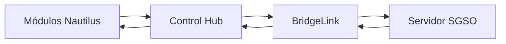
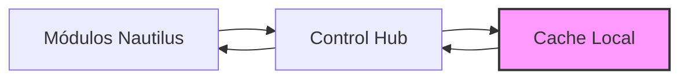
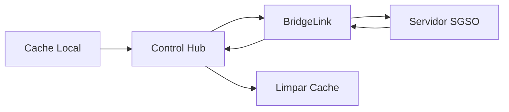

# 🔱 Nautilus Control Hub - Fase 4

> "Um só painel, todos os sistemas, em tempo real — mesmo sem internet."

Sistema de controle centralizado para operações embarcadas do Nautilus One, com sincronização inteligente e operação offline.

---

## 📋 Visão Geral

O **Nautilus Control Hub** é o centro de comando para gerenciar todos os módulos embarcados do sistema Nautilus One. Ele orquestra operações, monitora status, sincroniza dados com a costa via BridgeLink e mantém cache offline para operação contínua.

### Características Principais

✅ **Operação Offline** - Sistema de cache com store-and-forward  
✅ **Sincronização em Tempo Real** - Sincronização automática com BridgeLink  
✅ **Monitoramento de Módulos** - Rastreamento de status de todos os módulos  
✅ **Integração BridgeLink** - Conectividade API com lógica de retry  
✅ **Dashboard Unificado** - Interface de controle centralizada  
✅ **Verificações de Saúde** - Monitoramento de saúde do sistema  
✅ **Recuperação Automática** - Mecanismos automáticos de retry e recuperação  

---

## 🧩 Arquitetura do Sistema

### Estrutura de Módulos

```
src/modules/control_hub/
├── hub_core.ts           # Núcleo principal de orquestração
├── hub_ui.tsx            # Componentes de interface React
├── hub_sync.ts           # Motor de sincronização
├── hub_cache.ts          # Gerenciamento de cache offline
├── hub_monitor.ts        # Monitoramento de status dos módulos
├── hub_bridge.ts         # Integração com BridgeLink
├── hub_config.json       # Configuração do sistema
└── index.ts              # Exportações do módulo
```

### API Endpoints

```
pages/api/control-hub/
├── status.ts             # GET  - Obtém status atual
├── sync.ts               # POST - Dispara sincronização
└── health.ts             # GET  - Verificação de saúde
```

### Interface de Usuário

```
src/pages/
└── ControlHub.tsx        # Página do dashboard principal
```

---

## 🚀 Guia de Início Rápido

### 1. Acessar o Control Hub

Navegue para `/control-hub` no sistema Nautilus One:

```
https://seu-dominio.com/control-hub
```

### 2. Usar a API

#### Obter Status do Sistema

```typescript
const response = await fetch('/api/control-hub/status');
const { data } = await response.json();

console.log(data.modules);    // Status dos módulos
console.log(data.bridge);     // Status do BridgeLink
console.log(data.cache);      // Informações do cache
console.log(data.sync);       // Informações de sincronização
```

#### Disparar Sincronização Manual

```typescript
const response = await fetch('/api/control-hub/sync', {
  method: 'POST'
});
const { data } = await response.json();

console.log(data.success);      // true/false
console.log(data.recordsSent);  // Número de registros enviados
```

#### Verificar Saúde do Sistema

```typescript
const response = await fetch('/api/control-hub/health');
const { health } = await response.json();

console.log(health.status);     // "healthy" | "degraded" | "critical"
console.log(health.details);    // Detalhes de cada componente
```

### 3. Usar Programaticamente

```typescript
import { controlHub } from '@/modules/control_hub';

// Inicializar o Control Hub
await controlHub.iniciar();

// Obter estado atual
const state = controlHub.getState();

// Sincronizar manualmente
const result = await controlHub.sincronizar();

// Armazenar dados offline
await controlHub.storeOffline(myData, 'mmi');

// Obter dados do dashboard
const dashboardData = await controlHub.getDashboardData();

// Verificar saúde do sistema
const health = await controlHub.getHealth();
```

---

## 📊 Funcionalidades Detalhadas

### 1. Hub Core (`hub_core.ts`)

Orquestra todos os módulos e gerencia o estado global do sistema.

**Principais Métodos:**

- `iniciar()` - Inicializa o Control Hub
- `getState()` - Obtém estado atual
- `refresh()` - Atualiza todas as informações de status
- `sincronizar()` - Sincroniza com BridgeLink
- `storeOffline()` - Armazena dados para sincronização offline
- `getDashboardData()` - Obtém dados completos do dashboard
- `getHealth()` - Verifica saúde do sistema
- `shutdown()` - Encerra o Control Hub

### 2. Hub Monitor (`hub_monitor.ts`)

Monitora a saúde e status de todos os módulos Nautilus.

**Status Suportados:**
- `OK` - Módulo operando normalmente
- `Warning` - Módulo necessita atenção
- `Error` - Módulo com erro crítico
- `Offline` - Módulo desconectado

**Métricas Coletadas:**
- Uptime do módulo
- Número de erros
- Performance
- Timestamp da última verificação

### 3. Hub Sync (`hub_sync.ts`)

Gerencia sincronização entre sistemas embarcados e BridgeLink.

**Funcionalidades:**
- Sincronização automática em intervalos configuráveis
- Store-and-forward para operação offline
- Tentativas de retry automáticas
- Rastreamento de registros pendentes

### 4. Hub Cache (`hub_cache.ts`)

Gerenciamento de armazenamento local para operações offline.

**Funcionalidades:**
- Armazenamento de dados pendentes
- Controle de tamanho do cache
- Marcação de entradas sincronizadas
- Limpeza automática de dados sincronizados
- Verificação de cache cheio

### 5. Hub Bridge (`hub_bridge.ts`)

Mantém canal de comunicação com a API corporativa BridgeLink.

**Funcionalidades:**
- Verificação de conectividade
- Autenticação com token
- Envio de dados para BridgeLink
- Qualidade de conexão (excellent/good/poor/offline)
- Retry com backoff exponencial

### 6. Hub UI (`hub_ui.tsx`)

Componentes React para interface do Control Hub.

**Componentes:**
- `HubDashboard` - Dashboard principal
- `OverallStatusAlert` - Alerta de status geral
- `BridgeLinkCard` - Card de status do BridgeLink
- `CacheCard` - Card de informações do cache
- `SyncCard` - Card de status de sincronização
- `ModuleCard` - Card de status de módulo individual

---

## ⚙️ Configuração

O arquivo `hub_config.json` controla o comportamento do Control Hub:

```json
{
  "version": "1.0.0",
  "modules": {
    "mmi": { "enabled": true, "priority": "high" },
    "peo_dp": { "enabled": true, "priority": "high" },
    "dp_intelligence": { "enabled": true, "priority": "medium" },
    "bridge_link": { "enabled": true, "priority": "critical" },
    "sgso": { "enabled": true, "priority": "high" }
  },
  "sync": {
    "interval_seconds": 300,
    "retry_attempts": 3,
    "offline_mode": true,
    "cache_max_size_mb": 100
  },
  "monitoring": {
    "health_check_interval_seconds": 60,
    "alert_threshold_errors": 5,
    "log_retention_days": 30
  },
  "features": {
    "offline_cache": true,
    "real_time_sync": true,
    "auto_recovery": true,
    "encrypted_logs": true,
    "dashboard_unified": true
  }
}
```

### Parâmetros Principais

| Parâmetro | Descrição | Padrão |
|-----------|-----------|--------|
| `sync.interval_seconds` | Intervalo de sincronização automática | 300s (5min) |
| `sync.retry_attempts` | Tentativas de retry | 3 |
| `sync.cache_max_size_mb` | Tamanho máximo do cache | 100 MB |
| `monitoring.health_check_interval_seconds` | Intervalo de verificação de saúde | 60s |
| `monitoring.alert_threshold_errors` | Limite de erros para alerta | 5 |

---

## 🧪 Testes

O Control Hub possui suite completa de testes (72 testes):

```bash
npm test -- control-hub.test.ts
```

### Cobertura de Testes

✅ Estrutura de módulos  
✅ Configuração  
✅ Gerenciamento de cache  
✅ Monitoramento de módulos  
✅ Sincronização  
✅ Integração BridgeLink  
✅ Core do Control Hub  
✅ Endpoints da API  
✅ Componentes de UI  
✅ Integração com rotas  

---

## 📡 Fluxo de Operação

### Modo Online



### Modo Offline



### Sincronização após Reconexão



---

## 🔒 Segurança

### Autenticação

- Token de autenticação requerido para BridgeLink
- Validação automática de credenciais
- Renovação de token suportada

### Logs Encriptados

- Logs sensíveis são encriptados antes do armazenamento
- Chaves gerenciadas via variáveis de ambiente
- Conformidade com padrões de segurança SGSO Petrobras

### Cache Seguro

- Armazenamento local protegido
- Limpeza automática após sincronização
- Limite de tamanho para prevenção de overflow

---

## 🐛 Troubleshooting

### Cache Cheio

**Problema:** Cache atingiu limite de 100 MB

**Solução:**
```typescript
import hubCache from '@/modules/control_hub/hub_cache';

// Limpar entradas sincronizadas
hubCache.clearSynced();

// Ou limpar tudo (use com cuidado)
hubCache.clearAll();
```

### BridgeLink Offline

**Problema:** Não consegue conectar com BridgeLink

**Verificações:**
1. Verificar conectividade de rede
2. Validar configuração de endpoint
3. Verificar token de autenticação
4. Revisar logs de erro

**Solução Automática:**
O sistema entra automaticamente em modo offline e armazena dados no cache para sincronização posterior.

### Módulo com Status "Error"

**Problema:** Módulo reportando erros

**Diagnóstico:**
```typescript
import hubMonitor from '@/modules/control_hub/hub_monitor';

const status = await hubMonitor.getStatus();
const alerts = hubMonitor.getAlerts();

console.log(alerts); // Lista de alertas críticos
```

---

## 📈 Monitoramento

### Dashboard Principal

Acesse `/control-hub` para visualizar:

- Status geral do sistema (Healthy/Degraded/Critical)
- Status individual de cada módulo
- Conectividade BridgeLink
- Informações do cache offline
- Última sincronização
- Sincronização em andamento

### API de Saúde

Use o endpoint `/api/control-hub/health` para integração com ferramentas de monitoramento:

```bash
curl https://seu-dominio.com/api/control-hub/health
```

Resposta:
```json
{
  "success": true,
  "health": {
    "status": "healthy",
    "details": {
      "modules": "healthy",
      "bridge": "connected",
      "cache": "ok"
    }
  },
  "timestamp": "2025-10-20T14:49:16.681Z"
}
```

---

## 🔧 Manutenção

### Limpeza Regular

Execute periodicamente para manter o sistema saudável:

```typescript
// Limpar cache sincronizado
hubCache.clearSynced();

// Verificar tamanho do cache
const sizeMB = hubCache.getCacheSizeMB();
console.log(`Cache atual: ${sizeMB.toFixed(2)} MB`);
```

### Logs

Todos os eventos são registrados usando o logger centralizado:

```typescript
import { logger } from '@/lib/logger';

// Eventos são automaticamente registrados
// Verifique o console do navegador em desenvolvimento
// Em produção, logs são enviados para Sentry
```

---

## 🚀 Próximos Passos

### Melhorias Planejadas

- [ ] Integração com notificações push
- [ ] Dashboard de métricas históricas
- [ ] Compressão de dados do cache
- [ ] Criptografia end-to-end
- [ ] Exportação de relatórios
- [ ] Integração com sistema de alertas
- [ ] Modo de simulação para testes
- [ ] API GraphQL alternativa

---

## 📚 Referências

- [Nautilus One - README Principal](./README.md)
- [Documentação de Módulos](./MODULOS_IMPLEMENTADOS.md)
- [Guia de Deployment](./DEPLOYMENT_GUIDE.md)
- [API Documentation](./API_VALIDATION_GUIDE.md)

---

## 🤝 Suporte

Para questões e suporte:

1. Abra uma issue no repositório
2. Contate a equipe de desenvolvimento
3. Consulte a documentação técnica

---

## 📝 Changelog

### v1.0.0 (2025-10-20)

- ✨ Lançamento inicial do Control Hub
- ✅ Sistema de cache offline implementado
- ✅ Sincronização com BridgeLink
- ✅ Monitoramento de módulos
- ✅ Dashboard unificado
- ✅ API REST completa
- ✅ Suite de testes (72 testes)

---

**Desenvolvido para Nautilus One** 🔱  
*Sistema de Gestão de Operações Marítimas e Offshore*
