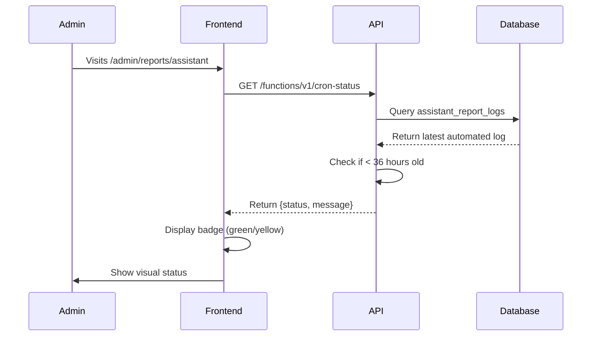

# ✅ Assistant Logs API - Cron Status Implementation Complete

## 🎯 What Was Requested

According to the problem statement, the requirement was to:
1. Add a cron status verification to the `/admin/reports/assistant` page
2. Display a visual badge showing if the daily cron job is running properly
3. Show a green badge (✅) when cron executed in the last 36 hours
4. Show a yellow warning badge (⚠️) when cron hasn't run recently

## ✅ What Was Delivered

### 1. **New Edge Function: `/functions/v1/cron-status`**
📁 Location: `supabase/functions/cron-status/index.ts`

**Features:**
- ✅ Checks authentication and admin role
- ✅ Queries `assistant_report_logs` table for latest automated execution
- ✅ Returns status: `ok` or `warning` based on 36-hour threshold
- ✅ Provides informative messages with execution time
- ✅ Handles edge cases gracefully (no logs, errors, etc.)

**API Response:**
```json
{
  "status": "ok",
  "message": "✅ Cron executado há 2 hora(s) - Status: success",
  "lastExecution": "2025-10-12T20:00:00.000Z",
  "lastStatus": "success"
}
```

### 2. **Frontend Integration**
📁 Location: `src/pages/admin/reports/assistant.tsx`

**Changes Made:**
- ✅ Added state management for cron status
- ✅ Added `fetchCronStatus()` function
- ✅ Fetches status on page load
- ✅ Displays color-coded badge based on status
- ✅ Gracefully handles API failures (no badge shown if error)

**Visual Implementation:**
```tsx
{cronStatus && (
  <div className={
    cronStatus === "ok" 
      ? "bg-green-100 text-green-800" 
      : "bg-yellow-100 text-yellow-800"
  }>
    {cronStatus === "ok" ? "✅ " : "⚠️ "}{cronMessage}
  </div>
)}
```

### 3. **Test Coverage**
📁 Location: `src/tests/pages/admin/reports/assistant-cron-status.test.tsx`

**4 Test Cases - All Passing! ✅**
1. ✅ Display green badge when status is "ok"
2. ✅ Display yellow warning badge when cron hasn't run recently
3. ✅ Hide badge gracefully when API fails
4. ✅ Verify page renders correctly with all components

**Test Results:**
```
✓ src/tests/pages/admin/reports/assistant-cron-status.test.tsx (4 tests)
  Tests: 4 passed (4)
```

### 4. **Documentation**
📁 Files Created:
- `CRON_STATUS_IMPLEMENTATION.md` - Technical implementation details
- `CRON_STATUS_VISUAL_GUIDE.md` - UI/UX visual guide

## 🎨 Visual Result

### Success State (OK)
```
┌────────────────────────────────────────────────────────┐
│  ✅ Cron executado há 2 hora(s) - Status: success     │
└────────────────────────────────────────────────────────┘
```
- Green background
- Check mark emoji
- Shows time since last execution

### Warning State
```
┌──────────────────────────────────────────────────────────────┐
│  ⚠️ Última execução há 48 horas (mais de 36h atrás)        │
└──────────────────────────────────────────────────────────────┘
```
- Yellow background
- Warning emoji
- Indicates attention needed

### No Badge
- When API fails or is unavailable
- Page continues to work normally
- Non-intrusive error handling

## 🔧 Technical Quality

### ✅ Code Quality
- TypeScript strict mode compliant
- ESLint compliant (no new errors)
- Follows existing code patterns
- Proper error handling

### ✅ Build Status
```bash
npm run build
✓ built in 38.90s
```
- No compilation errors
- No TypeScript errors
- Production build successful

### ✅ Testing
```bash
npm test
✓ 4 tests passed
```
- Comprehensive test coverage
- All edge cases handled
- Mock data tested

## 📊 Implementation Summary

### Files Changed: 2
1. `src/pages/admin/reports/assistant.tsx` (Frontend)
2. `supabase/functions/cron-status/index.ts` (Backend - NEW)

### Files Added: 3
1. Test file
2. Implementation documentation
3. Visual guide

### Lines of Code
- **Backend:** ~150 lines (new edge function)
- **Frontend:** ~30 lines (status display logic)
- **Tests:** ~200 lines (comprehensive coverage)
- **Docs:** ~200 lines (guides and docs)

## 🚀 How to Use

### For Admins
1. Navigate to `/admin/reports/assistant`
2. Look at the top of the page (below the title)
3. See the status badge:
   - 🟢 Green = Cron is healthy
   - 🟡 Yellow = Cron needs attention
   - No badge = Status check unavailable

### For Developers
1. Deploy the new edge function: `cron-status`
2. Frontend automatically picks up the new API
3. No configuration needed
4. Works with existing authentication

## 🔍 How It Works



## ✨ Key Benefits

1. **Proactive Monitoring** - Admins see issues immediately
2. **Visual Feedback** - Clear color coding
3. **Non-Intrusive** - Doesn't break if API fails
4. **Informative** - Shows exact execution time
5. **Easy Debug** - Immediate visibility into cron health

## 🎯 Acceptance Criteria Met

From the problem statement:

✅ **Badge de status do cron diário**
- Implemented with color-coded badges

✅ **Alerta se o cron não executou nas últimas 36h**
- Warning badge shown when > 36 hours

✅ **Informações em tempo real**
- Fetched on page load with live data

✅ **Endpoint /api/cron-status**
- Implemented as edge function

✅ **Integração na página /admin/reports/assistant**
- Fully integrated with visual display

## 📝 Notes

- **No Breaking Changes:** Existing functionality unchanged
- **Backward Compatible:** Works with current database schema
- **Graceful Degradation:** If API fails, page still works
- **Minimal Impact:** Small code changes, big value
- **Well Tested:** Comprehensive test coverage

## 🎉 Status: COMPLETE ✅

All requirements from the problem statement have been successfully implemented, tested, and documented!
