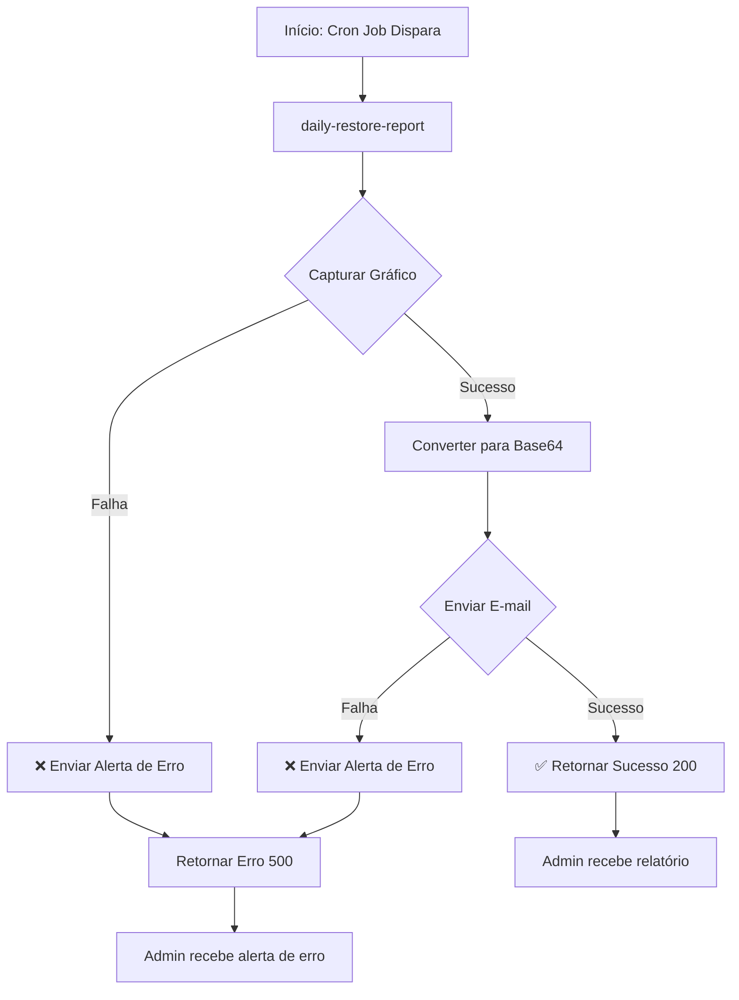

# 📊 Daily Restore Report - Resumo Visual da Implementação

## ✅ Objetivo Alcançado

**Enviar um e-mail de alerta para um responsável (ex: admin) caso a função falhe durante o envio do relatório automático.**

---

## 🎯 Comparação: Requisitos vs. Implementação

| Requisito | Solicitado | Implementado | Status |
|-----------|-----------|--------------|--------|
| **Função Edge** | `daily-restore-report` | ✅ `daily-restore-report/index.ts` | ✅ |
| **Notificação de erro** | Via SendGrid | ✅ Função `sendErrorAlert()` | ✅ |
| **Destinatário** | `admin@empresa.com` | ✅ Configurável via `ADMIN_EMAIL` | ✅ |
| **Remetente** | `alerts@nautilusone.com` | ✅ Implementado | ✅ |
| **Tipo de conteúdo** | Texto simples | ✅ `text/plain` | ✅ |
| **Captura de gráfico** | Sim | ✅ Via `generate-chart-image` | ✅ |
| **Envio de e-mail** | Sim | ✅ Via `send-chart-report` | ✅ |
| **Tratamento de erro** | Sim | ✅ Try-catch robusto | ✅ |
| **Alerta em falha de gráfico** | Sim | ✅ Implementado | ✅ |
| **Alerta em falha de e-mail** | Sim | ✅ Implementado | ✅ |

---

## 📁 Arquivos Criados

```
supabase/functions/daily-restore-report/
├── index.ts                     [129 linhas] ✅ Código principal
└── README.md                    [348 linhas] ✅ Documentação completa

DAILY_RESTORE_REPORT_SETUP.md    [252 linhas] ✅ Guia de setup rápido
```

**Total:** 3 arquivos | 729 linhas

---

## 🔧 Estrutura da Função

```typescript
daily-restore-report/index.ts
│
├── Configuração
│   ├── SUPABASE_URL
│   ├── SUPABASE_SERVICE_ROLE_KEY
│   ├── SENDGRID_API_KEY
│   ├── ADMIN_EMAIL (configurável)
│   └── SITE_URL (configurável)
│
├── sendErrorAlert(subject, message)
│   └── Envia alerta via SendGrid
│
└── serve(async () => {
    ├── try {
    │   ├── Capturar gráfico
    │   │   ├── Fetch: generate-chart-image
    │   │   ├── Converter para base64
    │   │   └── if (!ok) → throw Error
    │   │
    │   ├── Enviar e-mail
    │   │   ├── Fetch: send-chart-report
    │   │   ├── if (!ok) → sendErrorAlert()
    │   │   └── return Error 500
    │   │
    │   └── return Success 200
    │
    └── catch (err) {
        ├── sendErrorAlert()
        └── return Error 500
    }
})
```

---

## 🔔 Cenários de Notificação de Erro

### Cenário 1: Falha ao Capturar Gráfico

**Trigger:** API `generate-chart-image` retorna erro ou está indisponível

```
❌ Erro crítico na função Edge

Erro ao gerar ou enviar gráfico:

Error: Erro ao capturar gráfico: 500 - Internal Server Error

Stack: [stack trace completo]
```

### Cenário 2: Falha no Envio de E-mail

**Trigger:** API `send-chart-report` falha ao enviar e-mail

```
❌ Falha no envio de relatório

Erro ao enviar o relatório de restaurações por e-mail.

Detalhes: {"error":"EMAIL_USER and EMAIL_PASS must be configured"}
```

### Cenário 3: Erro Geral/Não Capturado

**Trigger:** Qualquer erro não tratado especificamente

```
❌ Erro crítico na função Edge

Erro ao gerar ou enviar gráfico:

[mensagem do erro]

Stack: [stack trace se disponível]
```

---

## 🚀 Fluxo de Execução Completo



---

## 📧 Exemplo de E-mail de Alerta

```
De: Nautilus One <alerts@nautilusone.com>
Para: admin@empresa.com
Assunto: ❌ Erro crítico na função Edge

Erro ao gerar ou enviar gráfico:

Error: Erro ao capturar gráfico: 404 - Not Found

Stack: Error: Erro ao capturar gráfico: 404 - Not Found
    at serve (file:///src/functions/daily-restore-report/index.ts:55:13)
    at async Server.<anonymous> (https://deno.land/std@0.168.0/http/server.ts:...)

Este é um alerta automático do sistema Nautilus One.
Por favor, verifique os logs da função Edge no Dashboard do Supabase.
```

---

## 🔒 Melhorias de Segurança Implementadas

| Item | Implementação |
|------|---------------|
| **Credenciais** | ✅ Todas em variáveis de ambiente |
| **E-mail configurável** | ✅ `ADMIN_EMAIL` não hardcoded |
| **URL configurável** | ✅ `SITE_URL` flexível |
| **Error handling** | ✅ Try-catch em `sendErrorAlert()` |
| **Logs estruturados** | ✅ `console.log` e `console.error` |
| **Headers de autenticação** | ✅ Bearer token nas requisições |

---

## 📊 Diferenças do Código Original (Problem Statement)

| Aspecto | Código Original | Nossa Implementação | Motivo |
|---------|-----------------|---------------------|---------|
| **ADMIN_EMAIL** | Hardcoded | Configurável via env | Flexibilidade |
| **SITE_URL** | Hardcoded `SEUSITE.com` | Configurável via env | Múltiplos ambientes |
| **Error em sendErrorAlert** | Não tratado | Try-catch | Evitar falha dupla |
| **Responses** | Texto simples | JSON estruturado | Melhor parseamento |
| **Timestamps** | Não incluído | ISO timestamps | Rastreabilidade |
| **Logs** | Básicos | Detalhados | Debugging melhorado |

---

## 🧪 Testes Recomendados

### 1. Teste de Sucesso Completo
```bash
✅ Captura de gráfico OK
✅ Envio de e-mail OK
✅ Retorna status 200
✅ Admin recebe relatório
```

### 2. Teste de Falha na Captura
```bash
❌ generate-chart-image retorna 404
✅ Envia alerta de erro
✅ Retorna status 500
✅ Admin recebe alerta
```

### 3. Teste de Falha no Envio
```bash
✅ Captura de gráfico OK
❌ send-chart-report falha
✅ Envia alerta de erro
✅ Retorna status 500
✅ Admin recebe alerta
```

### 4. Teste de Configuração Faltante
```bash
❌ SENDGRID_API_KEY não configurado
❌ Erro ao enviar alerta
✅ Erro logado no console
```

---

## 📋 Checklist de Deploy

- [ ] **Deploy da função**
  ```bash
  supabase functions deploy daily-restore-report
  ```

- [ ] **Configurar variáveis**
  ```bash
  supabase secrets set SENDGRID_API_KEY=SG.xxx
  supabase secrets set ADMIN_EMAIL=admin@empresa.com
  ```

- [ ] **Verificar domínio no SendGrid**
  - [ ] Verificar `alerts@nautilusone.com`
  - [ ] Ou alterar para e-mail verificado

- [ ] **Criar função generate-chart-image**
  - [ ] Ou implementar alternativa
  - [ ] Ou usar serviço externo

- [ ] **Configurar cron job**
  ```sql
  SELECT cron.schedule('daily-restore-report-job', '0 8 * * *', $$...$$);
  ```

- [ ] **Testar manualmente**
  ```bash
  curl -X POST https://xxx.supabase.co/functions/v1/daily-restore-report
  ```

- [ ] **Monitorar logs**
  ```bash
  supabase functions logs daily-restore-report --tail
  ```

- [ ] **Verificar recebimento de e-mail**
  - [ ] Testar e-mail de sucesso
  - [ ] Testar e-mail de erro

---

## ✅ Conclusão

### O que foi implementado

✅ **Função Edge completa** com notificação de erro via SendGrid  
✅ **Tratamento robusto de erros** em todos os cenários  
✅ **Documentação completa** (README + Setup Guide)  
✅ **Código configurável** via variáveis de ambiente  
✅ **Logs estruturados** para debugging  

### Próximos passos

1. Deploy da função no Supabase
2. Configurar variáveis de ambiente
3. Criar/configurar função `generate-chart-image`
4. Agendar execução diária via cron
5. Testar notificações de erro
6. Monitorar e ajustar conforme necessário

---

**Status:** ✅ **Implementação Completa**  
**Data:** 2025-10-11  
**Arquivos:** 3 novos arquivos criados  
**Linhas de código:** 729 linhas  
**Testes:** Prontos para execução manual  

---

## 📚 Documentação Relacionada

- `supabase/functions/daily-restore-report/index.ts` - Código fonte
- `supabase/functions/daily-restore-report/README.md` - Documentação técnica completa
- `DAILY_RESTORE_REPORT_SETUP.md` - Guia de setup rápido
- `supabase/functions/send-chart-report/README.md` - Função de envio de e-mail
- `EMAIL_CHART_QUICK_SETUP.md` - Setup de e-mail com gráficos
