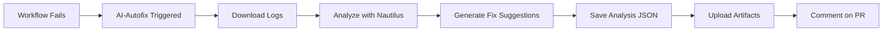

# Nautilus Intelligence Core - Quick Reference Guide

## 🚀 Quick Start

### 1. Setup (Repository Owner)

Add the OpenAI API key to repository secrets (optional but recommended):

```bash
# Navigate to: Repository → Settings → Secrets and variables → Actions
# Create new secret:
# Name: OPENAI_API_KEY
# Value: sk-...your-api-key
```

The system will work without this key, using fallback rule-based suggestions.

### 2. How It Works



## 📋 Detection Patterns

| Issue Type | Severity | Pattern Examples |
|------------|----------|------------------|
| Missing Files | 🔴 Critical | `ENOENT`, `Cannot find module` |
| Reference Errors | 🔴 Critical | `ReferenceError`, `is not defined` |
| Build Failures | 🔴 Critical | `Build failed`, `error TS` |
| Test Failures | 🟠 High | `FAIL`, `✕ test failed` |
| Low Coverage | 🟠 High | `coverage < 85%` |
| Vercel Failures | 🟠 High | `Vercel` + `failed` |
| Low Contrast | 🟡 Medium | `contrast ratio below` |
| Suspended Buttons | 🟡 Medium | `suspended button` |

## 🔧 Testing Locally

### Run Demo Mode

```bash
cd /home/runner/work/travel-hr-buddy/travel-hr-buddy
npx tsx src/ai/nautilus-core/index.ts --demo
```

### Test with Custom Logs

```bash
# Create a test log
cat > test.log << 'EOF'
error TS2304: Cannot find name 'Component'
Build failed with 1 error
Coverage: 78% (below threshold)
EOF

# Run analyzer
export LOG_SOURCES="test.log"
export GITHUB_WORKFLOW="Test"
export GITHUB_RUN_ID="999"
npx tsx src/ai/nautilus-core/index.ts
```

## 📊 Output Files

### analysis.json
```json
{
  "timestamp": "2025-10-20T22:00:00.000Z",
  "workflowName": "Build Nautilus One",
  "workflowRun": 12345,
  "findings": [...],
  "hasIssues": true
}
```

## 🎯 Environment Variables

| Variable | Description | Default |
|----------|-------------|---------|
| `OPENAI_API_KEY` | OpenAI API key | Falls back to rules |
| `GITHUB_TOKEN` | GitHub API token | Auto-provided |
| `LOG_SOURCES` | Comma-separated log files | `workflow.log` |
| `CREATE_PR` | Enable PR creation | `false` |
| `ANALYSIS_OUTPUT` | Output file path | `analysis.json` |

## 🔍 Workflow Triggers

The AI-Autofix workflow runs when these workflows **fail**:
- ✅ Build Nautilus One
- ✅ Test Coverage & Summary  
- ✅ Validate Buttons and Accessibility

## 📦 Artifacts

After each run, these artifacts are available for 30 days:
- `nautilus-analysis/analysis.json` - Detailed analysis results
- `nautilus-analysis/workflow.log` - Combined workflow logs

## 🐛 Troubleshooting

### No analysis generated
```bash
# Check if logs exist
ls -la workflow.log

# Run in demo mode to test
npx tsx src/ai/nautilus-core/index.ts --demo
```

### PR creation failed
```bash
# Check token permissions
echo $GITHUB_TOKEN | cut -c1-10

# Verify CREATE_PR is enabled
export CREATE_PR="true"
```

### AI suggestions not working
```bash
# Check API key
echo ${OPENAI_API_KEY:0:7}

# System will fallback to rule-based suggestions automatically
```

## 📝 Example Workflow Run

```bash
🌊 Nautilus Intelligence Core - Starting Analysis

📋 Configuration:
   Workflow: Build Nautilus One
   Run ID: 12345
   Log Sources: 1 file(s)
   Create PR: false

📖 Step 1: Analyzing logs...
   ✓ Loaded: workflow.log
   Found 3 issue(s)

💾 Step 2: Saving analysis results...
   Saved to: analysis.json

📊 Analysis Summary:
# Nautilus Intelligence Core - Analysis Report
**Workflow:** Build Nautilus One
**Run ID:** 12345
**Status:** ❌ Issues Detected

## Issues Found (3)
1. ❌ Build failure detected
2. 📉 Coverage below threshold detected
3. ❌ Test failure detected

✅ No issues detected - no action needed

🎉 Nautilus Intelligence Core - Analysis Complete
```

## 🔗 Related Files

- **Analyzer**: `src/ai/nautilus-core/analyzer.ts`
- **Fix Suggestions**: `src/ai/nautilus-core/suggestFix.ts`
- **PR Creation**: `src/ai/nautilus-core/createPR.ts`
- **Main**: `src/ai/nautilus-core/index.ts`
- **Workflow**: `.github/workflows/ai-autofix.yml`
- **Tests**: `src/tests/nautilus-core.test.ts`
- **Docs**: `docs/nautilus-intelligence-core.md`

## 💡 Tips

1. **First Run**: The workflow will only trigger after a failure is detected
2. **Analysis Only**: By default, `CREATE_PR=false` - only analysis is performed
3. **Cost Control**: Without `OPENAI_API_KEY`, uses free rule-based suggestions
4. **Testing**: Always test in demo mode before enabling PR creation

## 🎓 Advanced Usage

### Enable Automatic PR Creation

Edit `.github/workflows/ai-autofix.yml`:

```yaml
env:
  CREATE_PR: "true"  # Change from "false" to "true"
```

### Customize Analysis Output

```bash
export ANALYSIS_OUTPUT="./reports/analysis-$(date +%Y%m%d).json"
npx tsx src/ai/nautilus-core/index.ts
```

### Add Custom Detection Patterns

Edit `src/ai/nautilus-core/analyzer.ts`:

```typescript
// Add new pattern
if (logs.includes('YOUR_PATTERN')) {
  findings.push({
    type: 'your_issue_type',
    severity: 'high',
    message: '⚠️ Your custom message',
    pattern: 'YOUR_PATTERN',
    context: extractContext(logs, ['YOUR_PATTERN'])
  });
}
```

---

**Last Updated:** 2025-10-20  
**Version:** 1.0.0  
**Status:** ✅ Production Ready
