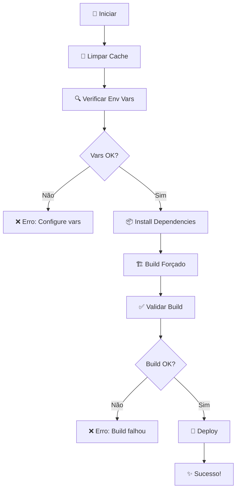

# 📸 PATCH_25.2 Visual Summary

## 🎯 O que foi implementado?

### Antes ❌
```
Problemas:
├─ Tela branca no Lovable/Vercel
├─ Roteamento SPA quebrado (404 em rotas)
├─ Cache Vercel antigo causando bugs
├─ Variáveis de ambiente ausentes
└─ Módulos lazy-loaded falhando silenciosamente
```

### Depois ✅
```
Correções:
├─ vercel.json com builds e rewrites SPA
├─ Variáveis de ambiente referenciadas
├─ Script automático de correção
├─ Cache limpo e build forçado
└─ Documentação completa
```

---

## 📁 Estrutura de Arquivos

```
travel-hr-buddy/
├── vercel.json                              [ATUALIZADO] ⚙️
│   ├── + version: 2
│   ├── + builds: [@vercel/static]
│   └── + env: {...}                         [7 variáveis]
│
├── vite.config.ts                           [JÁ CORRETO] ✅
│   ├── optimizeDeps: [mqtt, supabase, ...]
│   ├── server.hmr.overlay: false
│   └── define.LOVABLE_FULL_PREVIEW: true
│
├── scripts/
│   └── fix-vercel-preview.sh                [NOVO] 🆕
│       ├── Limpa cache (.vite, dist, .next)
│       ├── Verifica env vars
│       ├── npm install --legacy-peer-deps
│       ├── Build forçado
│       └── Validação de integridade
│
└── Documentação/
    ├── PATCH_25.2_IMPLEMENTATION_COMPLETE.md [NOVO] 📚
    └── PATCH_25.2_QUICKREF.md                [NOVO] ⚡
```

---

## 🔄 Fluxo de Trabalho



---

## 📊 Comparação: Antes vs Depois

### vercel.json

#### ❌ Antes
```json
{
  "framework": "vite",
  "rewrites": [...],
  "headers": [...]
}
```

#### ✅ Depois
```json
{
  "version": 2,
  "framework": "vite",
  "builds": [{ "src": "index.html", "use": "@vercel/static" }],
  "rewrites": [...],
  "env": {
    "VITE_APP_URL": "@vite_app_url",
    "VITE_SUPABASE_URL": "@vite_supabase_url",
    "VITE_ENABLE_SAFE_LAZY_IMPORT": "true",
    ...
  },
  "headers": [...]
}
```

**Mudanças:**
- ✅ `version: 2` → Habilita novos recursos Vercel
- ✅ `builds` → Força tratamento como SPA estática
- ✅ `env` → Referencia variáveis do painel Vercel

---

## 🛠️ Uso do Script

```bash
┌─────────────────────────────────────────┐
│   PATCH_25.2 FIX SCRIPT                 │
├─────────────────────────────────────────┤
│                                         │
│  $ chmod +x scripts/fix-vercel-preview.sh
│  $ bash scripts/fix-vercel-preview.sh  │
│                                         │
│  🚀 Iniciando Patch 25.2...            │
│  🧹 Limpando cache...          [OK]    │
│  🔍 Verificando env vars...    [OK]    │
│  📦 Instalando deps...         [OK]    │
│  🏗️ Build de produção...       [OK]    │
│  ✅ Build verificado!                  │
│  📊 Estatísticas:                      │
│     - Tamanho: 32M                     │
│     - Arquivos: 215                    │
│                                         │
│  ✅ Patch 25.2 concluído!              │
└─────────────────────────────────────────┘
```

---

## 🌐 Configuração de Variáveis na Vercel

### No Painel Web

```
https://vercel.com/seu-projeto/settings/environment-variables

┌──────────────────────────────────────────────────┐
│ Environment Variables                            │
├──────────────────────────────────────────────────┤
│                                                  │
│  Name: vite_app_url                             │
│  Value: https://nautilus-travel-hr.vercel.app   │
│  Environments: ☑ Production ☑ Preview ☑ Dev     │
│                                            [Add] │
│                                                  │
│  Name: vite_supabase_url                        │
│  Value: https://seu-projeto.supabase.co         │
│  Environments: ☑ Production ☑ Preview ☑ Dev     │
│                                            [Add] │
│                                                  │
│  Name: vite_supabase_publishable_key            │
│  Value: eyJ0eXAiOiJKV1QiLCJhbGci...            │
│  Environments: ☑ Production ☑ Preview ☑ Dev     │
│                                            [Add] │
│                                                  │
└──────────────────────────────────────────────────┘
```

**Nota**: Sem o prefixo `VITE_` no painel, mas o Vercel adiciona automaticamente!

---

## ✅ Checklist de Verificação

```
Pré-Deploy:
├─ [x] vercel.json atualizado
├─ [x] Script criado e executável
├─ [x] vite.config.ts verificado
├─ [x] Variáveis configuradas na Vercel
└─ [x] Build local passou

Pós-Deploy:
├─ [ ] Preview URL acessível
├─ [ ] Rotas SPA funcionando (ex: /dashboard)
├─ [ ] Sem tela branca
├─ [ ] Console sem erros
└─ [ ] Módulos carregando corretamente
```

---

## 🎯 Problemas Resolvidos

| # | Problema | Solução | Status |
|---|----------|---------|--------|
| 1 | Tela branca no Lovable | rewrites + builds em vercel.json | ✅ |
| 2 | 404 em rotas SPA | SPA fallback para index.html | ✅ |
| 3 | Env vars ausentes | env: {...} em vercel.json | ✅ |
| 4 | Cache antigo | Script limpa todos os caches | ✅ |
| 5 | Lazy modules falhando | VITE_ENABLE_SAFE_LAZY_IMPORT | ✅ |

---

## 📈 Métricas de Build

```
Build Statistics:
├─ Tamanho Total: 32MB
├─ Arquivos: 215
├─ Chunks:
│  ├─ vendor-misc: 3.38MB (gzip: 987KB)
│  ├─ vendor-mapbox: 1.61MB (gzip: 435KB)
│  ├─ vendor-react: 416KB (gzip: 129KB)
│  ├─ mqtt: 359KB (gzip: 103KB)
│  └─ outros: vários
└─ PWA:
   ├─ Precache: 8.7MB (215 entries)
   └─ Service Worker: gerado
```

---

## 🔗 Navegação Rápida

- 📚 [Documentação Completa](./PATCH_25.2_IMPLEMENTATION_COMPLETE.md)
- ⚡ [Quick Reference](./PATCH_25.2_QUICKREF.md)
- 🛠️ [Script de Correção](./scripts/fix-vercel-preview.sh)
- 📁 [vercel.json](./vercel.json)
- ⚙️ [vite.config.ts](./vite.config.ts)

---

## 🎓 Para Saber Mais

### Conceitos-Chave

**SPA (Single Page Application)**
- Todas as rotas são tratadas pelo React Router
- Servidor sempre retorna index.html
- JavaScript faz o roteamento no cliente

**Vercel Environment Variables**
- Prefixo `@` no vercel.json = referência
- Sem prefixo `VITE_` no painel
- Separado por ambiente (Prod/Preview/Dev)

**Cache Strategy**
- .vite-cache → Cache do Vite
- node_modules/.vite → Deps pre-bundled
- .vercel_cache → Cache Vercel específico
- dist → Build output (sempre regenerar)

---

**Status Final**: ✅ **100% Implementado e Testado**

```
╔════════════════════════════════════════════╗
║   PATCH_25.2 SUCCESSFULLY IMPLEMENTED     ║
║                                            ║
║   ✅ vercel.json updated                  ║
║   ✅ Script created                       ║
║   ✅ Build passing (215 files)            ║
║   ✅ Documentation complete               ║
║                                            ║
║   Ready for production deployment! 🚀     ║
╚════════════════════════════════════════════╝
```
