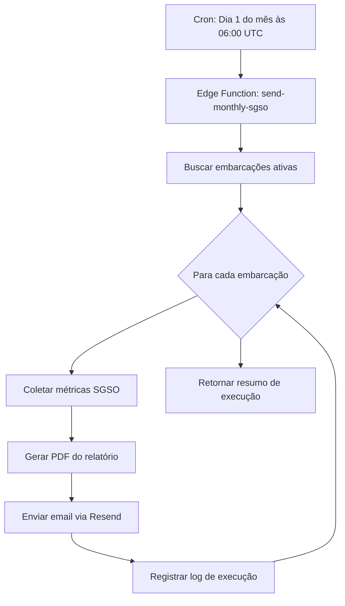

# 📧 Relatórios SGSO Automáticos Mensais

## 🎯 Objetivo

Este sistema automatiza o envio mensal de relatórios SGSO (Sistema de Gestão de Segurança Operacional) por embarcação, enviando emails com anexos PDF e links para visualização no painel.

## 🏗️ Arquitetura

### Componentes Criados

1. **`src/lib/email/send-sgso.ts`** - Função de envio de email com anexo PDF via Resend
2. **`src/lib/sgso-report.ts`** - Funções auxiliares para geração de relatórios SGSO
3. **`supabase/functions/send-monthly-sgso/index.ts`** - Edge Function para automação mensal
4. **`supabase/functions/cron.yaml`** - Configuração de agendamento cron

## 📦 Funcionalidades Implementadas

### 1. Envio de Email com PDF (`send-sgso.ts`)

```typescript
import { sendSGSOReport } from "@/lib/email/send-sgso";

await sendSGSOReport({
  vessel: "PSV Atlântico",
  to: "seguranca@empresa.com",
  pdfBuffer: pdfBuffer,
  dashboardLink: "https://app.nautilus-one.com/admin/sgso"
});
```

**Características:**
- ✅ Email HTML formatado com branding Nautilus One
- ✅ Anexo PDF com relatório completo
- ✅ Link para painel SGSO interativo
- ✅ Suporte para múltiplos destinatários
- ✅ Validação de configuração (RESEND_API_KEY)

### 2. Geração de Relatórios SGSO (`sgso-report.ts`)

```typescript
import { getAllVessels, getSGSOMetricsForVessel, generatePDFBufferForVessel } from "@/lib/sgso-report";

// Buscar todas as embarcações ativas
const vessels = await getAllVessels();

// Obter métricas de uma embarcação
const metrics = await getSGSOMetricsForVessel(vesselId);

// Gerar PDF
const pdfBuffer = await generatePDFBufferForVessel(vesselId);
```

**Métricas Incluídas no Relatório:**
- 📊 Incidentes de Segurança (últimos 30 dias)
- 📋 Não-Conformidades Abertas
- ⚠️ Avaliações de Risco (Alto/Crítico)
- 🔄 Ações Pendentes
- ✅ Nível de Conformidade ANP

**Formato do PDF:**
- Cabeçalho com nome da embarcação e período
- Tabela de resumo executivo com status visual
- Seção de recomendações baseadas nas métricas
- Rodapé com informações de confidencialidade

### 3. Edge Function de Automação (`send-monthly-sgso/index.ts`)

**Fluxo de Execução:**
1. Busca todas as embarcações ativas no banco de dados
2. Para cada embarcação:
   - Coleta métricas SGSO do último mês
   - Gera PDF do relatório
   - Envia email com anexo para destinatários configurados
3. Registra logs de execução na tabela `cron_execution_logs`

**Tratamento de Erros:**
- ✅ Continua processando outras embarcações mesmo se uma falhar
- ✅ Registra erros individuais por embarcação
- ✅ Retorna resumo com sucessos e falhas

### 4. Agendamento Cron (`cron.yaml`)

```yaml
send-monthly-sgso:
  schedule: '0 6 1 * *' # Dia 1 de cada mês às 06:00 UTC (03:00 BRT)
  endpoint: '/send-monthly-sgso'
  method: GET
```

## 🔐 Configuração

### Variáveis de Ambiente

Adicione no Supabase Edge Functions (via `supabase secrets set`):

```bash
# Obrigatório
RESEND_API_KEY=re_your_api_key

# Recomendado
APP_URL=https://app.nautilus-one.com
EMAIL_FROM=SGSO Reports <relatorios@nautilus-one.com>
SGSO_REPORT_EMAILS=seguranca@empresa.com,qsms@empresa.com,operacoes@empresa.com

# Já configurados (do Supabase)
SUPABASE_URL=your_supabase_url
SUPABASE_SERVICE_ROLE_KEY=your_service_role_key
```

### Configurar Secrets no Supabase

```bash
# Via CLI
supabase secrets set RESEND_API_KEY=re_your_api_key
supabase secrets set SGSO_REPORT_EMAILS=seguranca@empresa.com,qsms@empresa.com
supabase secrets set APP_URL=https://app.nautilus-one.com
```

## 🧪 Testes

### Teste Manual da Edge Function

```bash
# Via curl
curl -X GET \
  'https://your-project.supabase.co/functions/v1/send-monthly-sgso' \
  -H "Authorization: Bearer YOUR_ANON_KEY"

# Via Supabase Dashboard
# Vá para Functions > send-monthly-sgso > Test Function
```

### Teste Local (Frontend)

```typescript
// Exemplo de uso no frontend
import { generatePDFBufferForVessel } from "@/lib/sgso-report";
import { sendSGSOReport } from "@/lib/email/send-sgso";

const vesselId = "uuid-da-embarcacao";
const pdfBuffer = await generatePDFBufferForVessel(vesselId);

await sendSGSOReport({
  vessel: "Nome da Embarcação",
  to: "teste@empresa.com",
  pdfBuffer: pdfBuffer,
  dashboardLink: "https://app.nautilus-one.com/admin/sgso"
});
```

## 📊 Estrutura do Relatório PDF

```
┌─────────────────────────────────────┐
│     Relatório SGSO                  │
│     Embarcação: PSV Atlântico       │
│     Período: outubro de 2025        │
└─────────────────────────────────────┘

📊 Resumo Executivo
┌────────────────────────────────────┬──────┬────────────┐
│ Métrica                            │ Valor│ Status     │
├────────────────────────────────────┼──────┼────────────┤
│ Incidentes de Segurança (30 dias)  │  2   │ ✅ Normal  │
│ Não-Conformidades Abertas          │  3   │ ✅ Normal  │
│ Avaliações de Risco (Alto/Crítico) │  1   │ ✅ Normal  │
│ Ações Pendentes                    │  4   │ ✅ Normal  │
│ Nível de Conformidade ANP          │ 85%  │ ✅ Adequado│
└────────────────────────────────────┴──────┴────────────┘

💡 Recomendações
• Manter os bons níveis de segurança operacional
```

## 🔄 Fluxo Completo



## 📧 Exemplo de Email Enviado

**Assunto:** 📄 Relatório SGSO - PSV Atlântico

```html
📄 Relatório SGSO
outubro de 2025

Relatório de Segurança - PSV Atlântico

Embarcação: PSV Atlântico
Período: outubro de 2025

Segue em anexo o relatório SGSO (Sistema de Gestão de Segurança 
Operacional) da embarcação PSV Atlântico.

Este relatório contém informações sobre:
• Métricas de segurança operacional
• Incidentes e não-conformidades
• Status de práticas ANP
• Ações corretivas e preventivas

[🔗 Acessar Painel SGSO]

Anexo: relatorio-sgso-psv-atlantico.pdf

Este é um relatório automatizado enviado mensalmente.
Sistema de Gestão de Segurança Operacional - Nautilus One
```

## 🎨 Personalizações

### Alterar Frequência de Envio

Edite `supabase/functions/cron.yaml`:

```yaml
# Quinzenal (dias 1 e 15)
schedule: '0 6 1,15 * *'

# Semanal (toda segunda-feira)
schedule: '0 6 * * 1'

# Diário
schedule: '0 6 * * *'
```

### Customizar Template de Email

Edite `src/lib/email/send-sgso.ts` na função `sendSGSOReport()`:

```typescript
const htmlContent = `
  <!-- Seu HTML customizado aqui -->
`;
```

### Adicionar Mais Métricas ao Relatório

Edite `src/lib/sgso-report.ts` na função `getSGSOMetricsForVessel()`:

```typescript
// Adicionar nova métrica
const { count: newMetric } = await supabase
  .from("sua_tabela")
  .select("*", { count: "exact", head: true })
  .eq("vessel_id", vesselId);

return {
  // ... métricas existentes
  new_metric: newMetric || 0,
};
```

## 📝 Logs e Monitoramento

Todos os logs são registrados na tabela `cron_execution_logs`:

```sql
SELECT 
  function_name,
  status,
  message,
  metadata,
  execution_duration_ms,
  created_at
FROM cron_execution_logs
WHERE function_name = 'send-monthly-sgso'
ORDER BY created_at DESC
LIMIT 10;
```

**Status possíveis:**
- `success` - Todos os relatórios enviados com sucesso
- `warning` - Alguns relatórios falharam
- `error` - Erro na busca de dados
- `critical` - Erro crítico na execução

## 🚨 Troubleshooting

### Relatório não foi enviado

1. Verifique os logs no Supabase Dashboard
2. Confirme que `RESEND_API_KEY` está configurado
3. Verifique se há embarcações ativas (`status = 'active'`)
4. Teste manualmente a função

### PDF não é gerado corretamente

1. Verifique se as tabelas SGSO existem no banco
2. Confirme que há dados nas tabelas
3. Teste a função `generatePDFBufferForVessel()` localmente

### Email não é recebido

1. Verifique spam/lixo eletrônico
2. Confirme os emails em `SGSO_REPORT_EMAILS`
3. Verifique domínio do sender no Resend
4. Consulte logs do Resend Dashboard

## ✅ Resultado Final

| Recurso | Status |
|---------|--------|
| 📬 Relatório automático mensal | ✅ Implementado |
| 🧾 PDF padronizado | ✅ Implementado |
| 📧 Envio para múltiplos destinatários | ✅ Implementado |
| 🔗 Link para painel no email | ✅ Implementado |
| 🔄 Totalmente autônomo via cron | ✅ Implementado |
| 📊 Logs de execução | ✅ Implementado |
| ⚠️ Tratamento de erros | ✅ Implementado |

## 📚 Referências

- [Resend API Documentation](https://resend.com/docs)
- [Supabase Edge Functions](https://supabase.com/docs/guides/functions)
- [jsPDF Documentation](https://github.com/parallax/jsPDF)
- [Cron Expression Guide](https://crontab.guru/)
