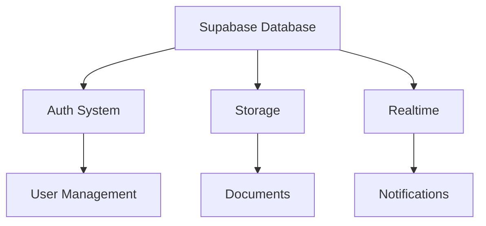
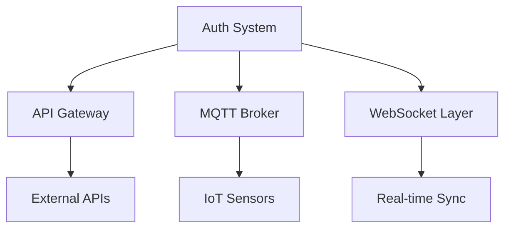
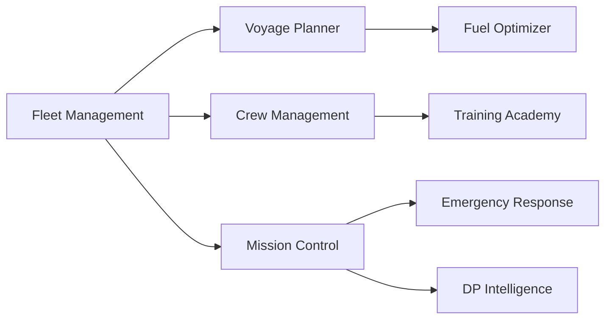
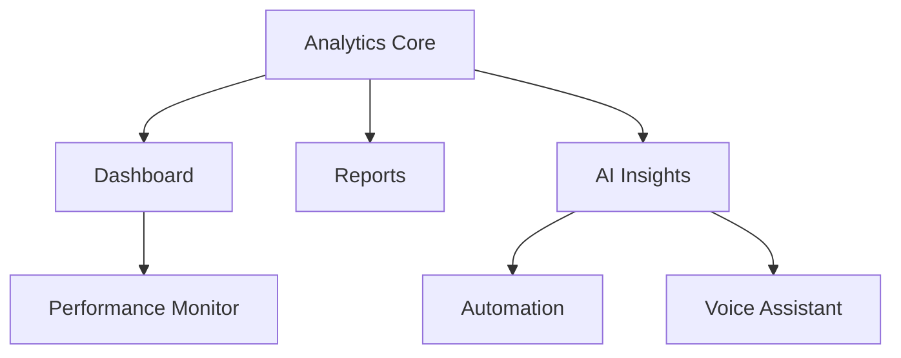

# 🗺️ Nautilus One - Roadmap Estratégico de Implementação

> **Versão:** 2.0  
> **Data:** 2025-01-27  
> **Status:** 📋 Em Planejamento  
> **Autor:** AI Architecture Team

---

## 📊 Visão Executiva

### Situação Atual

| Categoria | Total | Implementados | Parciais | Planejados | % Conclusão |
|-----------|-------|---------------|----------|------------|-------------|
| **Marítimo** | 11 | 6 | 4 | 1 | 64% |
| **Comunicação** | 4 | 3 | 1 | 0 | 87% |
| **Analytics** | 4 | 2 | 1 | 1 | 62% |
| **RH & Pessoas** | 3 | 2 | 1 | 0 | 83% |
| **Compliance** | 4 | 3 | 1 | 0 | 87% |
| **Logística** | 3 | 2 | 1 | 0 | 83% |
| **IA & Automação** | 4 | 2 | 2 | 0 | 62% |
| **Integração** | 2 | 1 | 1 | 0 | 75% |
| **Operações** | 4 | 1 | 2 | 1 | 37% |
| **TOTAL** | **39** | **22** | **14** | **3** | **69%** |

### Metas do Roadmap

- **Q1 2025:** Completar 100% dos módulos críticos (Tier 1)
- **Q2 2025:** Implementar 90% dos módulos Tier 2
- **Q3 2025:** Finalizar todos os módulos e otimizações
- **Q4 2025:** Focus em escala, performance e IA avançada

---

## 🎯 Matriz de Priorização

### Tier 1 - CRÍTICO (Implementar Primeiro)

Módulos essenciais para operação base do sistema.

| Módulo | Status Atual | Complexidade | Tempo Est. | Valor Negócio | Dependências |
|--------|--------------|--------------|------------|---------------|--------------|
| **Finance Hub** | ⚠️ 65% | 🟡 Média | 16h | 🔴 Crítico | Supabase, Auth |
| **Mission Control** | ⚠️ 20% | 🔴 Alta | 32h | 🔴 Crítico | Fleet, Emergency, Satellite |
| **Analytics Core** | ❌ 0% | 🔴 Alta | 40h | 🔴 Crítico | Supabase Realtime, Events |
| **Dashboard Principal** | ✅ 85% | 🟢 Baixa | 8h | 🔴 Crítico | Analytics, Widgets |
| **DP Intelligence** | ✅ 90% | 🟡 Média | 6h | 🔴 Crítico | Sensors, MQTT |
| **Fleet Management** | ⚠️ 70% | 🟡 Média | 12h | 🔴 Crítico | Supabase, Tracking |

**Total Tier 1:** 6 módulos | ~114h | **Prazo:** 3-4 semanas

### Tier 2 - IMPORTANTE (Segunda Fase)

Módulos que agregam valor significativo mas não bloqueiam operação.

| Módulo | Status Atual | Complexidade | Tempo Est. | Valor Negócio | Dependências |
|--------|--------------|--------------|------------|---------------|--------------|
| **Voice Assistant** | ✅ 90% | 🟢 Baixa | 4h | 🟡 Alto | OpenAI, STT/TTS |
| **Real-time Workspace** | ✅ 88% | 🟡 Média | 8h | 🟡 Alto | Supabase Realtime |
| **Crew Management** | ⚠️ 60% | 🟡 Média | 12h | 🟡 Alto | HR, Scheduling |
| **Compliance Hub** | ⚠️ 75% | 🟡 Média | 10h | 🟡 Alto | Audits, SGSO |
| **Training Academy** | ⚠️ 50% | 🟡 Média | 16h | 🟡 Alto | Courses, Certs |
| **Voyage Planner** | ⚠️ 65% | 🔴 Alta | 20h | 🟡 Alto | MapBox, Weather |
| **BridgeLink** | ⚠️ 70% | 🟡 Média | 12h | 🟡 Alto | MQTT, Sensors |
| **SGSO** | ⚠️ 80% | 🟡 Média | 8h | 🟡 Alto | Compliance |

**Total Tier 2:** 8 módulos | ~90h | **Prazo:** 2-3 semanas

### Tier 3 - DESEJÁVEL (Terceira Fase)

Módulos que completam o ecossistema e melhoram UX.

| Módulo | Status Atual | Complexidade | Tempo Est. | Valor Negócio | Dependências |
|--------|--------------|--------------|------------|---------------|--------------|
| **MMI (Maintenance)** | ⚠️ 70% | 🟡 Média | 12h | 🟢 Médio | Fleet, Scheduling |
| **FMEA Expert** | ⚠️ 60% | 🔴 Alta | 16h | 🟢 Médio | Risk Analysis, AI |
| **Forecast Global** | ⚠️ 55% | 🟡 Média | 14h | 🟢 Médio | Weather APIs |
| **Control Hub** | ⚠️ 50% | 🟡 Média | 12h | 🟢 Médio | MQTT, Dashboard |
| **Fuel Optimizer** | ⚠️ 40% | 🔴 Alta | 18h | 🟢 Médio | Analytics, AI |
| **AI Insights** | ⚠️ 45% | 🔴 Alta | 20h | 🟢 Médio | OpenAI, Analytics |
| **Automation Engine** | ⚠️ 35% | 🔴 Alta | 24h | 🟢 Médio | Workflows, Rules |
| **Documentos IA** | ⚠️ 55% | 🟡 Média | 10h | 🟢 Médio | Storage, OCR |
| **Logistics Hub** | ⚠️ 40% | 🟡 Média | 14h | 🟢 Médio | Planning, Fleet |
| **Emergency Response** | ⚠️ 30% | 🔴 Alta | 16h | 🟢 Médio | Alerts, Comms |

**Total Tier 3:** 10 módulos | ~156h | **Prazo:** 4-5 semanas

### Tier 4 - FUTURO (Backlog)

Módulos de longo prazo e inovação.

| Módulo | Status Atual | Complexidade | Tempo Est. | Valor Negócio | Dependências |
|--------|--------------|--------------|------------|---------------|--------------|
| **Satellite Tracker** | ⚠️ 25% | 🔴 Alta | 20h | 🟢 Baixo | External APIs |
| **Crew Wellbeing** | 📋 0% | 🟡 Média | 12h | 🟢 Baixo | HR, Health |
| **API Gateway** | ⚠️ 60% | 🔴 Alta | 16h | 🟢 Baixo | Auth, Rate Limit |
| **Feedback System** | ⚠️ 40% | 🟢 Baixa | 8h | 🟢 Baixo | Analytics |
| **Reports Center** | ⚠️ 50% | 🟡 Média | 12h | 🟢 Baixo | Analytics, PDF |
| **Performance Monitor** | ⚠️ 45% | 🟡 Média | 10h | 🟢 Baixo | Metrics, Logs |

**Total Tier 4:** 6 módulos | ~78h | **Prazo:** 2 semanas

---

## 🔄 Grafo de Dependências

### Módulos Foundation (Sem Dependências)



### Camada de Integração



### Camada de Negócio (Core Modules)



### Camada de Analytics & IA



---

## 📅 Cronograma Detalhado

### SPRINT 1 (Semana 1-2) - Foundation Layer ✅

**Objetivo:** Estabilizar base de dados e autenticação

- [x] Database Schema Review
- [x] Auth Flow Implementation
- [x] RLS Policies Setup
- [x] Realtime Channels Config
- [x] Edge Functions Base

**Entregáveis:**
- ✅ Schema migrations applied
- ✅ Auth working on all modules
- ✅ Realtime subscriptions functional

---

### SPRINT 2 (Semana 3-4) - Tier 1 Críticos 🔄

**Objetivo:** Completar módulos críticos de negócio

#### Week 3: Finance + Dashboard

**Dias 1-2: Finance Hub**
- [ ] Conectar UI aos dados reais (useFinanceData)
- [ ] Implementar exports (CSV, PDF, Excel)
- [ ] Adicionar realtime subscriptions
- [ ] Testes de integração completos

**Deliverables:** Finance Hub 100% funcional

**Dias 3-4: Dashboard Principal**
- [ ] Conectar widgets a dados reais
- [ ] Implementar cache de métricas
- [ ] Adicionar refresh automático
- [ ] Otimizar queries

**Deliverables:** Dashboard com dados live

**Dia 5: Code Review & Testing**

#### Week 4: Mission Control + Fleet

**Dias 1-3: Mission Control**
- [ ] Criar schema (mission_status, tactical_ops)
- [ ] Implementar backend queries
- [ ] Conectar AI Commander
- [ ] Adicionar System Logs real
- [ ] Integrar com Fleet/Emergency/Satellite

**Deliverables:** Mission Control operacional

**Dias 4-5: Fleet Management**
- [ ] Completar CRUD de vessels
- [ ] Implementar tracking em tempo real
- [ ] Adicionar alertas de status
- [ ] Integrar com DP Intelligence

**Deliverables:** Fleet Management completo

---

### SPRINT 3 (Semana 5-6) - Analytics Core 🔜

**Objetivo:** Implementar pipeline de analytics em tempo real

#### Week 5: Analytics Foundation

**Dias 1-2: Database & Schema**
```sql
CREATE TABLE analytics_events (
  id UUID PRIMARY KEY,
  event_type TEXT NOT NULL,
  module_id TEXT NOT NULL,
  user_id UUID REFERENCES auth.users,
  data JSONB NOT NULL,
  created_at TIMESTAMPTZ DEFAULT NOW()
);

CREATE TABLE analytics_metrics (
  id UUID PRIMARY KEY,
  metric_name TEXT NOT NULL,
  module_id TEXT NOT NULL,
  value NUMERIC NOT NULL,
  aggregation_period TEXT, -- 'hour', 'day', 'week', 'month'
  aggregated_at TIMESTAMPTZ NOT NULL,
  created_at TIMESTAMPTZ DEFAULT NOW()
);

CREATE TABLE analytics_dashboards (
  id UUID PRIMARY KEY,
  name TEXT NOT NULL,
  config JSONB NOT NULL,
  user_id UUID REFERENCES auth.users,
  is_public BOOLEAN DEFAULT FALSE,
  created_at TIMESTAMPTZ DEFAULT NOW()
);
```

**Dias 3-4: Edge Functions**
- [ ] `analytics-ingest`: Event collection endpoint
- [ ] `analytics-aggregate`: Scheduled aggregations
- [ ] `analytics-query`: Dashboard API

**Dia 5: Testing & Docs**

#### Week 6: Analytics UI

**Dias 1-3: Components**
- [ ] RealtimeMetrics component
- [ ] CustomDashboard builder
- [ ] Metric visualizations (charts)
- [ ] Alerting rules UI

**Dias 4-5: Integration**
- [ ] Connect to all modules
- [ ] Performance testing (< 2s latency)
- [ ] Load testing (1000 events/sec)

**Deliverables:** Analytics Core funcional

---

### SPRINT 4 (Semana 7-8) - Tier 2 Importantes 🔜

**Objetivo:** Completar módulos de alto valor

#### Week 7: Voice + Workspace

**Dias 1-2: Voice Assistant Enhancements**
- [ ] VAD implementation
- [ ] Retry logic
- [ ] Error handling robusto
- [ ] Usage analytics

**Dias 3-5: Real-time Workspace**
- [ ] Collaborative editing
- [ ] Presence indicators
- [ ] Activity feed
- [ ] File sharing

#### Week 8: Crew + Training

**Dias 1-3: Crew Management**
- [ ] Scheduling system
- [ ] Shift management
- [ ] Leave requests
- [ ] Performance tracking

**Dias 4-5: Training Academy**
- [ ] Course catalog
- [ ] Progress tracking
- [ ] Certifications
- [ ] Assessments

---

### SPRINT 5 (Semana 9-10) - Tier 2 Continuation 🔜

**Objetivo:** Voyage Planning + Compliance

#### Week 9: Voyage Planner

**Dias 1-4: Core Features**
- [ ] Route optimization
- [ ] Weather integration
- [ ] Fuel calculation
- [ ] Port scheduling
- [ ] MapBox integration

**Dia 5: Testing & Refinement**

#### Week 10: Compliance + SGSO

**Dias 1-3: Compliance Hub**
- [ ] Audit management
- [ ] Document tracking
- [ ] Deadline alerts
- [ ] Reporting

**Dias 4-5: SGSO Integration**
- [ ] Safety procedures
- [ ] Incident tracking
- [ ] Risk assessments
- [ ] Compliance checks

---

### SPRINT 6 (Semana 11-12) - Tier 3 Modules 🔜

**Objetivo:** Completar ecossistema

#### Week 11: Maintenance + FMEA

**Dias 1-3: MMI (Maintenance)**
- [ ] Job scheduling
- [ ] Parts inventory
- [ ] Work orders
- [ ] Preventive maintenance

**Dias 4-5: FMEA Expert**
- [ ] Risk analysis engine
- [ ] Failure mode catalog
- [ ] Recommendations
- [ ] Reports

#### Week 12: Weather + Control

**Dias 1-3: Forecast Global**
- [ ] Multi-source weather data
- [ ] Route weather analysis
- [ ] Alerts system
- [ ] Historical data

**Dias 4-5: Control Hub**
- [ ] Unified dashboard
- [ ] MQTT integration
- [ ] Real-time controls
- [ ] Automation rules

---

### SPRINT 7-8 (Semana 13-16) - Optimization 🔜

**Objetivo:** Performance, testes e documentação

#### Week 13-14: Performance

- [ ] Query optimization
- [ ] Caching strategy
- [ ] Bundle size reduction
- [ ] Lazy loading
- [ ] Code splitting

#### Week 15-16: Quality Assurance

- [ ] Integration tests (70%+ coverage)
- [ ] E2E tests (Playwright)
- [ ] Load testing
- [ ] Security audit
- [ ] Documentation completa

---

## 📈 Métricas de Sucesso

### KPIs por Sprint

| Sprint | Módulos Entregues | Cobertura Testes | Performance | Bug Count |
|--------|-------------------|------------------|-------------|-----------|
| Sprint 2 | 4/6 Tier 1 | 60% | < 3s load | < 10 |
| Sprint 3 | Analytics Core | 70% | < 2s queries | < 5 |
| Sprint 4 | 4/8 Tier 2 | 65% | < 3s load | < 8 |
| Sprint 5 | 4/8 Tier 2 | 70% | < 3s load | < 5 |
| Sprint 6 | 4/10 Tier 3 | 75% | < 3s load | < 5 |
| Sprint 7-8 | Optimization | 80% | < 2s load | 0 |

### Metas Globais Q1 2025

- ✅ **100%** dos módulos Tier 1 implementados
- ✅ **80%+** cobertura de testes
- ✅ **< 2s** tempo médio de resposta
- ✅ **99.9%** uptime
- ✅ **0** bugs críticos em produção

---

## 🚨 Riscos e Mitigações

### Riscos de Alto Impacto

| Risco | Probabilidade | Impacto | Mitigação |
|-------|---------------|---------|-----------|
| **Atraso na implementação do Analytics Core** | 🟡 Média | 🔴 Alto | Iniciar 1 semana antes, alocar 2 devs |
| **Problemas de performance com Realtime** | 🟡 Média | 🔴 Alto | Testing contínuo, fallback sem realtime |
| **Integração complexa Mission Control** | 🔴 Alta | 🔴 Alto | Protótipo MVP primeiro, iteração incremental |
| **Dependências de APIs externas** | 🟡 Média | 🟡 Médio | Mockar dados, implementar retry + cache |
| **Scope creep nos módulos** | 🔴 Alta | 🟡 Médio | Feature freeze por sprint, priorização rígida |

### Riscos de Médio Impacto

| Risco | Probabilidade | Impacto | Mitigação |
|-------|---------------|---------|-----------|
| **Bugs de UI em módulos existentes** | 🟢 Baixa | 🟡 Médio | Regression testing automatizado |
| **Latência em queries complexas** | 🟡 Média | 🟡 Médio | Indexação, materialized views |
| **Conflitos de merge no código** | 🟡 Média | 🟢 Baixo | Branches feature, code review rigoroso |

---

## 👥 Alocação de Recursos

### Time Necessário

**SPRINT 2-3 (Tier 1):**
- 2 Full-stack Developers (40h/semana cada)
- 1 UI/UX Designer (20h/semana)
- 1 QA Engineer (20h/semana)

**SPRINT 4-5 (Tier 2):**
- 2 Full-stack Developers (40h/semana cada)
- 1 QA Engineer (30h/semana)

**SPRINT 6-8 (Tier 3 + Optimization):**
- 2 Full-stack Developers (40h/semana cada)
- 1 DevOps Engineer (20h/semana)
- 1 QA Engineer (30h/semana)

### Custos Estimados (Opcional)

```
Desenvolvimento: 16 semanas × 2 devs × 40h = 1280h
QA: 16 semanas × 1 QA × 25h = 400h
Design: 8 semanas × 1 designer × 20h = 160h
DevOps: 4 semanas × 1 DevOps × 20h = 80h

TOTAL: ~1920h de trabalho
```

---

## 🎯 Funcionalidades Detalhadas por Módulo

### 1. Finance Hub (Tier 1) 🏦

**Status Atual:** ⚠️ 65% implementado

#### Features Implementadas ✅
- [x] Database schema (financial_transactions, budget_categories, invoices)
- [x] Hook useFinanceData com CRUD completo
- [x] Queries para transactions, categories, invoices
- [x] Summary calculations (income, expenses, balance)
- [x] Testes unitários (70% cobertura)

#### Features Pendentes ❌
- [ ] **UI conectada aos dados reais** (ainda usando mock)
- [ ] **Export de relatórios** (CSV, PDF, Excel)
- [ ] **Realtime subscriptions** para atualizações
- [ ] **Gráficos de despesas** conectados
- [ ] **Budget tracking** com alertas
- [ ] **Invoice management** UI

#### Funcionalidades Futuras 🔮
- [ ] Previsão de cashflow com IA
- [ ] Reconciliação bancária automática
- [ ] Multi-currency support
- [ ] Aprovação de despesas (workflow)

**Tempo Estimado:** 16h
**Prioridade:** 🔴 CRÍTICA

---

### 2. Mission Control (Tier 1) 🎯

**Status Atual:** ⚠️ 20% implementado

#### Features Implementadas ✅
- [x] UI Layout completo
- [x] Module status cards (design)
- [x] Tabs para diferentes módulos
- [x] AI Commander placeholder

#### Features Pendentes ❌
- [ ] **Database schema** (mission_status, tactical_ops, mission_logs)
- [ ] **Backend queries** para module health
- [ ] **AI Commander** funcional (edge function)
- [ ] **System Logs** com dados reais
- [ ] **Realtime alerts** e notificações
- [ ] **Integration** com Fleet, Emergency, Satellite
- [ ] **KPI Dashboard** com métricas reais
- [ ] **Command execution** system

#### Funcionalidades Detalhadas

**AI Commander:**
- Voice commands
- Natural language queries
- Task automation
- Predictive insights

**Module Health Monitoring:**
- Real-time status tracking
- Performance metrics per module
- Automatic alerts on degradation
- Health history and trends

**Tactical Operations:**
- Mission planning interface
- Task assignment and tracking
- Resource allocation
- Timeline visualization

**System Logs:**
- Centralized log aggregation
- Real-time log streaming
- Advanced filtering and search
- Log export and archiving

**Tempo Estimado:** 32h
**Prioridade:** 🔴 CRÍTICA

---

### 3. Analytics Core (Tier 1) 📊

**Status Atual:** ❌ 0% implementado

#### Features Pendentes ❌

**Data Collection Layer:**
- [ ] Event tracking system
- [ ] User behavior analytics
- [ ] Performance metrics collection
- [ ] Error tracking and reporting
- [ ] Custom event triggers

**Processing Pipeline:**
- [ ] Real-time event processing
- [ ] Batch aggregations (hourly, daily, weekly)
- [ ] Data transformation rules
- [ ] Anomaly detection
- [ ] Trend analysis

**Storage & Querying:**
- [ ] Time-series database schema
- [ ] Efficient indexing strategy
- [ ] Query optimization
- [ ] Data retention policies
- [ ] Archive management

**Visualization:**
- [ ] Custom dashboard builder
- [ ] Pre-built dashboard templates
- [ ] Real-time metric updates
- [ ] Interactive charts and graphs
- [ ] Export to PDF/PNG

**Alerting:**
- [ ] Custom alert rules
- [ ] Threshold monitoring
- [ ] Multi-channel notifications (email, SMS, push)
- [ ] Alert history and acknowledgment
- [ ] Escalation policies

**APIs:**
- [ ] REST API for metric queries
- [ ] WebSocket for real-time updates
- [ ] Batch export API
- [ ] Admin API for config

**Tempo Estimado:** 40h
**Prioridade:** 🔴 CRÍTICA

---

### 4. Voice Assistant (Tier 2) 🎤

**Status Atual:** ✅ 90% implementado

#### Features Implementadas ✅
- [x] Voice recording (MediaRecorder API)
- [x] STT (Speech-to-Text) via OpenAI Whisper
- [x] TTS (Text-to-Speech) via OpenAI
- [x] Audio playback
- [x] Edge functions (voice-to-text, text-to-speech)

#### Features Pendentes ❌
- [ ] **VAD** (Voice Activity Detection)
- [ ] **Wake word** detection
- [ ] **Retry logic** para edge functions
- [ ] **Error recovery** robusto
- [ ] **Analytics** de uso de voz
- [ ] **Voice profiles** por usuário
- [ ] **Multi-language** support expandido

#### Funcionalidades Futuras 🔮
- [ ] Conversational AI (multi-turn)
- [ ] Context awareness
- [ ] Voice biometrics
- [ ] Emotion detection

**Tempo Estimado:** 4h
**Prioridade:** 🟡 ALTA

---

### 5. Real-time Workspace (Tier 2) 💬

**Status Atual:** ✅ 88% implementado

#### Features Implementadas ✅
- [x] Real-time chat
- [x] Presence tracking
- [x] User status indicators
- [x] Message history
- [x] Supabase Realtime integration

#### Features Pendentes ❌
- [ ] **Collaborative document editing**
- [ ] **File sharing** in chat
- [ ] **Screen sharing** (WebRTC)
- [ ] **Video calls** integration
- [ ] **Message reactions** e threads
- [ ] **Search** across messages
- [ ] **Notifications** granulares

#### Funcionalidades Futuras 🔮
- [ ] AI-powered meeting summaries
- [ ] Automatic transcription
- [ ] Smart suggestions
- [ ] Calendar integration

**Tempo Estimado:** 8h
**Prioridade:** 🟡 ALTA

---

## 📚 Documentação Técnica

### Architecture Decisions

**1. Supabase como Backend único**
- ✅ Reduz complexidade
- ✅ Realtime built-in
- ✅ Auth integrado
- ⚠️ Vendor lock-in aceitável

**2. OpenAI para funcionalidades de IA**
- ✅ APIs estáveis
- ✅ Modelos state-of-the-art
- ⚠️ Custo por uso
- 🔄 Considerar fallback para modelos open-source

**3. Edge Functions para lógica sensível**
- ✅ Segurança (API keys no backend)
- ✅ Performance (próximo ao DB)
- ✅ Escalabilidade automática

**4. React Query para state management**
- ✅ Cache inteligente
- ✅ Refetch automático
- ✅ Otimistic updates

### Tech Stack Consolidado

```typescript
// Frontend
- React 18.3+ (UI framework)
- TypeScript 5.0+ (Type safety)
- TanStack Query 5.0+ (Server state)
- Tailwind CSS 3.0+ (Styling)
- Shadcn/ui (Component library)
- Framer Motion (Animations)
- Recharts (Charts)

// Backend
- Supabase (Database + Auth + Storage + Realtime)
- PostgreSQL 15+ (Database)
- PostgREST (Auto API)
- Deno (Edge Functions)

// External Services
- OpenAI API (AI features)
- MapBox (Maps)
- MQTT (IoT)
- Tesseract.js (OCR)

// DevOps
- Vite (Build tool)
- Vitest (Unit tests)
- Playwright (E2E tests)
- GitHub Actions (CI/CD)
```

---

## ✅ Definition of Done

### Por Módulo

Um módulo é considerado **DONE** quando:

- [x] Todas as features planejadas implementadas
- [x] Conectado ao Supabase (se aplicável)
- [x] Testes unitários com 70%+ cobertura
- [x] Testes de integração passando
- [x] UI responsiva (mobile + desktop)
- [x] Sem erros TypeScript
- [x] Performance < 3s load time
- [x] Documentação técnica atualizada
- [x] Code review aprovado
- [x] QA sign-off

### Por Sprint

Um sprint é considerado **DONE** quando:

- [x] Todos os módulos planejados DONE
- [x] Demo para stakeholders realizada
- [x] Bugs críticos resolvidos
- [x] Retrospectiva realizada
- [x] Roadmap atualizado

---

## 🔄 Processo de Iteração

### Weekly Cycle

**Segunda:**
- Sprint planning
- Task breakdown
- Dependency check

**Terça-Quinta:**
- Development
- Daily standups (15min)
- Code reviews

**Sexta:**
- Sprint demo
- Retrospective
- Planning próxima semana

### Monthly Cycle

**Semana 1-3:** Development
**Semana 4:** 
- Integration testing
- Bug fixing
- Documentation
- Release preparation

---

## 📞 Comunicação

### Status Reports

**Daily:** Quick update no Slack/Discord
**Weekly:** Status document enviado para stakeholders
**Monthly:** Executive summary com métricas

### Canais

- 🔴 **Crítico:** Immediate call
- 🟡 **Urgente:** Slack mention
- 🟢 **Normal:** Async communication

---

## 🎓 Aprendizados e Best Practices

### Do que Funcionou Bem ✅

1. **Modularização clara** facilita desenvolvimento paralelo
2. **Supabase Realtime** simplifica features em tempo real
3. **Type safety** com TypeScript reduz bugs
4. **Component library** (shadcn) acelera UI development

### Desafios Enfrentados ⚠️

1. **Schema changes** requerem cuidado com RLS policies
2. **Edge functions** têm cold start ocasional
3. **Query optimization** crítica para performance
4. **Type generation** do Supabase às vezes trava

### Recomendações 💡

1. **Sempre** testar RLS policies antes de deploy
2. **Implementar** retry logic em todas edge functions
3. **Usar** índices no banco de forma agressiva
4. **Manter** tipos do Supabase atualizados
5. **Documentar** decisões arquiteturais importantes

---

## 📊 Dashboard de Progresso

### Overall Progress

```
█████████████████████░░░░░░░░ 69% Complete
```

### By Category

```
Marítimo:     ████████████████░░░░ 64%
Comunicação:  █████████████████░░░ 87%
Analytics:    ████████████░░░░░░░░ 62%
RH & Pessoas: ████████████████░░░░ 83%
Compliance:   █████████████████░░░ 87%
Logística:    ████████████████░░░░ 83%
IA:           ████████████░░░░░░░░ 62%
Integração:   ███████████████░░░░░ 75%
Operações:    ███████░░░░░░░░░░░░░ 37%
```

---

## 🎯 Conclusão

Este roadmap está **vivo** e será atualizado continuamente conforme:
- Feedback de usuários
- Mudanças de prioridade
- Descobertas técnicas
- Novas oportunidades

**Próxima Revisão:** Final do Sprint 2 (Semana 4)

---

**Documento mantido por:** AI Architecture Team  
**Última atualização:** 2025-01-27  
**Versão:** 2.0  
**Status:** 📋 Ativo
