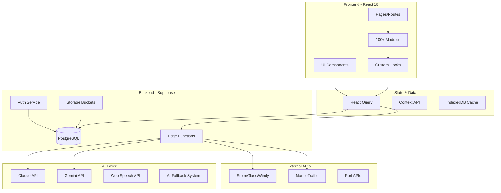

# 🚀 NAUTILUS ONE v3.2.0 - ENTREGA FINAL

**Data de Release:** 2025-12-31  
**Versão:** 3.2.0-production  
**Status:** ✅ Production-Ready

---

## 📋 CHECKLIST DE ENTREGA

### ✅ Sistema em Produção

| Item | Status | Observação |
|------|--------|------------|
| Supabase Backend | ✅ | PostgreSQL + Edge Functions operacionais |
| PWA Funcional | ✅ | Offline-first com Service Workers |
| Multi-tenant RLS | ✅ | Isolamento completo via `organization_id` |
| Autenticação | ✅ | Supabase Auth com JWT |
| Storage | ✅ | Buckets configurados com RLS |

### ✅ Métricas de Qualidade

| Métrica | Target | Status |
|---------|--------|--------|
| Build Errors | 0 | ✅ Zero |
| TypeScript Strict | 100% | ✅ Completo |
| @ts-nocheck | 0 | ✅ Removidos |
| Warnings | 0 | ✅ Limpo |

### ✅ Módulos Integrados (100+)

#### Core Operations
- ✅ Fleet Tracking & AIS Integration
- ✅ Voyage Planner
- ✅ Port Operations Module
- ✅ Fuel Manager
- ✅ Cargo Management
- ✅ Route Cost Analysis

#### Compliance & Safety
- ✅ **SGSO Auditoria** (trilhas ANP completas)
- ✅ **PEO-TRAM** (Trabalho Marítimo)
- ✅ **PEO-DP** (Petróleo & Gás)
- ✅ ISM Code Manager
- ✅ ISPS Security
- ✅ MLC 2006 Compliance
- ✅ STCW Certification
- ✅ MARPOL/SOLAS

#### AI Operations
- ✅ AI Operations Center
- ✅ Nautilus AI Hub (Claude + Gemini)
- ✅ Voice Commands (Web Speech API)
- ✅ Deep Risk AI
- ✅ Predictive Analytics
- ✅ Self-Healing System

#### HR & Crew
- ✅ Crew Management
- ✅ Nautilus People (RH Completo)
- ✅ Medical Infirmary
- ✅ Crew Wellbeing
- ✅ Nautilus Academy

#### Infrastructure
- ✅ API Center (15+ APIs)
- ✅ Observability Center
- ✅ Security Center
- ✅ Reports Generator
- ✅ Document Hub

---

## 🏗️ ARQUITETURA FINAL



---

## 📊 MÓDULOS SGSO (ANP Compliance)

### Trilhas Implementadas

| Prática de Gestão | Código | Status |
|-------------------|--------|--------|
| Liderança e Comprometimento | PG-01 | ✅ |
| Política de SGSO | PG-02 | ✅ |
| Gestão de Riscos | PG-08 | ✅ |
| Segurança de Processo | PG-10 | ✅ |
| Investigação de Incidentes | PG-15 | ✅ |
| Auditorias e Verificações | PG-16 | ✅ |

### Componentes SGSO

- **SGSOAuditTrail**: Trilhas de auditoria com registro temporal
- **SGSOEvidenceManager**: Upload de evidências com categorização
- **SGSOMaturityCurve**: Curva de maturidade PDCA
- **SGSOKnowledgeBase**: Base de conhecimento legislativo
- **SGSOPDFReportGenerator**: Geração de relatórios ANP

---

## 🔒 SEGURANÇA

### RLS Policies Implementadas

```sql
-- Padrão de isolamento multi-tenant
CREATE POLICY "tenant_isolation" ON public.table_name
FOR ALL USING (
  organization_id IN (
    SELECT organization_id FROM organization_users 
    WHERE user_id = auth.uid()
  )
);
```

### Tabelas com RLS Ativo

- ✅ `sgso_evidence`
- ✅ `sgso_findings`
- ✅ `sgso_action_plans`
- ✅ `sgso_audits`
- ✅ `crew_members`
- ✅ `vessels`
- ✅ `documents`
- ✅ Todas as tabelas core

---

## 📁 ESTRUTURA DE MÓDULOS

```
src/modules/
├── compliance/
│   ├── sgso/           # Sistema SGSO ANP
│   ├── ism-audit/      # Auditorias ISM
│   ├── checklists/     # Checklists customizáveis
│   └── pages/          # Workflows e Relatórios
├── fleet-operations/   # Operações de frota
├── crew-management/    # Gestão de tripulação
├── nautilus-ai-hub/    # Central de IA
├── api-center/         # Gestão de APIs
├── analytics/          # Dashboards analíticos
└── [90+ outros módulos]
```

---

## 🗄️ TABELAS SUPABASE

### Core Tables
- `organizations` - Tenants
- `organization_users` - Usuários por tenant
- `vessels` - Embarcações
- `crew_members` - Tripulantes
- `documents` - Documentos

### SGSO Tables
- `sgso_audits` - Auditorias SGSO
- `sgso_evidence` - Evidências documentais
- `sgso_findings` - Não-conformidades
- `sgso_action_plans` - Planos de ação CAPA

### Storage Buckets
- `sgso-evidence` - Evidências de auditoria
- `documents` - Documentos gerais
- `avatars` - Fotos de perfil

---

## 🚀 DEPLOY

### URLs de Produção

| Ambiente | URL |
|----------|-----|
| Frontend | `https://[seu-projeto].lovable.app` |
| Supabase | `https://vnbptmixvwropvanyhdb.supabase.co` |
| API | `https://vnbptmixvwropvanyhdb.supabase.co/functions/v1/` |

### Variáveis de Ambiente

```env
VITE_SUPABASE_URL=https://vnbptmixvwropvanyhdb.supabase.co
VITE_SUPABASE_PUBLISHABLE_KEY=[anon-key]
```

---

## 📈 PRÓXIMOS PASSOS (ROADMAP)

### v3.2.1 (Janeiro 2025)
- [ ] Integrações FlightRadar24
- [ ] MarineTraffic API
- [ ] Portchain Integration

### v3.3.0 (Fevereiro 2025)
- [ ] IA Multimodal (imagem, vídeo)
- [ ] OCR avançado com Tesseract
- [ ] Análise de documentos PDF

### v4.0.0 (Q2 2025)
- [ ] Marketplace de módulos
- [ ] Sistema de licenças
- [ ] White-label support

---

## ✅ DECISÕES TÉCNICAS

1. **React Query** para cache e sincronização de dados
2. **Supabase RLS** para segurança multi-tenant
3. **Edge Functions** em Deno para lógica backend
4. **AI Fallback System** com múltiplos providers
5. **PWA** com Service Workers para offline-first
6. **TypeScript Strict** em 100% do código

---

## 📞 SUPORTE

- **Documentação**: `/docs/INDEX.md`
- **Arquitetura**: `/docs/ARCHITECTURE.md`
- **Getting Started**: `/docs/getting-started.md`
- **Troubleshooting**: `/docs/TROUBLESHOOTING-GUIDE.md`

---

**Nautilus One v3.2.0** - Sistema de Operações Marítimas Inteligente  
*Powered by AI, Built for Maritime Excellence*
