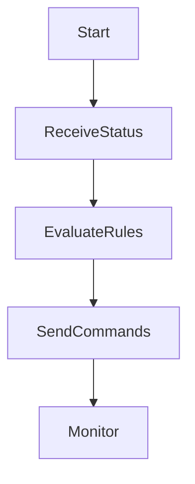

# 🤖 Módulo: coordination-ai

## 📌 Objetivo
Orquestra ações simultâneas entre múltiplos agentes autônomos, como drones, sensores e satélites, com base em regras de missão e feedback da IA.

## 📁 Estrutura de Arquivos
- `lib/coordination/logic.ts`
- `hooks/useCoordination.ts`
- `components/CoordinationPanel.tsx`

## 🔗 Integrações
- Supabase: `missions`, `agents`
- MQTT: `agents/+/status`, `coordination/commands`
- IA: ONNX Runtime (local), fallback via LLM API

## 🔄 Fluxo Operacional

## 🧪 Testes

- ✅ Unitários
- ✅ Mock reativo
- ✅ Integração MQTT

## 📋 Status Atual

- ✅ Estrutura lógica criada
- ✅ UI básica implementada
- ✅ Integração com MQTT
- ✅ Coordenação reativa
