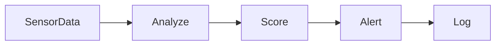

# ⚠️ Módulo: deep-risk-ai

## 📌 Objetivo
Avaliar riscos operacionais em tempo real utilizando inferência local e análise contextual com IA embarcada.

## 📁 Estrutura de Arquivos
- `lib/deep-risk/engine.ts`
- `hooks/useRiskScore.ts`
- `components/RiskIndicator.tsx`

## 🔗 Integrações
- Supabase: `incident_reports`, `telemetry`
- IA: ONNX Runtime + fallback para API externa de risco

## 🔄 Fluxo Operacional

## 🧪 Testes

- ✅ Score < 0.3 = OK
- ✅ Score > 0.7 = ALERT
- ✅ IA responde em <500ms

## 📋 Status Atual

- ✅ UI criada
- ✅ Lógica ONNX ativa
- ✅ Integração com logs
