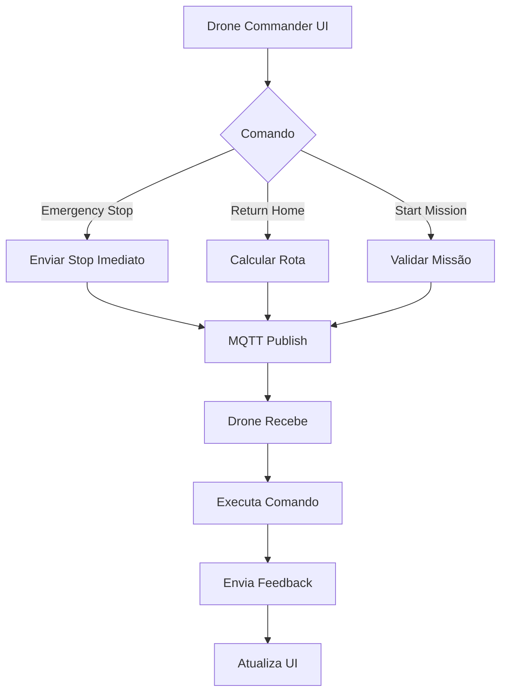

# 🚁 Module: Drone Commander

## 📌 Visão Geral

O módulo `drone-commander` é o centro de controle para a frota autônoma de drones, permitindo comando, monitoramento e coordenação em tempo real de múltiplos veículos aéreos não tripulados para inspeção, vigilância e operações de reconhecimento marítimo.

**Categoria**: Specialized / Operations  
**Rota**: `/admin/drone-commander`  
**Status**: Ativo  
**Versão**: 2.0

## 🧱 Estrutura

### Componentes Principais
- `/src/pages/admin/drone-commander/index.tsx`: Interface principal do commander
- `/src/modules/drone-commander/components/`:
  - `DroneFleetOverview.tsx`: Visão geral da frota
  - `DroneMissionAssignment.tsx`: Atribuição de missões
  - `DroneLogsViewer.tsx`: Visualizador de logs
  - `DroneRealtimeMonitor.tsx`: Monitor em tempo real

### Serviços
- `/src/modules/drone-commander/services/drone-service.ts`: Lógica de negócio e API
- `/src/modules/drone-commander/types.ts`: Definições TypeScript


### FleetControl
- Multi-drone coordination
- Fleet status overview (Flying, Hovering, Idle, Emergency)
- Swarm operations
- Mission assignment
- Real-time monitoring with WebSocket

### FlightPlanner
- Flight path planning
- No-fly zone management
- Weather integration
- Battery optimization
- Waypoint navigation

### VideoStream
- Live video feeds
- Multi-camera view
- Recording and playback
- AI-powered analysis

### DataCollection
- Aerial photography
- Thermal imaging
- Sensor data collection
- Automated reporting

### Commands
- **Emergency Stop**: Parada de emergência
- **Return Home**: Retorno à base
- **Takeoff / Landing**: Decolagem / pouso
- **Waypoint Navigation**: Navegação por pontos

## 🧪 Testes

### Testes E2E
- **Arquivo**: `tests/e2e/drone-commander.spec.ts`
- **Cobertura**:
  - ✅ Carregamento da página sem erros
  - ✅ Visualização da frota
  - ✅ Indicadores de status
  - ✅ Envio de comandos com feedback
  - ✅ Monitoramento em tempo real
  - ✅ WebSocket connection status
  - ✅ Métricas (bateria, sinal)
  - ✅ Comando de emergência
  - ✅ Performance e timeouts

### Como Executar
```bash
# Testes E2E específicos do drone-commander
npm run test:e2e -- drone-commander.spec.ts

# Todos os testes E2E
npm run test:e2e
```

## 📊 Métricas

### Performance
- Latência de comando: < 50ms
- Atualização de status: a cada 5s
- WebSocket reconnect: < 3s

### Capacidade
- Drones simultâneos: até 50
- Comandos por segundo: até 100
- Retenção de histórico: 90 dias

## 🛠️ TODO

### Curto Prazo
- [ ] Adicionar suporte a drones DJI
- [ ] Implementar geofencing visual
- [ ] Melhorar UI de telemetria em tempo real
- [ ] Adicionar filtros avançados de logs

### Médio Prazo
- [ ] Visualização 3D da frota
- [ ] IA para predição de falhas
- [ ] Auto-recovery em caso de perda de sinal
- [ ] Multi-tenancy (frotas isoladas por cliente)


## 🔌 Integrações

### Supabase Database
- **Tabela**: `drones` - Cadastro e configuração de drones
- **Tabela**: `drone_flights` - Histórico de voos
- **Tabela**: `drone_commands` - Log de comandos enviados
- **Tabela**: `drone_telemetry` - Dados de telemetria em tempo real

### WebSocket Server
- Conexão persistente para atualizações em tempo real
- Eventos de status, bateria, GPS
- Notificações de emergência

### MQTT Topics
- `drones/{drone_id}/command` - Envio de comandos
- `drones/{drone_id}/status` - Recebimento de status
- `drones/{drone_id}/telemetry` - Dados de telemetria

### Módulos Relacionados
- **Mission Control**: Coordenação de missões
- **Weather Dashboard**: Dados meteorológicos para planejamento de voo
- **Fleet Management**: Rastreamento de ativos
- **mission-engine**: Integração para execução de missões
- **analytics**: Métricas de performance da frota

## ⚙️ Fluxo de Comando



## 🎯 Funcionalidades

## Última Atualização

**Data**: 2025-10-29  
**Versão**: 2.0  
**Features**: Fleet control, Flight planning, Video streaming
