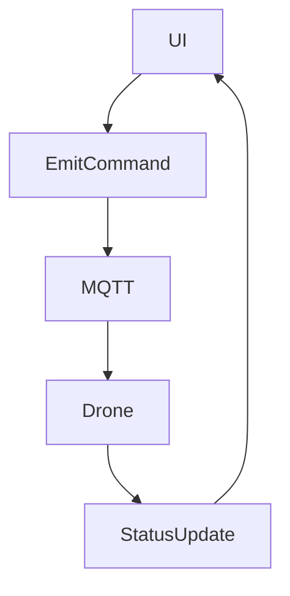

# 🛸 Módulo: drone-commander

## 📌 Objetivo
Emitir comandos, monitorar status e coordenar drones submarinos durante missões autônomas.

## 📁 Estrutura de Arquivos
- `lib/drone/command-service.ts`
- `hooks/useDroneStatus.ts`
- `components/DroneCommanderPanel.tsx`

## 🔗 Integrações
- MQTT: `drones/+/commands`, `drones/+/status`
- Supabase: `drone_logs`, `drone_profiles`

## 🔄 Fluxo Operacional

## 🧪 Testes

- ✅ Comando MOVE emitido
- ✅ Resposta em <1s
- ✅ UI atualiza automaticamente

## 📋 Status Atual

- ✅ UI em desenvolvimento
- ✅ Estrutura MQTT implementada
- ✅ Logs Supabase
