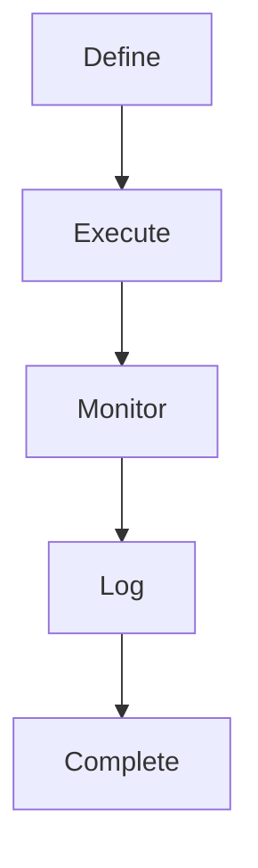

# 🧭 Módulo: mission-engine

## 📌 Objetivo
Definir e executar pipelines de missão com múltiplas etapas, coordenação AI e drones embarcados.

## 📁 Estrutura de Arquivos
- `lib/mission/pipeline.ts`
- `hooks/useMissionEngine.ts`
- `components/MissionStepper.tsx`

## 🔗 Integrações
- coordination-ai, drone-commander
- Supabase: `missions`, `mission_logs`
- LLM API: sugestão de fallback

## 🔄 Fluxo Operacional

## 🧪 Testes

- ✅ Execução de pipeline fictícia
- ✅ Logs visuais em tempo real

## 📋 Status Atual

- ✅ Lógica do pipeline pronta
- ✅ UI básica
- ✅ Integração completa
