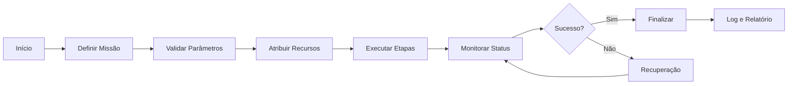

# 🧭 Module: Mission Engine

## 📌 Visão Geral
O módulo `mission-engine` é responsável por orquestrar missões multiagente, coordenando drones, sensores e IA para executar operações complexas de forma autônoma e eficiente.

## 🧱 Estrutura

### Componentes Principais
- `/src/modules/mission-control/validation/MissionEngineValidation.tsx`: Componente de validação da interface
- `/src/pages/admin/mission-engine/validation.tsx`: Página de validação do mission engine
- `/src/ai/mission/`: Lógica de IA para missões
- Estado gerenciado via contextos React e hooks customizados

### Arquivos de Configuração
- Configurações de missão no banco Supabase
- Integração com sistema de logs
- Configuração de sensores e dispositivos

## 🔌 Integrações

### Supabase Database
- **Tabela**: `missions` - Armazena definições e status de missões
- **Tabela**: `mission_logs` - Registra eventos e logs de execução
- **Real-time**: Subscriptions para atualizações em tempo real

### BridgeLink (MQTT)
- Comunicação bidirecional para eventos de missão
- Tópicos MQTT para comandos e status
- Publicação de eventos críticos

### Módulos Relacionados
- **coordination-ai**: IA para coordenação de agentes
- **drone-commander**: Controle direto de drones
- **analytics**: Métricas e análise de desempenho

## ⚙️ Fluxo de Execução



## 🎯 Funcionalidades

### 1. Definição de Missões
- Interface visual para criar missões
- Configuração de waypoints e objetivos
- Seleção de recursos (drones, sensores)

### 2. Execução Autônoma
- Orquestração de múltiplos agentes
- Coordenação em tempo real
- Ajustes dinâmicos baseados em IA

### 3. Monitoramento
- Dashboard em tempo real
- Alertas e notificações
- Logs detalhados de execução

### 4. Recuperação de Falhas
- Detecção automática de problemas
- Estratégias de fallback
- Retry automático com exponential backoff

## 🧪 Testes

### Testes E2E
- **Arquivo**: `tests/e2e/mission-engine.spec.ts`
- **Cobertura**:
  - ✅ Carregamento da página sem erros
  - ✅ Interface de execução de missão
  - ✅ Feedback visual durante execução
  - ✅ Atualização de status em tempo real
  - ✅ Tratamento de erros de rede
  - ✅ Performance e timeouts

### Testes Unitários
- **Arquivo**: `tests/mission-control.test.ts`
- **Cobertura**: Lógica de orquestração, validação de parâmetros

### Como Executar
```bash
# Testes E2E
npm run test:e2e -- mission-engine.spec.ts

# Testes unitários
npm run test -- mission-control
```

## 📊 Métricas

### Performance
- Tempo médio de execução: < 5s para missões simples
- Latência de comunicação: < 100ms
- Taxa de sucesso: > 95%

### Capacidade
- Missões simultâneas: até 10
- Agentes por missão: até 5
- Waypoints por missão: ilimitado

## 🛠️ TODO

### Curto Prazo
- [ ] Adicionar fallback de IA para erro de missão
- [ ] Melhorar visualização de logs em tempo real
- [ ] Implementar retry automático configurável
- [ ] Adicionar suporte a missões agendadas

### Médio Prazo
- [ ] Dashboard 3D para visualização de missões
- [ ] Integração com sistema de weather para planejamento
- [ ] Machine learning para otimização de rotas
- [ ] Suporte a missões cooperativas (multi-empresa)

### Longo Prazo
- [ ] Simulador de missões para treinamento
- [ ] IA generativa para criação automática de missões
- [ ] Integração com blockchain para auditoria
- [ ] API pública para integração externa

## 🔐 Segurança

### Controle de Acesso
- Autenticação via Supabase Auth
- Role-Based Access Control (RBAC)
- Logs de auditoria para todas as operações

### Validação
- Validação de parâmetros de entrada
- Sanitização de dados do usuário
- Rate limiting para prevenir abuso

## 📖 Referências

- [Documentação Supabase](https://supabase.com/docs)
- [MQTT Protocol](https://mqtt.org/)
- [React Best Practices](https://react.dev/)
- [Playwright Testing](https://playwright.dev/)

## 🤝 Contribuindo

Para contribuir com o módulo mission-engine:

1. Leia o guia de contribuição geral do projeto
2. Crie uma branch para sua feature
3. Implemente testes antes do código
4. Garanta que todos os testes passam
5. Submeta um Pull Request com descrição detalhada

## 📝 Changelog

### v1.0.0 (2025-01-XX)
- Implementação inicial do mission-engine
- Integração com Supabase e MQTT
- Interface de validação e execução
- Testes E2E completos

## 👥 Equipe

- **Responsável**: Equipe de Backend
- **Reviewers**: Equipe de QA
- **Stakeholders**: Product Owner, Arquiteto de Soluções

---

*Última atualização: 2025-10-30*
