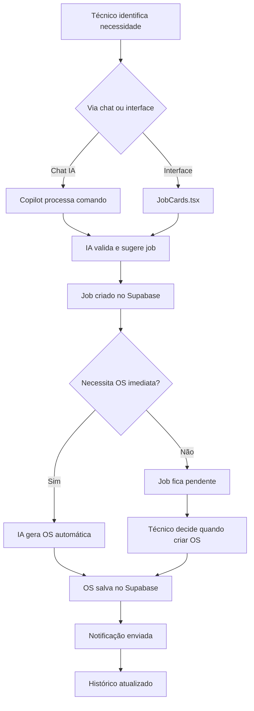
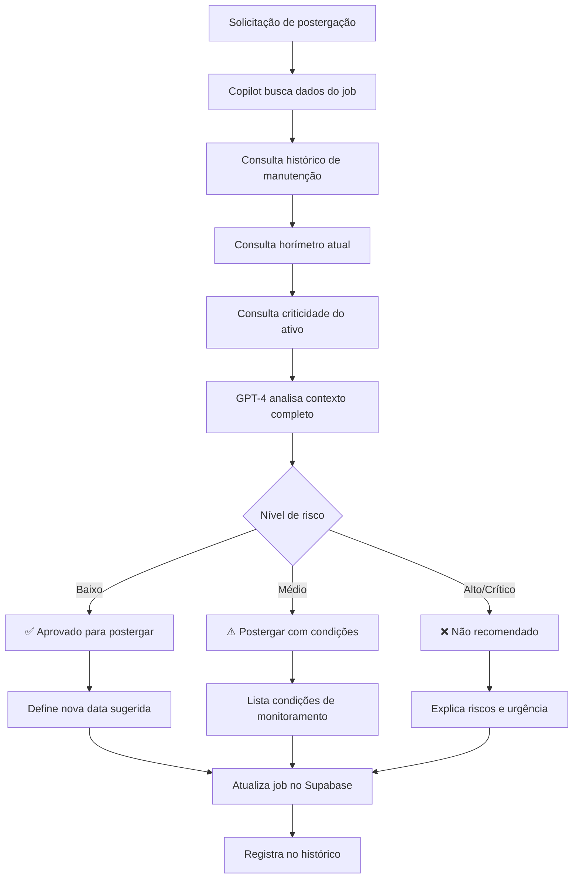

# 🛠️ Nautilus One — Módulo Manutenção Inteligente (MMI)

## ✅ Visão Geral

O módulo de **Manutenção Inteligente (MMI)** é responsável por:

- Criação e gestão de jobs de manutenção técnica
- Acompanhamento da saúde dos ativos da frota
- Geração automática de Ordens de Serviço (OS)
- Sugestões inteligentes de postergação com IA
- Integração total com Supabase e assistente IA global

O MMI utiliza inteligência artificial (GPT-4) para:
- Avaliar riscos de postergação de manutenções
- Sugerir ações preventivas baseadas em histórico
- Criar jobs via linguagem natural
- Priorizar manutenções críticas

---

## 📐 Estrutura Supabase

O MMI utiliza 6 tabelas principais no Supabase:

### 1. `mmi_assets` — Ativos (Equipamentos, Embarcações)

Armazena informações sobre todos os ativos da frota que requerem manutenção.

```sql
CREATE TABLE mmi_assets (
  id UUID PRIMARY KEY DEFAULT gen_random_uuid(),
  organization_id UUID REFERENCES organizations(id),
  asset_name TEXT NOT NULL,
  asset_type TEXT NOT NULL, -- 'vessel', 'generator', 'engine', 'pump', etc.
  vessel_id UUID REFERENCES vessels(id),
  location TEXT,
  manufacturer TEXT,
  model TEXT,
  serial_number TEXT,
  installation_date DATE,
  last_maintenance_date TIMESTAMP WITH TIME ZONE,
  next_maintenance_date TIMESTAMP WITH TIME ZONE,
  status TEXT DEFAULT 'operational', -- 'operational', 'maintenance', 'failure', 'retired'
  criticality TEXT DEFAULT 'medium', -- 'low', 'medium', 'high', 'critical'
  metadata JSONB DEFAULT '{}',
  created_at TIMESTAMP WITH TIME ZONE DEFAULT NOW(),
  updated_at TIMESTAMP WITH TIME ZONE DEFAULT NOW()
);
```

**Campos principais:**
- `asset_type`: Tipo de ativo (embarcação, gerador, motor, etc.)
- `criticality`: Nível de criticidade para priorização
- `status`: Status operacional atual
- `metadata`: Dados técnicos adicionais (capacidade, especificações, etc.)

### 2. `mmi_components` — Componentes Técnicos

Componentes individuais de cada ativo que requerem manutenção específica.

```sql
CREATE TABLE mmi_components (
  id UUID PRIMARY KEY DEFAULT gen_random_uuid(),
  asset_id UUID REFERENCES mmi_assets(id) ON DELETE CASCADE,
  component_name TEXT NOT NULL,
  component_type TEXT NOT NULL, -- 'hydraulic', 'electrical', 'mechanical', etc.
  location TEXT,
  manufacturer TEXT,
  part_number TEXT,
  maintenance_interval_hours INTEGER,
  last_maintenance_hours INTEGER,
  current_hours INTEGER DEFAULT 0,
  health_score NUMERIC DEFAULT 100, -- 0-100
  failure_risk TEXT DEFAULT 'low', -- 'low', 'medium', 'high', 'critical'
  metadata JSONB DEFAULT '{}',
  created_at TIMESTAMP WITH TIME ZONE DEFAULT NOW(),
  updated_at TIMESTAMP WITH TIME ZONE DEFAULT NOW()
);
```

**Campos principais:**
- `maintenance_interval_hours`: Intervalo de manutenção em horas
- `health_score`: Score de saúde (0-100)
- `failure_risk`: Risco de falha calculado

### 3. `mmi_jobs` — Jobs de Manutenção

Jobs de manutenção pendentes, em andamento ou concluídos.

```sql
CREATE TABLE mmi_jobs (
  id SERIAL PRIMARY KEY,
  organization_id UUID REFERENCES organizations(id),
  asset_id UUID REFERENCES mmi_assets(id),
  component_id UUID REFERENCES mmi_components(id),
  job_title TEXT NOT NULL,
  job_description TEXT,
  job_type TEXT NOT NULL, -- 'preventive', 'corrective', 'inspection', 'emergency'
  priority TEXT DEFAULT 'medium', -- 'low', 'medium', 'high', 'critical'
  status TEXT DEFAULT 'pending', -- 'pending', 'in_progress', 'completed', 'postponed', 'cancelled'
  assigned_to UUID REFERENCES crew_members(id),
  estimated_hours NUMERIC,
  actual_hours NUMERIC,
  due_date TIMESTAMP WITH TIME ZONE,
  completed_at TIMESTAMP WITH TIME ZONE,
  postponement_count INTEGER DEFAULT 0,
  postponement_reason TEXT,
  ai_recommendation TEXT,
  metadata JSONB DEFAULT '{}',
  created_at TIMESTAMP WITH TIME ZONE DEFAULT NOW(),
  updated_at TIMESTAMP WITH TIME ZONE DEFAULT NOW()
);
```

**Campos principais:**
- `job_type`: Tipo de manutenção (preventiva, corretiva, inspeção, emergência)
- `priority`: Prioridade do job
- `postponement_count`: Número de vezes que foi postergado
- `ai_recommendation`: Recomendação da IA para o job

### 4. `mmi_os` — Ordens de Serviço

Ordens de serviço vinculadas a jobs de manutenção.

```sql
CREATE TABLE mmi_os (
  id SERIAL PRIMARY KEY,
  job_id INTEGER REFERENCES mmi_jobs(id) ON DELETE CASCADE,
  os_number TEXT UNIQUE NOT NULL,
  status TEXT DEFAULT 'open', -- 'open', 'in_progress', 'closed', 'cancelled'
  opened_by UUID REFERENCES crew_members(id),
  opened_at TIMESTAMP WITH TIME ZONE DEFAULT NOW(),
  closed_at TIMESTAMP WITH TIME ZONE,
  parts_used JSONB DEFAULT '[]',
  labor_hours NUMERIC,
  total_cost NUMERIC,
  notes TEXT,
  signature TEXT, -- Digital signature or approval
  metadata JSONB DEFAULT '{}',
  created_at TIMESTAMP WITH TIME ZONE DEFAULT NOW(),
  updated_at TIMESTAMP WITH TIME ZONE DEFAULT NOW()
);
```

**Campos principais:**
- `os_number`: Número único da OS
- `parts_used`: Array JSON com peças utilizadas
- `total_cost`: Custo total da OS

### 5. `mmi_history` — Histórico Técnico

Histórico de falhas, inspeções e intervenções técnicas.

```sql
CREATE TABLE mmi_history (
  id UUID PRIMARY KEY DEFAULT gen_random_uuid(),
  asset_id UUID REFERENCES mmi_assets(id),
  component_id UUID REFERENCES mmi_components(id),
  job_id INTEGER REFERENCES mmi_jobs(id),
  event_type TEXT NOT NULL, -- 'failure', 'inspection', 'repair', 'replacement', 'adjustment'
  event_description TEXT,
  severity TEXT DEFAULT 'medium', -- 'low', 'medium', 'high', 'critical'
  reported_by UUID REFERENCES crew_members(id),
  downtime_hours NUMERIC,
  root_cause TEXT,
  corrective_action TEXT,
  attachments JSONB DEFAULT '[]', -- Photos, documents
  metadata JSONB DEFAULT '{}',
  event_date TIMESTAMP WITH TIME ZONE DEFAULT NOW(),
  created_at TIMESTAMP WITH TIME ZONE DEFAULT NOW()
);
```

**Campos principais:**
- `event_type`: Tipo de evento (falha, inspeção, reparo, etc.)
- `severity`: Gravidade do evento
- `root_cause`: Causa raiz identificada
- `corrective_action`: Ação corretiva aplicada

### 6. `mmi_hours` — Horímetros

Registro de horas operacionais dos equipamentos (manual, OCR, IoT).

```sql
CREATE TABLE mmi_hours (
  id UUID PRIMARY KEY DEFAULT gen_random_uuid(),
  asset_id UUID REFERENCES mmi_assets(id),
  component_id UUID REFERENCES mmi_components(id),
  reading_value INTEGER NOT NULL,
  reading_type TEXT DEFAULT 'manual', -- 'manual', 'ocr', 'iot'
  reading_source TEXT, -- User ID, device ID, or OCR job ID
  reading_date TIMESTAMP WITH TIME ZONE DEFAULT NOW(),
  verified BOOLEAN DEFAULT FALSE,
  metadata JSONB DEFAULT '{}',
  created_at TIMESTAMP WITH TIME ZONE DEFAULT NOW()
);
```

**Campos principais:**
- `reading_type`: Tipo de leitura (manual, OCR, IoT)
- `reading_value`: Valor do horímetro
- `verified`: Se a leitura foi verificada

---

## 🔌 Rotas API

### POST `/api/mmi/jobs/:id/postpone`

Avalia via GPT-4 se um job pode ser postergado com risco baixo.

**Endpoint:** `POST /api/mmi/jobs/:id/postpone`

**Entrada:**
```json
{
  "jobId": 2493,
  "reason": "Equipamento ainda está operacional"
}
```

**Retorno:**
```json
{
  "success": true,
  "recommendation": "✅ Pode postergar",
  "risk_level": "low",
  "analysis": "Com base no histórico de manutenção e nas horas atuais do equipamento, a postergação por até 30 dias apresenta risco baixo.",
  "suggested_date": "2025-11-15T00:00:00Z",
  "conditions": [
    "Monitorar vibração do motor diariamente",
    "Verificar níveis de óleo semanalmente",
    "Realizar nova avaliação em 15 dias"
  ]
}
```

**Possíveis respostas:**
- ✅ **Pode postergar** (risco baixo)
- ⚠️ **Postergar com condições** (risco médio)
- ❌ **Não é recomendável** (risco alto/crítico)

### POST `/api/mmi/os/create`

Cria uma nova OS a partir de um job existente.

**Endpoint:** `POST /api/mmi/os/create`

**Entrada:**
```json
{
  "jobId": 2493,
  "priority": "high",
  "notes": "Substituição preventiva de filtros"
}
```

**Retorno:**
```json
{
  "success": true,
  "os_id": 1847,
  "os_number": "OS-2025-001847",
  "message": "OS criada com sucesso",
  "job": {
    "id": 2493,
    "title": "Troca de filtros - Gerador BB",
    "status": "in_progress"
  }
}
```

---

## 🧩 Componentes React

### MaintenanceCopilot.tsx

Componente de chat técnico com capacidades de IA para gestão de manutenção.

**Localização:** `src/components/mmi/MaintenanceCopilot.tsx`

**Funcionalidades:**
- Interface de chat com bolhas de usuário/assistente
- Botões de comandos rápidos (Criar Job, OS Críticas, Jobs Pendentes, Postergar)
- Comandos em linguagem natural:
  - "Criar job de troca de óleo no gerador BB"
  - "Postergar job #2493"
  - "Listar OS críticas para a docagem"
- Botões de ação contextuais nas respostas
- Badges de metadados (números de job, OS, níveis de risco)
- Integração com GPT-4 via Supabase Edge Function
- Tratamento de erros com orientações úteis

**Exemplo de uso:**
```tsx
import MaintenanceCopilot from '@/components/mmi/MaintenanceCopilot';

function MMIPage() {
  return (
    <div>
      <MaintenanceCopilot />
    </div>
  );
}
```

### JobCards.tsx

Exibe cards de jobs com status, prioridade, data, componente e IA.

**Ações integradas:**
- ✅ Criar OS
- 📅 Postergar via IA
- 🔍 Visualizar sugestão da IA

---

## 🧠 Integração ao Assistente Global

O assistente global do Nautilus One foi atualizado para ter consciência do MMI.

### Comandos suportados:

| Comando | Ação |
|---------|------|
| `manutenção` / `manutencao` | Navega para o módulo MMI |
| `jobs` | Lista jobs de manutenção |
| `criar job` | Instruções para criar job |
| `os` / `ordem de serviço` | Gestão de ordens de serviço |
| `postergar` | Avaliação de postergação |
| `equipamentos` | Gestão de ativos |

### Prompt do sistema atualizado:

O assistente agora inclui:
- Acesso ao Módulo de Manutenção Inteligente (MMI)
- Capacidade de consultar APIs MMI via Supabase
- Respostas técnicas orientadas à ação
- Sugestões contextuais para manutenção

---

## 📊 Exemplos de Comando IA

### 1. Registrar job de inspeção

**Usuário:** "Registrar job de inspeção visual no motor STBD"

**IA:** 
```
✅ Job criado com sucesso!

📋 Job #2494 - Inspeção visual motor STBD
📅 Data prevista: 2025-10-20
👤 Atribuído para: Técnico responsável
⚡ Prioridade: Média

🔗 [Ver detalhes] [Criar OS] [Editar job]
```

### 2. Avaliar postergação

**Usuário:** "O job 2445 pode ser postergado?"

**IA:**
```
🤖 Análise de postergação - Job #2445

⚠️ POSTERGAR COM CONDIÇÕES (Risco Médio)

📊 Análise:
- Último maintenance: há 45 dias
- Horas atuais: 3.240h (intervalo: 3.500h)
- Margem disponível: 260h (~15 dias úteis)

✅ Condições para postergação:
1. Monitorar temperatura do óleo diariamente
2. Verificar pressão hidráulica a cada turno
3. Nova avaliação em 7 dias
4. Realizar manutenção antes de 3.450h

📅 Data máxima recomendada: 30/10/2025

🔗 [Postergar com condições] [Executar agora] [Ver histórico]
```

### 3. Listar jobs críticos

**Usuário:** "Quantos jobs críticos estão pendentes para a embarcação Atlas?"

**IA:**
```
🚨 Jobs Críticos - Embarcação Atlas

📊 Total: 3 jobs críticos pendentes

1. 🔴 Job #2487 - Troca de válvula sistema de lastro
   📅 Vencido há 2 dias
   ⚡ URGENTE - Risco de falha

2. 🔴 Job #2491 - Inspeção elétrica painel principal
   📅 Vence em 1 dia
   ⚡ CRÍTICO - Certificação obrigatória

3. 🟠 Job #2495 - Manutenção bomba de incêndio
   📅 Vence em 5 dias
   ⚡ ALTA - Equipamento de segurança

🔗 [Ver todos] [Priorizar] [Criar OS múltiplas]
```

### 4. Gerar OS

**Usuário:** "Gerar OS para troca de válvula no sistema de lastro"

**IA:**
```
✅ OS criada com sucesso!

📄 OS-2025-001848
📋 Job: #2487 - Troca de válvula sistema de lastro
🏢 Embarcação: Atlas
📅 Data de abertura: 15/10/2025
👤 Responsável: João Silva

📦 Materiais necessários:
- Válvula borboleta 6" (1 unidade)
- Junta de vedação (2 unidades)
- Parafusos M12 (8 unidades)

⏱️ Tempo estimado: 4 horas

🔗 [Imprimir OS] [Adicionar materiais] [Atribuir técnico]
```

---

## 🧾 Fluxo Funcional

### Fluxo de Criação de OS



### Fluxo de Decisão de Postergação



---

## 🏗️ Arquitetura

### Componentes principais:

```
MMI Module
├── Frontend (React + TypeScript)
│   ├── MaintenanceCopilot.tsx (Chat IA)
│   ├── JobCards.tsx (Visualização de jobs)
│   ├── AssetList.tsx (Lista de ativos)
│   └── OSManager.tsx (Gestão de OS)
│
├── Backend (Supabase Edge Functions)
│   ├── assistant-query (Assistente global)
│   ├── mmi-postpone-job (Avaliação de postergação)
│   ├── mmi-create-os (Criação de OS)
│   └── mmi-analyze-health (Análise de saúde)
│
├── Database (Supabase PostgreSQL)
│   ├── mmi_assets
│   ├── mmi_components
│   ├── mmi_jobs
│   ├── mmi_os
│   ├── mmi_history
│   └── mmi_hours
│
└── AI Integration (OpenAI GPT-4)
    ├── Postergação inteligente
    ├── Criação de jobs via NLP
    ├── Análise de riscos
    └── Recomendações técnicas
```

---

## 📈 KPIs e Métricas

### Métricas operacionais:

- **MTBF** (Mean Time Between Failures): Tempo médio entre falhas
- **MTTR** (Mean Time To Repair): Tempo médio de reparo
- **Disponibilidade**: % de tempo operacional
- **Taxa de postergação**: % de jobs postergados vs. executados no prazo
- **Eficácia preventiva**: % de falhas evitadas por manutenção preventiva
- **Custo por hora de manutenção**: Custo médio de manutenção por hora
- **Acurácia da IA**: % de recomendações corretas da IA

### Dashboards:

1. **Visão Geral:** Jobs pendentes, críticos, em andamento
2. **Saúde da Frota:** Health score por ativo
3. **Análise Preditiva:** Previsão de falhas
4. **Custos:** Análise de custos de manutenção
5. **Performance:** KPIs operacionais

---

## 🚀 Próximos Passos

### Fase 1: Backend (APIs e Edge Functions)
- [ ] Implementar Edge Function `mmi-postpone-job`
- [ ] Implementar Edge Function `mmi-create-os`
- [ ] Implementar Edge Function `mmi-analyze-health`
- [ ] Criar migrations para tabelas MMI

### Fase 2: Frontend (Componentes)
- [ ] Finalizar MaintenanceCopilot.tsx
- [ ] Criar JobCards.tsx
- [ ] Criar AssetList.tsx
- [ ] Criar OSManager.tsx
- [ ] Integrar com rotas do sistema

### Fase 3: Integrações
- [ ] Integrar leitura de horímetro via OCR
- [ ] Conectar sensores IoT para leitura automática
- [ ] Criar embeddings de histórico técnico para IA
- [ ] Implementar notificações por email/SMS

### Fase 4: Analytics e Relatórios
- [ ] Implementar dashboards de KPIs
- [ ] Criar relatórios PDF/CSV inteligentes
- [ ] Adicionar gráficos de tendências
- [ ] Implementar alertas preditivos

---

## 🛠️ Stack Tecnológica

- **Frontend:** React 18+ com TypeScript
- **UI:** TailwindCSS + shadcn/ui
- **Backend:** Supabase (Edge Functions, Database, Storage, Auth)
- **IA:** OpenAI GPT-4 (via assistant-query)
- **Ícones:** Lucide React
- **Notificações:** Resend / SendGrid (email), SMS via Twilio
- **Analytics:** Custom analytics com Supabase + Recharts
- **OCR:** Tesseract.js ou Google Cloud Vision
- **IoT:** MQTT/WebSocket para sensores em tempo real

---

## 📚 Referências

- [Supabase Documentation](https://supabase.com/docs)
- [OpenAI API Reference](https://platform.openai.com/docs/api-reference)
- [React Documentation](https://react.dev)
- [shadcn/ui Components](https://ui.shadcn.com)
- [TailwindCSS Documentation](https://tailwindcss.com/docs)

---

## 📝 Licença

Este módulo faz parte do sistema **Nautilus One / Travel HR Buddy** e está sujeito à licença do projeto principal.

---

**Desenvolvido com ❤️ pela equipe Nautilus One**

**Última atualização:** Outubro 2025
