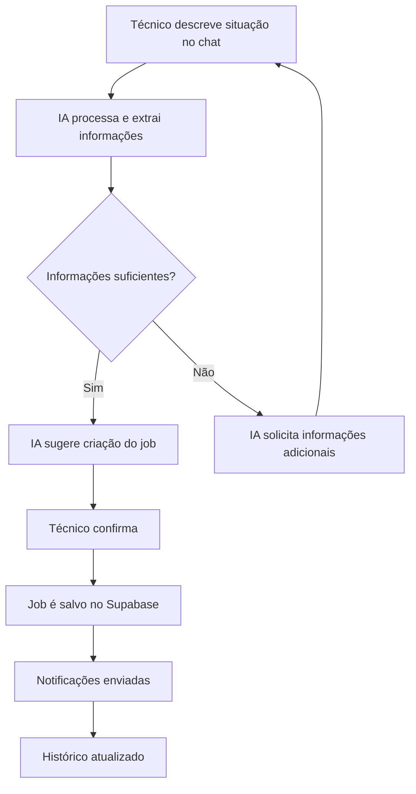
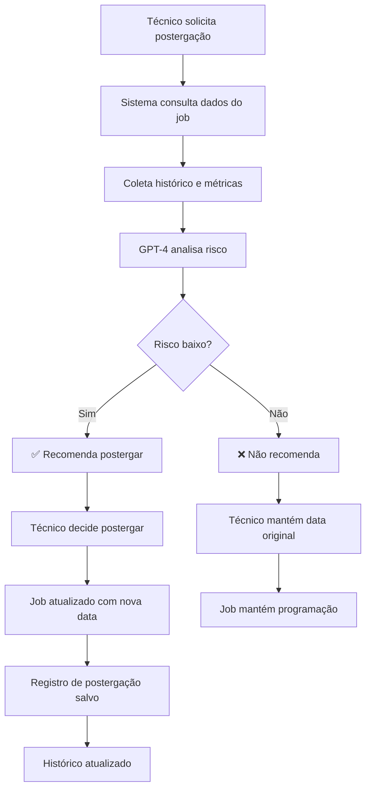
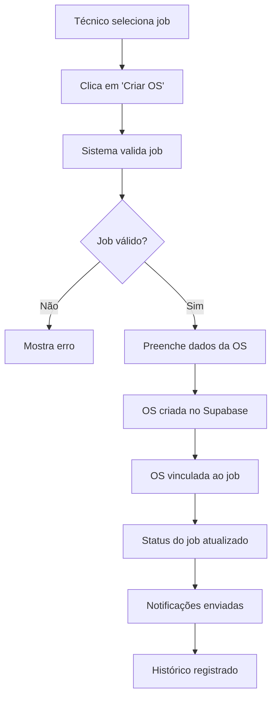

# 🛠️ Nautilus One — Módulo Manutenção Inteligente (MMI)

## ✅ Visão Geral

O **Módulo de Manutenção Inteligente (MMI)** é responsável por:

- ✅ Criação e gestão de jobs de manutenção técnica
- ✅ Acompanhamento da saúde dos ativos da frota
- ✅ Geração automática de Ordens de Serviço (OS)
- ✅ Sugestões inteligentes de postergação com IA
- ✅ Integração total com Supabase e assistente IA global

---

## 📐 Estrutura Supabase

### Tabelas Criadas

#### 1. `mmi_assets` — Ativos (Equipamentos, Embarcações)
Armazena informações sobre os ativos da frota que requerem manutenção.

```sql
CREATE TABLE mmi_assets (
  id UUID PRIMARY KEY DEFAULT uuid_generate_v4(),
  name VARCHAR(255) NOT NULL,
  type VARCHAR(100) NOT NULL, -- 'vessel', 'generator', 'engine', 'hydraulic_system', etc.
  model VARCHAR(255),
  serial_number VARCHAR(100),
  installation_date DATE,
  location VARCHAR(255),
  status VARCHAR(50) DEFAULT 'active', -- 'active', 'inactive', 'maintenance', 'decommissioned'
  metadata JSONB DEFAULT '{}',
  created_at TIMESTAMP WITH TIME ZONE DEFAULT NOW(),
  updated_at TIMESTAMP WITH TIME ZONE DEFAULT NOW()
);
```

#### 2. `mmi_components` — Componentes Técnicos
Componentes específicos de cada ativo que requerem manutenção.

```sql
CREATE TABLE mmi_components (
  id UUID PRIMARY KEY DEFAULT uuid_generate_v4(),
  asset_id UUID REFERENCES mmi_assets(id) ON DELETE CASCADE,
  name VARCHAR(255) NOT NULL,
  type VARCHAR(100) NOT NULL, -- 'motor', 'valve', 'pump', 'filter', etc.
  location VARCHAR(255), -- Localização física no ativo (popa, proa, etc.)
  manufacturer VARCHAR(255),
  model VARCHAR(255),
  maintenance_interval_hours INT, -- Intervalo de manutenção em horas
  last_maintenance_date DATE,
  next_maintenance_date DATE,
  status VARCHAR(50) DEFAULT 'operational', -- 'operational', 'degraded', 'failed', 'maintenance'
  criticality VARCHAR(20) DEFAULT 'medium', -- 'low', 'medium', 'high', 'critical'
  metadata JSONB DEFAULT '{}',
  created_at TIMESTAMP WITH TIME ZONE DEFAULT NOW(),
  updated_at TIMESTAMP WITH TIME ZONE DEFAULT NOW()
);
```

#### 3. `mmi_jobs` — Jobs de Manutenção
Jobs de manutenção pendentes, em andamento ou concluídos.

```sql
CREATE TABLE mmi_jobs (
  id UUID PRIMARY KEY DEFAULT uuid_generate_v4(),
  job_number VARCHAR(50) UNIQUE NOT NULL, -- Ex: "JOB-2493"
  asset_id UUID REFERENCES mmi_assets(id) ON DELETE SET NULL,
  component_id UUID REFERENCES mmi_components(id) ON DELETE SET NULL,
  title VARCHAR(255) NOT NULL,
  description TEXT,
  type VARCHAR(100) NOT NULL, -- 'preventive', 'corrective', 'predictive', 'inspection'
  priority VARCHAR(20) DEFAULT 'medium', -- 'low', 'medium', 'high', 'critical'
  status VARCHAR(50) DEFAULT 'pending', -- 'pending', 'scheduled', 'in_progress', 'completed', 'postponed', 'cancelled'
  assigned_to UUID, -- User ID do técnico responsável
  scheduled_date DATE,
  due_date DATE,
  completion_date DATE,
  estimated_hours DECIMAL(6,2),
  actual_hours DECIMAL(6,2),
  ai_postponement_suggestion TEXT, -- Sugestão da IA sobre postergação
  ai_postponement_risk VARCHAR(20), -- 'low', 'medium', 'high'
  postponement_count INT DEFAULT 0,
  last_postponement_date DATE,
  metadata JSONB DEFAULT '{}',
  created_at TIMESTAMP WITH TIME ZONE DEFAULT NOW(),
  updated_at TIMESTAMP WITH TIME ZONE DEFAULT NOW()
);
```

#### 4. `mmi_os` — Ordens de Serviço
Ordens de serviço vinculadas a jobs de manutenção.

```sql
CREATE TABLE mmi_os (
  id UUID PRIMARY KEY DEFAULT uuid_generate_v4(),
  os_number VARCHAR(50) UNIQUE NOT NULL, -- Ex: "OS-2023-1234"
  job_id UUID REFERENCES mmi_jobs(id) ON DELETE CASCADE,
  asset_id UUID REFERENCES mmi_assets(id) ON DELETE SET NULL,
  title VARCHAR(255) NOT NULL,
  description TEXT,
  status VARCHAR(50) DEFAULT 'open', -- 'open', 'in_progress', 'completed', 'cancelled'
  priority VARCHAR(20) DEFAULT 'medium',
  assigned_team VARCHAR(255),
  created_by UUID NOT NULL, -- User ID
  approved_by UUID, -- User ID do aprovador
  approval_date DATE,
  start_date DATE,
  completion_date DATE,
  total_cost DECIMAL(12,2),
  parts_used JSONB DEFAULT '[]', -- Lista de peças utilizadas
  work_performed TEXT,
  notes TEXT,
  attachments JSONB DEFAULT '[]', -- URLs de anexos (fotos, documentos)
  metadata JSONB DEFAULT '{}',
  created_at TIMESTAMP WITH TIME ZONE DEFAULT NOW(),
  updated_at TIMESTAMP WITH TIME ZONE DEFAULT NOW()
);
```

#### 5. `mmi_history` — Histórico Técnico
Histórico de falhas, inspeções e eventos técnicos.

```sql
CREATE TABLE mmi_history (
  id UUID PRIMARY KEY DEFAULT uuid_generate_v4(),
  asset_id UUID REFERENCES mmi_assets(id) ON DELETE CASCADE,
  component_id UUID REFERENCES mmi_components(id) ON DELETE SET NULL,
  job_id UUID REFERENCES mmi_jobs(id) ON DELETE SET NULL,
  os_id UUID REFERENCES mmi_os(id) ON DELETE SET NULL,
  event_type VARCHAR(100) NOT NULL, -- 'failure', 'inspection', 'maintenance', 'repair', 'test'
  severity VARCHAR(20), -- 'low', 'medium', 'high', 'critical'
  description TEXT NOT NULL,
  root_cause TEXT,
  corrective_action TEXT,
  reported_by UUID NOT NULL, -- User ID
  occurred_at TIMESTAMP WITH TIME ZONE NOT NULL,
  attachments JSONB DEFAULT '[]',
  metadata JSONB DEFAULT '{}',
  created_at TIMESTAMP WITH TIME ZONE DEFAULT NOW()
);
```

#### 6. `mmi_hours` — Horímetros
Registros de horas de operação (manual, OCR, IoT).

```sql
CREATE TABLE mmi_hours (
  id UUID PRIMARY KEY DEFAULT uuid_generate_v4(),
  asset_id UUID REFERENCES mmi_assets(id) ON DELETE CASCADE,
  component_id UUID REFERENCES mmi_components(id) ON DELETE CASCADE,
  reading_value DECIMAL(10,2) NOT NULL, -- Valor do horímetro
  reading_type VARCHAR(50) DEFAULT 'manual', -- 'manual', 'ocr', 'iot'
  reading_date TIMESTAMP WITH TIME ZONE NOT NULL,
  recorded_by UUID, -- User ID (para registros manuais)
  source VARCHAR(100), -- 'mobile_app', 'web_interface', 'iot_device', 'ocr_scanner'
  image_url VARCHAR(500), -- URL da foto do horímetro (para OCR)
  confidence_score DECIMAL(5,4), -- Score de confiança para leituras OCR (0-1)
  verified BOOLEAN DEFAULT FALSE,
  verified_by UUID,
  verified_at TIMESTAMP WITH TIME ZONE,
  notes TEXT,
  metadata JSONB DEFAULT '{}',
  created_at TIMESTAMP WITH TIME ZONE DEFAULT NOW()
);
```

---

## 🔌 Rotas API

### 1. `POST /api/mmi/jobs/:id/postpone`

**Descrição:** Avalia via GPT-4 se um job pode ser postergado com risco baixo.

**Entrada:**
- `jobId` (URL parameter) - ID do job

**Corpo da Requisição:**
```json
{
  "reason": "Falta de peças de reposição",
  "proposed_new_date": "2025-11-15"
}
```

**Retorno Sucesso:**
```json
{
  "success": true,
  "recommendation": "✅ Pode postergar",
  "risk_level": "low",
  "ai_analysis": "Análise detalhada da IA sobre o impacto da postergação...",
  "suggested_actions": [
    "Verificar estoque de peças antes da nova data",
    "Monitorar sintomas de desgaste"
  ]
}
```

**Retorno Negativo:**
```json
{
  "success": true,
  "recommendation": "❌ Não é recomendável postergar",
  "risk_level": "high",
  "ai_analysis": "O componente está em estado crítico e a postergação pode resultar em falha catastrófica...",
  "suggested_actions": [
    "Realizar manutenção imediatamente",
    "Considerar substituição de emergência"
  ]
}
```

### 2. `POST /api/mmi/os/create`

**Descrição:** Cria uma nova Ordem de Serviço a partir de um job existente.

**Corpo da Requisição:**
```json
{
  "jobId": "uuid-do-job",
  "title": "Troca de óleo do gerador principal",
  "description": "Manutenção preventiva programada",
  "assigned_team": "Equipe de Manutenção A",
  "priority": "high",
  "start_date": "2025-10-20"
}
```

**Retorno:**
```json
{
  "success": true,
  "os_id": "uuid-da-os",
  "os_number": "OS-2025-0123",
  "message": "✅ OS criada com sucesso"
}
```

---

## 🧩 Componentes React

### `JobCards.tsx`

Componente visual para exibição de cards de jobs com status, prioridade, data, componente e análise IA.

**Localização:** `src/components/mmi/JobCards.tsx`

**Funcionalidades:**
- ✅ Exibe lista de jobs com informações resumidas
- ✅ Indicadores visuais de prioridade e status
- ✅ Ações integradas:
  - **Criar OS** - Botão para gerar OS diretamente do job
  - **Postergar via IA** - Solicita análise de risco para postergação
  - **Visualizar sugestão da IA** - Mostra recomendações anteriores

**Exemplo de Interface:**

```tsx
<JobCard
  jobNumber="JOB-2493"
  title="Troca de óleo do gerador BB"
  priority="high"
  status="pending"
  dueDate="2025-10-30"
  component="Gerador STBD"
  asset="Embarcação Atlas"
  aiSuggestion="Manutenção preventiva dentro do prazo recomendado"
  onCreateOS={() => handleCreateOS(jobId)}
  onPostpone={() => handleAIPostponement(jobId)}
/>
```

---

## 🤖 Copilot de Manutenção

### Visão Geral
Chat técnico com capacidades avançadas de linguagem natural para gestão de manutenção.

**Localização:** `src/components/mmi/MaintenanceCopilot.tsx`

### Comandos Suportados

#### 1. Criação de Jobs
```
"Criar job de troca de óleo no gerador BB"
"Registrar job de inspeção visual no motor STBD"
"Novo job: troca de válvula no sistema de lastro"
```

#### 2. Consulta de Status
```
"Listar OS críticas para a docagem"
"Quantos jobs críticos estão pendentes para a embarcação Atlas?"
"Mostrar jobs vencidos"
```

#### 3. Postergação com IA
```
"Postergar job #2493"
"O job 2445 pode ser postergado?"
"Avaliar risco de postergar manutenção do motor principal"
```

#### 4. Análise e Relatórios
```
"Gerar relatório de manutenções do último mês"
"Mostrar histórico do componente XYZ"
"Quais equipamentos estão com manutenção atrasada?"
```

### Recursos Técnicos
- ✅ IA com contexto embarcado e memória de sessão
- ✅ Tokens de autenticação e controle de permissões
- ✅ Integração com Supabase para queries em tempo real
- ✅ Respostas com ações executáveis (criar, editar, visualizar)

---

## 🧠 Integração ao Assistente Global

### Atualização do System Prompt

O prompt do assistente em `supabase/functions/assistant-query/index.ts` foi atualizado para incluir:

```typescript
const systemPrompt = `
Você é o assistente do sistema Nautilus One / Travel HR Buddy.
Responda de forma clara e útil.

Você tem acesso ao Módulo de Manutenção Inteligente (MMI). 
Quando o usuário mencionar equipamentos, falhas, jobs, OS ou manutenção preditiva, 
consulte o Supabase via APIs MMI e responda com estrutura clara, técnica e orientada à ação.

Módulos disponíveis no sistema:
...
13. **Manutenção Inteligente (MMI)** (/mmi) - Gestão de manutenção de ativos
    - Jobs de manutenção
    - Ordens de Serviço (OS)
    - Análise preditiva com IA
    - Horímetros e histórico técnico
...
`;
```

### Capacidades do Assistente com MMI

O assistente agora pode:
- ✅ Responder dúvidas sobre manutenção, OS, jobs e ativos
- ✅ Gerar jobs via linguagem natural
- ✅ Sugerir ações ou postergações com base em dados reais
- ✅ Buscar histórico de manutenções e falhas
- ✅ Recomendar ações preditivas baseadas em padrões

---

## 📊 Exemplos de Comando IA

### Exemplo 1: Criação de Job
**Usuário:** "Registrar job de inspeção visual no motor STBD"

**IA:**
```
✅ Job criado com sucesso!

📋 Detalhes:
• Número: JOB-2494
• Tipo: Inspeção
• Componente: Motor STBD
• Prioridade: Média
• Status: Pendente
• Data programada: 2025-10-25

🔗 [Ver Job] | [Criar OS] | [Atribuir Técnico]
```

### Exemplo 2: Avaliação de Postergação
**Usuário:** "O job 2445 pode ser postergado?"

**IA:**
```
🤖 Análise de Postergação - Job #2445

❌ Não é recomendável postergar

📊 Análise:
• Componente: Bomba hidráulica principal
• Última manutenção: Há 8 meses
• Horas de operação: 2.850h (limite: 2.500h)
• Criticidade: Alta
• Risco de postergação: ALTO

⚠️ Impactos Potenciais:
- Possível falha catastrófica da bomba
- Parada não programada da embarcação
- Custo de reparo pode aumentar 300%
- Risco de segurança operacional

✅ Recomendação:
Executar manutenção imediatamente. Considerar substituição preventiva.

🔗 [Criar OS Urgente] | [Ver Histórico] | [Contatar Fornecedor]
```

### Exemplo 3: Consulta de Status
**Usuário:** "Quantos jobs críticos estão pendentes para a embarcação Atlas?"

**IA:**
```
📊 Status de Manutenção - Embarcação Atlas

⚠️ 3 jobs críticos pendentes:

1. JOB-2491 - Troca de filtros do sistema hidráulico
   • Vencimento: Hoje
   • Status: Atrasado
   • [Criar OS]

2. JOB-2493 - Inspeção de válvulas de segurança
   • Vencimento: 25/10/2025
   • Status: Programado
   • [Ver Detalhes]

3. JOB-2498 - Manutenção do sistema de lastro
   • Vencimento: 30/10/2025
   • Status: Pendente
   • [Programar]

📌 Recomendação: Priorizar JOB-2491 imediatamente.

🔗 [Ver Todos os Jobs] | [Gerar Relatório] | [Agendar Manutenções]
```

---

## 🧾 Fluxo Funcional

### 1. Criação de Job via Copilot



### 2. Avaliação de Postergação com IA



### 3. Criação Automática de OS



---

## 📈 Diagrama Lógico (Arquitetura do Sistema)

```
┌─────────────────────────────────────────────────────────────┐
│                     FRONTEND (React)                        │
├─────────────────────────────────────────────────────────────┤
│                                                             │
│  ┌──────────────┐  ┌──────────────┐  ┌─────────────────┐  │
│  │  JobCards    │  │  Copilot     │  │  Dashboard      │  │
│  │  Component   │  │  Chat        │  │  MMI            │  │
│  └──────────────┘  └──────────────┘  └─────────────────┘  │
│          │                 │                   │            │
└──────────┼─────────────────┼───────────────────┼────────────┘
           │                 │                   │
           └─────────────────┼───────────────────┘
                             │
                    ┌────────▼────────┐
                    │   API Routes    │
                    │  /api/mmi/*     │
                    └────────┬────────┘
                             │
        ┌────────────────────┼────────────────────┐
        │                    │                    │
        ▼                    ▼                    ▼
┌───────────────┐  ┌─────────────────┐  ┌──────────────┐
│ Supabase DB   │  │  OpenAI GPT-4   │  │  Supabase    │
│ (PostgreSQL)  │  │  (Análise IA)   │  │  Edge Funcs  │
└───────────────┘  └─────────────────┘  └──────────────┘
        │                    │                    │
        └────────────────────┼────────────────────┘
                             │
                    ┌────────▼────────┐
                    │   Integrations  │
                    │  - Email/Alerts │
                    │  - OCR          │
                    │  - IoT Devices  │
                    └─────────────────┘
```

---

## 📌 Próximos Passos Sugeridos

### Fase 1: Desenvolvimento Imediato
- [ ] Finalizar desenvolvimento do Copilot de Manutenção (frontend + backend)
- [ ] Criar testes automatizados para APIs MMI
- [ ] Implementar componente JobCards com todas as funcionalidades
- [ ] Configurar notificações por email para jobs críticos

### Fase 2: Integrações Avançadas
- [ ] Integrar leitura de horímetro com OCR
- [ ] Conectar dispositivos IoT para leitura automática de sensores
- [ ] Implementar dashboard analítico com métricas de manutenção
- [ ] Criar sistema de alertas preditivos

### Fase 3: IA e Analytics
- [ ] Implementar embeddings dos históricos técnicos para IA explicativa
- [ ] Desenvolver modelos preditivos de falhas
- [ ] Criar sistema de recomendações automáticas
- [ ] Implementar análise de tendências e padrões

### Fase 4: Relatórios e Exportações
- [ ] Exportações inteligentes (relatórios PDF/CSV com insights)
- [ ] Dashboard executivo com KPIs de manutenção
- [ ] Relatórios de compliance e auditoria
- [ ] Integração com sistemas externos (ERP, CMMS)

---

## 🔧 Stack Tecnológica

**Frontend:**
- React 18+ com TypeScript
- TailwindCSS para estilização
- shadcn/ui para componentes
- Lucide React para ícones

**Backend:**
- Supabase (Database, Auth, Storage, Edge Functions)
- PostgreSQL com extensões avançadas
- Row Level Security (RLS) para segurança

**IA e Machine Learning:**
- OpenAI GPT-4 para análise e sugestões
- Embeddings para busca vetorial
- Análise preditiva customizada

**Integrações:**
- Resend / SendGrid para email
- OCR via Tesseract ou serviços cloud
- IoT via protocolos MQTT/HTTP

---

## 🎯 KPIs e Métricas

### Operacionais
- **MTBF** (Mean Time Between Failures) - Tempo médio entre falhas
- **MTTR** (Mean Time To Repair) - Tempo médio de reparo
- **Disponibilidade de Ativos** - Percentual de tempo operacional
- **Compliance de Manutenção** - % de jobs realizados no prazo

### Financeiras
- **Custo por Hora de Manutenção**
- **Redução de Custos de Emergência**
- **ROI de Manutenção Preditiva**

### Qualidade
- **Taxa de Retrabalho**
- **Acurácia das Previsões da IA**
- **Satisfação da Equipe Técnica**

---

## 📞 Suporte e Documentação

### Links Úteis
- [Documentação Supabase](https://supabase.io/docs)
- [OpenAI API Reference](https://platform.openai.com/docs)
- [React Query Documentation](https://tanstack.com/query/latest)

### Contatos
- **Equipe de Desenvolvimento:** dev@nautilus.ai
- **Suporte Técnico:** support@nautilus.ai
- **Issues no GitHub:** [travel-hr-buddy/issues](https://github.com/RodrigoSC89/travel-hr-buddy/issues)

---

**Desenvolvido com:**
- ⚛️ Next.js, React, TypeScript
- 🎨 TailwindCSS, shadcn/ui
- 🗄️ Supabase (PostgreSQL, Auth, Storage, Edge)
- 🤖 OpenAI GPT-4 (postergação, copiloto)
- 📧 Resend / SendGrid (email de alertas e OS)

---

**Versão:** 1.0.0  
**Última Atualização:** Outubro 2025  
**Status:** ✅ Documentação Completa | 🚧 Implementação em Progresso
