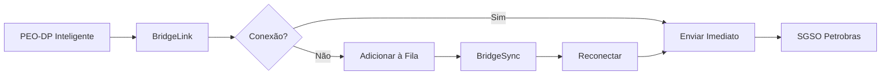

# 🌉 BridgeLink Module

Sistema de comunicação segura entre bordo e costa para transmissão de relatórios e eventos críticos do PEO-DP Inteligente ao SGSO Petrobras.

## 📋 Funcionalidades

- ✅ Envio seguro de relatórios técnicos (PDF)
- ✅ Transmissão de eventos críticos em tempo real
- ✅ Autenticação via token Bearer
- ✅ Sincronização offline/online com fila persistente
- ✅ API REST local para integração
- ✅ Rate limiting e segurança
- ✅ Retry automático com backoff exponencial

## 🏗️ Arquitetura

```
bridge_link/
├── bridge_core.py      # Comunicação segura com SGSO
├── bridge_api.py       # API REST local
├── bridge_sync.py      # Sincronização offline/online
└── README.md
```

## 📦 Instalação

```bash
# Instalar dependências
pip install -r ../requirements.txt

# Ou instalar manualmente
pip install requests flask flask-limiter PyJWT
```

## 🔧 Configuração

Configure as variáveis de ambiente:

```bash
# Endpoint SGSO Petrobras
export BRIDGE_ENDPOINT="https://sgso.petrobras.com.br/api"

# Token de autenticação
export BRIDGE_TOKEN="seu_token_bearer_aqui"

# Configurações da API local
export BRIDGE_API_PORT="5000"
export BRIDGE_API_USER="admin"
export BRIDGE_API_PASSWORD="sua_senha_segura"
export BRIDGE_SECRET_KEY="chave_secreta_jwt"
```

## 🚀 Uso Básico

### 1. BridgeCore - Comunicação Direta

```python
from bridge_link import BridgeCore

# Inicializar
bridge = BridgeCore(
    endpoint="https://sgso.petrobras.com.br/api",
    token="seu_token_aqui"
)

# Verificar conexão
if bridge.verificar_conexao():
    print("✅ Conexão OK")

# Enviar relatório
resultado = bridge.enviar_relatorio(
    arquivo_pdf="/path/to/relatorio.pdf",
    metadata={
        "embarcacao": "FPSO-123",
        "tipo": "auditoria_mensal",
        "data": "2025-01-15"
    }
)

# Enviar evento crítico
bridge.enviar_evento({
    "tipo": "loss_dp",
    "embarcacao": "FPSO-123",
    "severidade": "critica",
    "descricao": "Perda de posicionamento dinâmico no setor 3",
    "latitude": -23.5505,
    "longitude": -46.6333
})
```

### 2. BridgeSync - Sincronização Offline/Online

```python
from bridge_link import BridgeCore, BridgeSync, MessageType, MessagePriority

# Inicializar
bridge = BridgeCore(endpoint="...", token="...")
sync = BridgeSync(bridge_core=bridge)

# Adicionar mensagem à fila (funciona offline)
sync.add_to_queue(
    message_type=MessageType.EVENT,
    data={
        "tipo": "loss_dp",
        "embarcacao": "FPSO-123",
        "severidade": "critica"
    },
    priority=MessagePriority.CRITICAL
)

# Iniciar sincronização automática
sync.start()

# Sistema enviará automaticamente quando conexão estiver disponível
```

### 3. BridgeAPI - API REST Local

```bash
# Iniciar servidor API
python bridge_api.py
```

```python
# Fazer requisições à API
import requests

# 1. Autenticar
response = requests.post("http://localhost:5000/auth/login", json={
    "username": "admin",
    "password": "sua_senha"
})
token = response.json()["token"]

# 2. Enviar relatório
files = {"file": open("relatorio.pdf", "rb")}
headers = {"Authorization": f"Bearer {token}"}
response = requests.post(
    "http://localhost:5000/api/relatorio",
    files=files,
    headers=headers
)

# 3. Enviar evento
response = requests.post(
    "http://localhost:5000/api/evento",
    json={
        "tipo": "falha",
        "embarcacao": "FPSO-123",
        "severidade": "alta",
        "descricao": "Falha no sistema de propulsão"
    },
    headers=headers
)
```

## 🔄 Fluxo de Trabalho



## 📊 Estatísticas

```python
# Obter estatísticas da fila
stats = sync.get_statistics()
print(f"Total: {stats['total']}")
print(f"Pendentes: {stats['pending']}")
print(f"Processadas: {stats['processed']}")
print(f"Falhas: {stats['failed']}")
```

## ⚙️ Configurações Avançadas

### Rate Limiting

Configure limites de requisições na API:

```python
# bridge_api.py
limiter = Limiter(
    app=app,
    default_limits=["200 per day", "50 per hour"]
)
```

### Retry com Backoff

Configure tentativas de reenvio:

```python
sync = BridgeSync(
    bridge_core=bridge,
    max_retries=5,  # Máximo de 5 tentativas
    sync_interval=60  # Verificar a cada 60 segundos
)
```

### Cleanup Automático

```python
# Remover mensagens antigas (processadas há mais de 30 dias)
sync.cleanup_old_messages(days=30)
```

## 🔒 Segurança

- ✅ Autenticação Bearer Token para SGSO
- ✅ JWT para autenticação da API local
- ✅ Rate limiting para prevenir abuso
- ✅ Validação de entrada
- ✅ HTTPS recomendado em produção

## 🐛 Troubleshooting

### Erro de Conexão

```python
if not bridge.verificar_conexao():
    print("❌ Sem conexão com SGSO")
    print("Verifique:")
    print("- URL do endpoint")
    print("- Token de autenticação")
    print("- Conectividade de rede")
```

### Fila Crescendo

```python
stats = sync.get_statistics()
if stats['pending'] > 1000:
    print("⚠️ Fila muito grande!")
    print("- Verificar conexão")
    print("- Verificar logs de erro")
    print("- Considerar aumentar sync_interval")
```

## 📝 Logs

Logs são salvos automaticamente. Configure o nível:

```python
import logging
logging.basicConfig(level=logging.DEBUG)  # DEBUG, INFO, WARNING, ERROR
```

## 🧪 Testes

```bash
# Executar testes (requer pytest)
pytest tests/test_bridge_link.py -v

# Com cobertura
pytest tests/test_bridge_link.py --cov=bridge_link
```

## 📚 Referências

- NORMAM-101: Normas da Autoridade Marítima
- IMCA M 117: Guidelines for Design and Operation of DP Vessels
- [Documentação SGSO Petrobras](https://sgso.petrobras.com.br/docs)

## 🤝 Suporte

Para suporte ou dúvidas:
- Abrir issue no repositório
- Contatar equipe de desenvolvimento
- Consultar documentação completa

## 📄 Licença

MIT License - © 2025 Nautilus One
