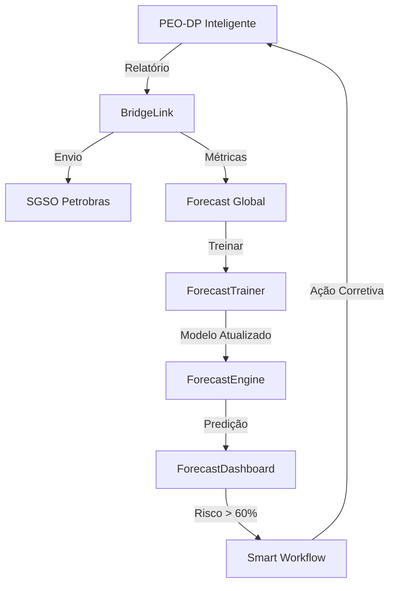

# 🔮 Forecast Global Module

Sistema de previsão baseado em aprendizado coletivo de frota. Utiliza Machine Learning para prever riscos de não-conformidade e falhas técnicas em múltiplas embarcações.

## 📋 Funcionalidades

- ✅ Previsão de risco de conformidade baseada em ML
- ✅ Aprendizado contínuo com dados de toda a frota
- ✅ Treinamento automático agendado
- ✅ Dashboard com métricas e alertas
- ✅ Suporte a múltiplos modelos (RandomForest, GradientBoosting)
- ✅ Explicabilidade de predições (feature importance)
- ✅ Alertas automáticos quando risco > 60%

## 🏗️ Arquitetura

```
forecast_global/
├── forecast_engine.py      # Motor de ML para previsão
├── forecast_trainer.py     # Sistema de treinamento contínuo
├── forecast_dashboard.py   # Visualização e alertas
└── README.md
```

## 📦 Instalação

```bash
# Instalar dependências
pip install -r ../requirements.txt

# Ou instalar manualmente
pip install pandas numpy scikit-learn joblib schedule
```

## 🔧 Configuração

Prepare seu dataset de treinamento (CSV):

```csv
horas_dp,falhas_mensais,eventos_asog,score_peodp,risco_conformidade
2400,3,1,85,0
1800,5,2,72,1
2600,1,0,92,0
```

Campos:
- `horas_dp`: Horas de operação em DP
- `falhas_mensais`: Número de falhas no mês
- `eventos_asog`: Eventos ASOG registrados
- `score_peodp`: Score de conformidade PEO-DP (0-100)
- `risco_conformidade`: 0 = baixo risco, 1 = alto risco

## 🚀 Uso Básico

### 1. ForecastEngine - Motor de Previsão

```python
from forecast_global import ForecastEngine

# Criar engine
engine = ForecastEngine(
    model_type="random_forest"  # ou "gradient_boosting"
)

# Treinar modelo
resultado = engine.treinar(
    dataset_csv="dados_frota.csv",
    test_size=0.2,
    validate=True
)

print(f"Acurácia: {resultado['metrics']['test_accuracy']:.4f}")
print(f"ROC-AUC: {resultado['metrics']['roc_auc']:.4f}")

# Fazer previsão
# [horas_dp, falhas_mensais, eventos_asog, score_peodp]
entrada = [2400, 3, 1, 85]
predicao = engine.prever(entrada)

print(f"Risco: {predicao['risco_percentual']}%")
print(f"Nível: {predicao['nivel_risco']}")
if 'recomendacao' in predicao:
    print(f"⚠️ {predicao['recomendacao']}")
```

### 2. ForecastTrainer - Treinamento Contínuo

```python
from forecast_global import ForecastEngine, ForecastTrainer

# Criar engine e trainer
engine = ForecastEngine()
trainer = ForecastTrainer(
    engine=engine,
    min_new_records=100,  # Mínimo de novos registros para retreinar
    performance_threshold=0.75  # Acurácia mínima
)

# Adicionar dados de relatório PEO-DP
relatorio = {
    "embarcacao": "FPSO-123",
    "horas_dp": 2400,
    "falhas_mensais": 3,
    "eventos_asog": 1,
    "score_peodp": 85,
    "teve_nao_conformidade": False
}

resultado = trainer.adicionar_dados_de_relatorio(relatorio)
print(f"✅ {resultado['records_added']} registros adicionados")

# Avaliar necessidade de retreinamento
avaliacao = trainer.avaliar_necessidade_retreinamento()
if avaliacao['needs_retraining']:
    print(f"🔄 Retreinamento necessário: {avaliacao['reason']}")
    resultado = trainer.retreinar_modelo()
    print(f"✅ Modelo retreinado: acurácia={resultado['test_accuracy']:.4f}")

# Agendar retreinamento automático
trainer.agendar_retreinamento_automatico(
    intervalo_dias=7,
    hora="03:00"
)

# Iniciar loop de retreinamento
trainer.executar_loop_retreinamento()  # Roda em background
```

### 3. ForecastDashboard - Visualização e Alertas

```python
from forecast_global import ForecastEngine, ForecastDashboard

# Criar engine e dashboard
engine = ForecastEngine()
engine.treinar("dados_frota.csv")

dashboard = ForecastDashboard(
    engine=engine,
    alert_threshold=60.0  # Alertar quando risco > 60%
)

# Registrar predição
predicao = engine.prever([2400, 3, 1, 85])
dashboard.registrar_predicao("FPSO-123", predicao)

# Métricas da frota
metricas = dashboard.get_metricas_frota()
print(f"Total de embarcações: {metricas['total_embarcacoes']}")
print(f"Risco médio: {metricas['risco_medio']}%")
print(f"Embarcações em risco: {metricas['embarcacoes_em_risco']}")

# Histórico de uma embarcação
historico = dashboard.get_historico_embarcacao("FPSO-123", dias=30)
print(f"Registros: {len(historico)}")

# Tendência de risco
tendencia = dashboard.get_tendencia_risco("FPSO-123", dias=7)
print(f"Tendência: {tendencia['emoji']} {tendencia['tendencia']}")

# Comparar embarcações
comparacao = dashboard.comparar_embarcacoes([
    "FPSO-123",
    "FPSO-456",
    "FPSO-789"
])
print("Ranking por risco:")
for item in comparacao['ranking']:
    print(f"  {item['embarcacao']}: {item['risco_percentual']}%")

# Relatório resumo
relatorio = dashboard.gerar_relatorio_resumo()
print(f"\n📊 Status da Frota:")
print(f"  Risco médio: {relatorio['status_frota']['risco_medio_frota']}%")
print(f"  Tendência: {relatorio['tendencia_7_dias']['emoji']} {relatorio['tendencia_7_dias']['tendencia']}")
print(f"  Alertas (24h): {relatorio['alertas_24h']}")
print("\nRecomendações:")
for rec in relatorio['recomendacoes']:
    print(f"  {rec}")

# Exportar relatório
dashboard.exportar_relatorio_csv(
    output_path="relatorio_frota.csv",
    dias=30
)
```

## 🔄 Fluxo Integrado



## 📊 Métricas e KPIs

### Feature Importance

```python
info = engine.get_model_info()
for feature, importance in info['feature_importance'].items():
    print(f"{feature}: {importance:.4f}")
```

Output exemplo:
```
score_peodp: 0.4523
horas_dp: 0.2891
falhas_mensais: 0.1876
eventos_asog: 0.0710
```

### Histórico de Treinamento

```python
stats = trainer.get_statistics()
print(f"Total de registros: {stats['total_records']}")
print(f"Total de treinamentos: {stats['total_trainings']}")
print(f"Último treinamento: {stats['last_training']}")
```

## 🎯 Classificação de Risco

| Risco % | Nível | Ação |
|---------|-------|------|
| 0-30% | Baixo | Monitoramento regular |
| 30-60% | Médio | Atenção aumentada |
| 60-80% | Alto | Criar ação preventiva |
| 80-100% | Crítico | Intervenção imediata |

## ⚙️ Configurações Avançadas

### Escolher Modelo ML

```python
# RandomForest (padrão) - Bom equilíbrio velocidade/acurácia
engine = ForecastEngine(model_type="random_forest")

# GradientBoosting - Maior acurácia, mais lento
engine = ForecastEngine(model_type="gradient_boosting")
```

### Ajustar Hiperparâmetros

Edite `forecast_engine.py`:

```python
def _create_model(self):
    if self.model_type == "random_forest":
        return RandomForestClassifier(
            n_estimators=200,      # Aumentar para mais árvores
            max_depth=10,          # Profundidade máxima
            min_samples_split=5,   # Mínimo para dividir
            random_state=42
        )
```

### Previsão em Lote

```python
# Prever para múltiplas embarcações de uma vez
df_resultados = engine.prever_lote(
    dataset_csv="embarcacoes_ativas.csv",
    output_csv="predicoes_resultado.csv"
)

# Filtrar alto risco
alto_risco = df_resultados[df_resultados['nivel_risco'].isin(['alto', 'critico'])]
print(f"Embarcações em alto risco: {len(alto_risco)}")
```

## 🔔 Sistema de Alertas

Alertas são gerados automaticamente quando:
- Risco > threshold (padrão: 60%)
- Tendência de risco aumentando
- Embarcação atinge nível crítico

Alertas são salvos em `data/dashboard/alertas.json`:

```json
{
  "tipo": "risco_elevado",
  "embarcacao": "FPSO-123",
  "timestamp": "2025-01-15T10:30:00",
  "risco_percentual": 78.5,
  "nivel_risco": "alto",
  "recomendacao": "Criar ação corretiva via Smart Workflow"
}
```

## 🧪 Validação do Modelo

### Métricas de Avaliação

```python
resultado = engine.treinar("dataset.csv", validate=True)

print("Acurácia Treino:", resultado['metrics']['train_accuracy'])
print("Acurácia Teste:", resultado['metrics']['test_accuracy'])
print("ROC-AUC:", resultado['metrics']['roc_auc'])
print("\nClassification Report:")
print(resultado['metrics']['classification_report'])
print("\nConfusion Matrix:")
print(resultado['metrics']['confusion_matrix'])
print("\nCV Scores:", resultado['metrics']['cv_scores'])
```

### Validação Cruzada

A validação cruzada (5-fold) é executada automaticamente durante o treinamento quando `validate=True`.

## 📈 Melhorando a Performance

### 1. Mais Dados

Quanto mais dados de diferentes embarcações, melhor o modelo aprende padrões globais.

### 2. Feature Engineering

Adicionar features derivadas:
- Taxa de falhas (falhas / horas_dp)
- Tendência de score (comparar com mês anterior)
- Indicadores sazonais

### 3. Ensemble de Modelos

Combinar múltiplos modelos para melhor predição.

## 🐛 Troubleshooting

### Modelo com Baixa Acurácia

```python
# 1. Verificar distribuição de classes
import pandas as pd
df = pd.read_csv("dataset.csv")
print(df['risco_conformidade'].value_counts())

# 2. Verificar correlações
print(df.corr())

# 3. Adicionar mais dados
# 4. Experimentar diferentes modelos
```

### Overfitting

Se acurácia de treino >> acurácia de teste:
- Reduzir `max_depth`
- Aumentar `min_samples_split`
- Adicionar mais dados de validação

### Underfitting

Se ambas acurácias são baixas:
- Aumentar `n_estimators`
- Adicionar features
- Tentar modelo mais complexo

## 📚 Referências

- [Scikit-learn Documentation](https://scikit-learn.org/)
- [Random Forest Classifier](https://scikit-learn.org/stable/modules/generated/sklearn.ensemble.RandomForestClassifier.html)
- [Gradient Boosting](https://scikit-learn.org/stable/modules/generated/sklearn.ensemble.GradientBoostingClassifier.html)
- NORMAM-101: Normas da Autoridade Marítima
- IMCA M 117: Guidelines for Design and Operation of DP Vessels

## 🤝 Suporte

Para suporte ou dúvidas:
- Abrir issue no repositório
- Contatar equipe de desenvolvimento
- Consultar documentação completa

## 📄 Licença

MIT License - © 2025 Nautilus One
