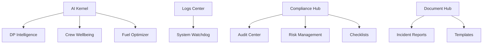

# 🔍 Nautilus One - Análise de Pendências e Roadmap de Desenvolvimento
**Data:** 2025-10-24  
**Versão:** PATCH 94.1  
**Status:** Análise Completa do Sistema

---

## 📊 RESUMO EXECUTIVO

### Visão Geral
- **Total de Módulos Registrados:** 90+ (incluindo auto-gerados)
- **Módulos Ativos:** ~50 módulos
- **Módulos Deprecated:** 5 módulos
- **Módulos Sem Implementação:** ~15 módulos
- **Problemas de Código:** 460+ instâncias de TODOs/@ts-nocheck/any[]
- **Tabelas Supabase:** 138 tabelas
- **Rotas Ativas:** 17 rotas principais

### Score de Completude
```
┌─────────────────────────────────┬──────────┐
│ Categoria                        │ Status   │
├─────────────────────────────────┼──────────┤
│ Core System                      │ 85% ✅   │
│ Operations Modules               │ 70% 🟡   │
│ Intelligence & AI                │ 65% 🟡   │
│ Compliance & Emergency           │ 75% ✅   │
│ Logistics & Planning             │ 60% 🟡   │
│ HR & Training                    │ 55% 🟡   │
│ Documents & Finance              │ 50% 🔴   │
│ Connectivity & Workspace         │ 65% 🟡   │
│ Code Quality                     │ 40% 🔴   │
└─────────────────────────────────┴──────────┘
```

---

## 🚨 PROBLEMAS CRÍTICOS

### 1. **Tabela `logs` Não Existe no Supabase**
**Prioridade:** 🔴 CRÍTICA  
**Módulo Afetado:** `core.logs-center` (PATCH 94.0)

**Problema:**
```typescript
// src/modules/logs-center/LogsCenter.tsx:76
const { data: logs, error, isLoading } = useQuery({
  queryKey: ['logs'],
  queryFn: async () => {
    const { data, error } = await supabase
      .from('logs') // ❌ Tabela não existe
      .select('*')
```

**Solução:**
```sql
-- Criar tabela logs
CREATE TABLE public.logs (
  id UUID PRIMARY KEY DEFAULT gen_random_uuid(),
  timestamp TIMESTAMPTZ NOT NULL DEFAULT now(),
  level TEXT NOT NULL CHECK (level IN ('info', 'warning', 'error', 'debug')),
  module TEXT NOT NULL,
  message TEXT NOT NULL,
  metadata JSONB,
  user_id UUID REFERENCES auth.users(id),
  created_at TIMESTAMPTZ NOT NULL DEFAULT now()
);

-- Índices para performance
CREATE INDEX idx_logs_timestamp ON logs(timestamp DESC);
CREATE INDEX idx_logs_level ON logs(level);
CREATE INDEX idx_logs_module ON logs(module);

-- RLS Policies
ALTER TABLE logs ENABLE ROW LEVEL SECURITY;

CREATE POLICY "Users can view their organization logs"
ON logs FOR SELECT
USING (true); -- Ajustar conforme regra de organização

CREATE POLICY "System can insert logs"
ON logs FOR INSERT
WITH CHECK (true);
```

### 2. **320+ Arquivos com @ts-nocheck/@ts-ignore**
**Prioridade:** 🔴 ALTA  
**Impacto:** Segurança de tipos, bugs ocultos, manutenção

**Arquivos Críticos:**
```
src/components/automation/smart-onboarding-wizard.tsx - @ts-nocheck
src/components/communication/integrated-communication-system.tsx - @ts-nocheck
src/components/compliance/ComplianceReporter.tsx - @ts-nocheck
src/components/control-hub/*.tsx - @ts-nocheck (4 arquivos)
src/components/crew/advanced-crew-dossier-interaction.tsx - @ts-nocheck
src/components/dashboard/enhanced-*.tsx - @ts-nocheck (2 arquivos)
```

**Solução:** Criar tipos adequados e remover progressivamente os @ts-nocheck

### 3. **Módulos Auto-Gerados Incorretos no Registry**
**Prioridade:** 🟡 MÉDIA

**Problema:**
```typescript
// src/modules/registry.ts:669-967
'.home.runner.work.travel-hr-buddy.travel-hr-buddy.src.modules.registry': {
  id: '.home.runner.work.travel-hr-buddy.travel-hr-buddy.src.modules.registry',
  name: 'Registry',
  category: 'features',
  path: '/home/runner/work/travel-hr-buddy/travel-hr-buddy/src/modules/registry',
  // ... 40+ entradas inválidas
```

**Solução:** Limpar o registry de entradas auto-geradas com paths absolutos

---

## 📋 MÓDULOS POR STATUS

### ✅ MÓDULOS COMPLETOS E FUNCIONAIS (15)

1. **core.dashboard** - Dashboard principal ✅
2. **core.system-watchdog** - Monitor autônomo (PATCH 93.0) ✅
3. **authentication** - Sistema de autenticação ✅
4. **features.price-alerts** - Alertas de preço ✅
5. **features.reservations** - Reservas ✅
6. **compliance.hub** - Hub de compliance (PATCH 92.0) ✅
7. **operations.crew** - Gestão de tripulação ✅
8. **operations.fleet** - Gestão de frota ✅
9. **intelligence.ai-insights** - IA insights ✅
10. **connectivity.communication** - Comunicação ✅
11. **features.weather** - Dashboard meteorológico ✅
12. **documents.hub** - Hub de documentos (PATCH 91.1) ✅
13. **hr.training** - Academia de treinamento ✅
14. **emergency.response** - Resposta emergencial ✅
15. **planning.voyage** - Planejamento de viagem ✅

### 🟡 MÓDULOS PARCIALMENTE IMPLEMENTADOS (25)

#### **1. core.logs-center** (PATCH 94.0)
**Problema:** Tabela `logs` não existe  
**Completude:** 85%  
**Ação:** Criar migration Supabase

#### **2. operations.maritime-system**
**Problema:** 3 implementações diferentes, sem consolidação  
**Completude:** 70%  
**Ação:** Consolidar em única implementação

#### **3. intelligence.dp-intelligence**
**Problema:** IA com fallback genérico, falta padrão específico no kernel  
**Completude:** 75%  
**Ação:** Adicionar padrão `dp-analysis` no ai/kernel.ts

#### **4. operations.performance**
**Problema:** Métricas mockadas, sem dados reais  
**Completude:** 60%  
**Ação:** Implementar queries reais no Supabase

#### **5. operations.crew-wellbeing**
**Problema:** UI completa mas sem integração IA  
**Completude:** 65%  
**Ação:** Adicionar análise preditiva de saúde

#### **6. compliance.audit-center** (DEPRECATED)
**Problema:** Marcado como deprecated, mas ainda em uso  
**Completude:** 80%  
**Ação:** Migrar funcionalidades para compliance.hub

#### **7. emergency.risk-management** (DEPRECATED)
**Problema:** Marcado como deprecated, mas ainda em uso  
**Completude:** 75%  
**Ação:** Migrar para compliance.hub

#### **8. features.checklists** (DEPRECATED)
**Problema:** Sistema legado ainda referenciado  
**Completude:** 70%  
**Ação:** Migrar para compliance.hub

#### **9. logistics.hub**
**Problema:** Tabelas parciais, sem IA  
**Completude:** 55%  
**Ação:** Implementar tabelas completas + IA

#### **10. logistics.fuel-optimizer**
**Problema:** Mock data, sem algoritmo real  
**Completude:** 50%  
**Ação:** Implementar otimização com IA

#### **11. logistics.satellite-tracker**
**Problema:** UI placeholder, sem API real  
**Completude:** 40%  
**Ação:** Integrar API de rastreamento

#### **12. maintenance.planner**
**Problema:** Dados estáticos, sem predição IA  
**Completude:** 60%  
**Ação:** Adicionar manutenção preditiva

#### **13. connectivity.channel-manager**
**Problema:** Sem integração WebRTC/MQTT  
**Completude:** 65%  
**Ação:** Implementar real-time communication

#### **14. connectivity.api-gateway**
**Problema:** Placeholder, sem proxy real  
**Completude:** 30%  
**Ação:** Implementar gateway funcional

#### **15. connectivity.notifications**
**Problema:** Sem push notifications  
**Completude:** 70%  
**Ação:** Integrar FCM/OneSignal

#### **16. workspace.realtime**
**Problema:** Sem sincronização Y.js  
**Completude:** 50%  
**Ação:** Implementar CRDT sync

#### **17. workspace.collaboration**
**Problema:** UI básica, sem funcionalidades colaborativas  
**Completude:** 45%  
**Ação:** Adicionar co-editing, cursors, awareness

#### **18. assistants.voice**
**Problema:** Sem reconhecimento de voz real  
**Completude:** 40%  
**Ação:** Integrar Web Speech API ou Whisper

#### **19. finance.hub**
**Problema:** Placeholder completo  
**Completude:** 20%  
**Ação:** Implementar gestão financeira

#### **20. documents.incident-reports**
**Problema:** Formulário básico, sem IA  
**Completude:** 60%  
**Ação:** Adicionar análise automática

#### **21. config.settings** (DEPRECATED)
**Problema:** "No implementation", deprecated  
**Completude:** 0%  
**Ação:** Remover do registry

#### **22. config.user-management**
**Problema:** UI básica, sem permissões granulares  
**Completude:** 55%  
**Ação:** Implementar RBAC completo

#### **23. features.vault-ai**
**Problema:** Semantic search incompleto  
**Completude:** 60%  
**Ação:** Implementar embeddings + vector search

#### **24. features.task-automation**
**Problema:** Workflows mockados  
**Completude:** 50%  
**Ação:** Implementar engine de automação

#### **25. features.project-timeline**
**Problema:** Timeline estática  
**Completude:** 55%  
**Ação:** Adicionar edição drag-and-drop

### 🔴 MÓDULOS NÃO IMPLEMENTADOS (10)

#### **1. core.shared** (DEPRECATED)
**Status:** Deprecated, sem uso  
**Ação:** Remover completamente

#### **2. intelligence.analytics**
**Status:** Placeholder  
**Ação:** Implementar analytics engine

#### **3. intelligence.automation**
**Status:** Stub básico  
**Ação:** Implementar workflows inteligentes

#### **4. emergency.mission-control**
**Status:** UI placeholder  
**Ação:** Implementar centro de controle

#### **5. emergency.mission-logs**
**Status:** Formulário básico  
**Ação:** Implementar logging estruturado

#### **6. hr.peo-dp**
**Status:** Integração não funcional  
**Ação:** Implementar integração real

#### **7. hr.employee-portal**
**Status:** Portal básico  
**Ação:** Adicionar self-service completo

#### **8. connectivity.integrations-hub**
**Status:** Placeholder  
**Ação:** Implementar hub de integrações

#### **9. documents.templates**
**Status:** Lista vazia  
**Ação:** Implementar sistema de templates

#### **10. features.travel**
**Status:** Stub básico  
**Ação:** Implementar gestão de viagens

---

## 🗄️ ANÁLISE DE BANCO DE DADOS

### Tabelas Existentes sem Módulos Correspondentes

1. **ai_context_log** ✅ - Usado pelo AI Kernel
2. **ai_reports** ❌ - Sem módulo de relatórios IA
3. **ai_suggestions** ❌ - Sem módulo de sugestões
4. **automation_executions** 🟡 - Módulo task-automation incompleto
5. **automation_workflows** 🟡 - Módulo task-automation incompleto
6. **copilot_conversations/messages** ✅ - Usado pelo Copilot
7. **crew_ai_insights/recommendations** 🟡 - Integração IA parcial
8. **crew_gamification_profiles** ❌ - Sem módulo gamification
9. **employee_certificates** ❌ - Sem módulo de certificação de funcionários
10. **error_logs** ✅ - Usado pelo System Watchdog
11. **help_center_analytics** 🟡 - Módulo help-center sem analytics
12. **ia_response_cache** ✅ - Usado pelo AI Kernel
13. **intelligent_notifications** 🟡 - Notifications center sem IA
14. **knowledge_base** ✅ - Usado pelo admin
15. **nautilus_workflows** ❌ - Sem módulo workflows
16. **onboarding_progress** ❌ - Sem módulo onboarding
17. **organization_billing** ❌ - Sem módulo billing
18. **peotram_* (7 tabelas)** 🟡 - Módulo PEOTRAM incompleto
19. **saas_* (2 tabelas)** ❌ - Sem módulo SaaS management
20. **system_context_snapshots** ✅ - Usado pelo System Watchdog
21. **tenant_* (6 tabelas)** 🟡 - Multi-tenancy parcial
22. **user_achievements** ❌ - Sem módulo gamification
23. **user_recommendations** ❌ - Sem módulo de recomendações
24. **ux_metrics** ❌ - Sem módulo analytics UX
25. **voice_* (5 tabelas)** 🟡 - Módulo voice-assistant incompleto
26. **watchdog_logs** ✅ - Usado pelo System Watchdog
27. **workflow_* (2 tabelas)** ❌ - Sem módulo workflows

### Módulos sem Tabelas Correspondentes

1. **operations.performance** - Sem tabela `performance_metrics_detailed`
2. **logistics.fuel-optimizer** - Sem tabela `fuel_optimization_history`
3. **maintenance.planner** - Usa `maintenance_schedules` ✅
4. **connectivity.api-gateway** - Sem tabela `api_gateway_logs`
5. **workspace.realtime** - Sem tabela `workspace_sessions`
6. **finance.hub** - Sem tabelas finance_*
7. **documents.templates** - Sem tabela `document_templates`
8. **features.travel** - Usa `travel_*` existentes 🟡

---

## 🔧 PROBLEMAS DE CÓDIGO

### Arquivos com @ts-nocheck (20+ críticos)

```typescript
// 🔴 Prioridade ALTA - Remover @ts-nocheck
src/components/automation/smart-onboarding-wizard.tsx
src/components/communication/integrated-communication-system.tsx
src/components/compliance/ComplianceReporter.tsx
src/components/control-hub/AIInsightReporter.tsx
src/components/control-hub/ControlHubPanel.tsx
src/components/control-hub/SystemAlerts.tsx
src/components/crew/advanced-crew-dossier-interaction.tsx
src/components/dashboard/enhanced-dashboard.tsx
src/components/dashboard/enhanced-unified-dashboard.tsx
```

### Uso de `any[]` (25+ instâncias)

```typescript
// src/ai/kernel.ts:658
export function getAIContextLogs(module?: string): any[] // ❌

// src/components/communication/inbox-manager.tsx:54
attachments?: any[]; // ❌

// src/components/crew/advanced-crew-dossier-interaction.tsx
badges_earned: any[]; // ❌
achievements: any[]; // ❌

// src/components/crew/crew-ai-insights.tsx
const [recommendations, setRecommendations] = useState<any[]>([]); // ❌
const [rotations, setRotations] = useState<any[]>([]); // ❌
const [skillGaps, setSkillGaps] = useState<any[]>([]); // ❌
```

### TODOs Críticos (60+)

```typescript
// src/components/admin/organization-stats-cards.tsx:16
value: "0", // TODO: buscar dados reais

// src/components/ai/advanced-ai-insights.tsx:175
// TODO: Open implementation workflow dialog

// src/components/ai/integrated-ai-assistant.tsx:437
// TODO: Implement settings dialog

// src/components/ai/nautilus-copilot-advanced.tsx:262
// TODO: Open maintenance scheduling dialog

// src/components/auth/protected-route.tsx:32
// TODO: Add permission checking logic

// src/components/cert/CertViewer.tsx:60
// TODO: Implementar função RPC validate_cert_token

// src/components/automation/automated-reports-manager.tsx:2
// TODO: Implement automated reports functionality

// src/components/automation/automation-workflows-manager.tsx:2
// TODO: Implement automation workflows functionality
```

---

## 🎯 ROADMAP DE DESENVOLVIMENTO

### 🔴 FASE 1: CORREÇÕES CRÍTICAS (1-2 semanas)

#### PATCH 94.2 - Database Fixes
**Prioridade:** CRÍTICA  
**Tempo:** 2 dias

1. **Criar tabela `logs`**
   ```sql
   -- Migration: 20251024_create_logs_table.sql
   -- Ver SQL completo na seção "Problemas Críticos"
   ```

2. **Criar tabela `ai_reports`**
   ```sql
   CREATE TABLE public.ai_reports (
     id UUID PRIMARY KEY DEFAULT gen_random_uuid(),
     module TEXT NOT NULL,
     report_type TEXT NOT NULL,
     content JSONB NOT NULL,
     generated_at TIMESTAMPTZ DEFAULT now(),
     user_id UUID REFERENCES auth.users(id)
   );
   ```

3. **Criar tabela `document_templates`**
   ```sql
   CREATE TABLE public.document_templates (
     id UUID PRIMARY KEY DEFAULT gen_random_uuid(),
     name TEXT NOT NULL,
     category TEXT NOT NULL,
     template_content TEXT NOT NULL,
     variables JSONB,
     created_at TIMESTAMPTZ DEFAULT now()
   );
   ```

#### PATCH 94.3 - Registry Cleanup
**Prioridade:** ALTA  
**Tempo:** 1 dia

1. **Remover entradas auto-geradas incorretas**
   - Limpar linhas 669-967 do registry.ts
   - Remover paths absolutos `/home/runner/work/...`

2. **Consolidar módulos deprecated**
   - Mover `compliance.audit-center` → `compliance.hub`
   - Mover `emergency.risk-management` → `compliance.hub`
   - Mover `features.checklists` → `compliance.hub`
   - Remover `core.shared` e `config.settings`

#### PATCH 94.4 - TypeScript Fixes (Parte 1)
**Prioridade:** ALTA  
**Tempo:** 3 dias

1. **Remover @ts-nocheck dos arquivos críticos**
   - `smart-onboarding-wizard.tsx`
   - `integrated-communication-system.tsx`
   - `ComplianceReporter.tsx`
   - `control-hub/*.tsx` (4 arquivos)

2. **Criar tipos adequados**
   ```typescript
   // src/types/crew.ts
   export interface CrewBadge {
     id: string;
     name: string;
     icon: string;
     earned_at: string;
   }

   export interface CrewAchievement {
     id: string;
     title: string;
     description: string;
     points: number;
     unlocked_at: string;
   }
   ```

### 🟡 FASE 2: MÓDULOS PRIORITÁRIOS (3-4 semanas)

#### PATCH 95.0 - Logistics Hub Complete
**Tempo:** 1 semana

1. **Implementar tabelas faltantes**
   ```sql
   CREATE TABLE fuel_consumption_history (...);
   CREATE TABLE logistics_routes (...);
   CREATE TABLE supply_chain_events (...);
   ```

2. **Adicionar IA para otimização**
   - Padrão `fuel-optimization` no ai/kernel.ts
   - Algoritmo de otimização de rotas
   - Predição de consumo

3. **UI completa**
   - Dashboard de logística
   - Visualização de rotas
   - Alertas de suprimento

#### PATCH 96.0 - Finance Hub Implementation
**Tempo:** 1 semana

1. **Criar módulo finance**
   ```
   src/modules/finance/
   ├── components/
   │   ├── FinanceOverview.tsx
   │   ├── ExpenseTracker.tsx
   │   ├── BudgetPlanner.tsx
   │   └── FinancialReports.tsx
   ├── hooks/
   │   └── useFinance.ts
   ├── services/
   │   └── financeService.ts
   └── index.tsx
   ```

2. **Criar tabelas**
   ```sql
   CREATE TABLE financial_transactions (...);
   CREATE TABLE budgets (...);
   CREATE TABLE invoices (...);
   ```

3. **Integrar com existing expenses table**

#### PATCH 97.0 - Voice Assistant Complete
**Tempo:** 1 semana

1. **Implementar Web Speech API**
   ```typescript
   // src/services/voiceRecognition.ts
   export class VoiceRecognitionService {
     recognition: SpeechRecognition;
     // ...
   }
   ```

2. **Adicionar comandos de voz**
   - Navegação
   - Consultas
   - Ações rápidas

3. **UI de feedback**
   - Visualização de onda sonora
   - Transcrição em tempo real
   - Confirmação de comandos

#### PATCH 98.0 - Workspace Collaboration
**Tempo:** 1 semana

1. **Implementar Y.js CRDT**
   ```typescript
   // src/services/collaboration.ts
   import * as Y from 'yjs';
   import { WebrtcProvider } from 'y-webrtc';
   ```

2. **Adicionar funcionalidades**
   - Co-editing de documentos
   - Cursors de múltiplos usuários
   - Presence awareness
   - Chat em tempo real

3. **Criar tabela workspace_sessions**

### 🟢 FASE 3: MELHORIAS E EXPANSÃO (4-6 semanas)

#### PATCH 99.0 - AI Enhancements
**Tempo:** 2 semanas

1. **Adicionar padrões IA faltantes**
   ```typescript
   // src/ai/kernel.ts
   case 'fuel-optimization': // ✅ Novo
   case 'crew-wellbeing': // ✅ Novo
   case 'financial-analysis': // ✅ Novo
   case 'voice-command': // ✅ Novo
   ```

2. **Implementar AI Reports module**
3. **Melhorar precisão das predições**

#### PATCH 100.0 - Gamification System
**Tempo:** 1 semana

1. **Criar módulo gamification**
2. **Usar tabelas existentes**
   - user_achievements
   - crew_gamification_profiles
3. **UI de rankings e badges**

#### PATCH 101.0 - Billing & SaaS Management
**Tempo:** 2 semanas

1. **Criar admin billing module**
2. **Integrar Stripe/Paddle**
3. **Dashboard de métricas SaaS**
4. **Usar tabelas existentes**
   - organization_billing
   - saas_plans
   - saas_tenants

#### PATCH 102.0 - Workflow Engine
**Tempo:** 2 semanas

1. **Implementar workflow engine completo**
2. **UI de workflow builder**
3. **Integração com automation_workflows**
4. **Triggers e actions configuráveis**

---

## 📈 MÉTRICAS DE SUCESSO

### Antes (Atual - PATCH 94.0)
```
┌──────────────────────────┬─────────┐
│ Métrica                  │ Valor   │
├──────────────────────────┼─────────┤
│ Módulos Completos        │ 15/90   │
│ Cobertura de Tipos       │ 40%     │
│ Tabelas sem Módulo       │ 27      │
│ @ts-nocheck Files        │ 20+     │
│ TODOs Críticos           │ 60+     │
│ Build Errors             │ 1       │
│ Deprecated Modules       │ 5       │
└──────────────────────────┴─────────┘
```

### Após Fase 1 (PATCH 94.4)
```
┌──────────────────────────┬─────────┐
│ Métrica                  │ Valor   │
├──────────────────────────┼─────────┤
│ Módulos Completos        │ 20/85   │
│ Cobertura de Tipos       │ 65%     │
│ Tabelas sem Módulo       │ 24      │
│ @ts-nocheck Files        │ 10      │
│ TODOs Críticos           │ 40      │
│ Build Errors             │ 0       │
│ Deprecated Modules       │ 0       │
└──────────────────────────┴─────────┘
```

### Após Fase 2 (PATCH 98.0)
```
┌──────────────────────────┬─────────┐
│ Métrica                  │ Valor   │
├──────────────────────────┼─────────┤
│ Módulos Completos        │ 35/85   │
│ Cobertura de Tipos       │ 80%     │
│ Tabelas sem Módulo       │ 15      │
│ @ts-nocheck Files        │ 2       │
│ TODOs Críticos           │ 15      │
│ Build Errors             │ 0       │
│ Deprecated Modules       │ 0       │
└──────────────────────────┴─────────┘
```

### Meta Final (PATCH 102.0)
```
┌──────────────────────────┬─────────┐
│ Métrica                  │ Valor   │
├──────────────────────────┼─────────┤
│ Módulos Completos        │ 60/85   │
│ Cobertura de Tipos       │ 95%     │
│ Tabelas sem Módulo       │ 5       │
│ @ts-nocheck Files        │ 0       │
│ TODOs Críticos           │ 0       │
│ Build Errors             │ 0       │
│ Deprecated Modules       │ 0       │
└──────────────────────────┴─────────┘
```

---

## 🎬 PRÓXIMOS PASSOS IMEDIATOS

### Esta Semana (Prioridade CRÍTICA)

1. **Criar tabela `logs`**
   ```bash
   # Executar migration via Supabase Dashboard ou CLI
   supabase migration new create_logs_table
   # Adicionar SQL da seção "Problemas Críticos"
   supabase db push
   ```

2. **Testar módulo logs-center**
   ```bash
   npm run dev
   # Acessar http://localhost:5173/dashboard/logs-center
   # Verificar funcionamento completo
   ```

3. **Limpar MODULE_REGISTRY**
   - Editar `src/modules/registry.ts`
   - Remover linhas 669-967 (entradas auto-geradas)
   - Validar com `npm run type-check`

4. **Fix build error** (se ainda existir)
   - Verificar import do LogsCenter
   - Testar build completo

### Próxima Semana

1. **PATCH 94.3** - Registry cleanup completo
2. **PATCH 94.4** - Remover @ts-nocheck dos 5 arquivos críticos
3. **Começar PATCH 95.0** - Logistics Hub

---

## 📝 NOTAS FINAIS

### Dependências Entre Módulos


### Riscos Identificados

1. **Performance**
   - 138 tabelas Supabase podem gerar queries lentas
   - Falta de índices em algumas tabelas críticas
   - Considerar particionamento de logs

2. **Segurança**
   - Revisar RLS policies em todas as tabelas
   - Audit trail incompleto
   - Falta validação de permissões granulares

3. **Escalabilidade**
   - Real-time subscriptions podem sobrecarregar
   - Cache strategy não definida
   - CDN não configurado para assets

### Recursos Necessários

- **Backend:** 1 desenvolvedor full-time
- **Frontend:** 2 desenvolvedores (1 senior, 1 pleno)
- **DevOps:** 0.5 desenvolvedor (part-time)
- **QA:** 1 tester
- **Tempo Total:** 10-12 semanas (Fases 1-3)

---

**Gerado em:** 2025-10-24  
**Versão do Relatório:** 1.0  
**Próxima Revisão:** Após PATCH 94.4

🌊 _"Navegando rumo à excelência operacional"_
