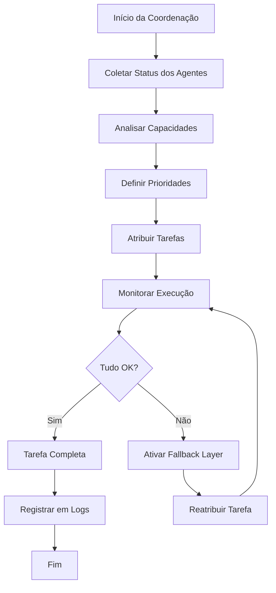

# 🔬 Módulo: Coordination AI

## 📌 Objetivo
Sistema de coordenação multi-agente com capacidade de análise, atribuição automática de tarefas e gestão de frotas de dispositivos (drones, surface bots e sensores) dentro do ecossistema Nautilus One. O módulo atua como orquestrador central para operações autônomas e colaborativas.

## 📁 Estrutura de Arquivos
- `coordinationAI.ts` — lógica central de análise e atribuição de tarefas
- `fallbackLayer.ts` — camada de contingência e recuperação
- `aiFleetStatus.tsx` — componente de status da frota AI
- `CoordinationAIPanel.tsx` — UI principal do painel de coordenação
- `services/coordinationService.ts` — serviço de coordenação de agentes
- `validation/` — validação de dados e regras de coordenação
- `components/` — componentes UI especializados
- `index.ts` — exports públicos do módulo

## 🔗 Integrações

### Supabase
Tabelas envolvidas:
- `coordination_agents` — registro de agentes disponíveis
- `coordination_tasks` — tarefas atribuídas e em execução
- `coordination_logs` — histórico de ações e decisões

### MQTT
Tópicos relevantes:
- `nautilus/coordination/tasks` — publicação de novas tarefas
- `nautilus/coordination/agents/+/status` — status de agentes
- `nautilus/coordination/assignments` — atribuições de tarefas

### IA
- **Análise de capacidades**: Avalia status e capacidades de dispositivos
- **Atribuição inteligente**: Distribui tarefas baseado em prioridade, saúde do dispositivo e capacidades
- **Previsão de falhas**: Identifica agentes em risco antes de falhas

## 🔄 Fluxo Operacional



## 🧪 Testes

### Unitários
✅ **Sim** - Cobertura de lógica de atribuição e análise

Localização: `__tests__/coordination-ai/`

Principais testes:
- `coordinationAI.test.ts` — testes da lógica de coordenação
- `fallbackLayer.test.ts` — testes da camada de contingência
- `coordinationService.test.ts` — testes do serviço

### E2E
🚧 **Em andamento** - Testes de integração completa em desenvolvimento

### Mocks
✅ **Disponíveis** em `services/coordinationService.ts`
- Mock de agentes (drones, bots, sensores)
- Mock de tarefas com diferentes prioridades
- Simulação de falhas e recuperação

## 📋 Status Atual

- [x] Estrutura criada (PATCH 175.0)
- [x] Integração com drone-commander
- [x] Integração com surface-bot
- [x] Lógica de IA conectada
- [x] UI funcional (PATCH 471)
- [x] Sistema multi-agente implementado
- [x] Serviço de coordenação ativo
- [ ] Integração MQTT completa
- [ ] Testes E2E finalizados
- [ ] Documentação de API completa

## 🎯 Tipos Exportados

### Principais Interfaces
```typescript
// Status de dispositivos
interface DeviceStatus {
  id: string;
  type: "drone" | "surfacebot" | "sensor";
  status: string;
  health: number; // 0-100
  capabilities: string[];
}

// Atribuição de tarefas
interface TaskAssignment {
  id: string;
  deviceId: string;
  task: string;
  priority: "low" | "medium" | "high" | "critical";
  status: "pending" | "assigned" | "in_progress" | "completed";
  timestamp: Date;
}

// Agentes coordenados
interface Agent {
  id: string;
  name: string;
  type: AgentType;
  status: AgentStatus;
  capabilities: string[];
}
```

## 🔧 Uso Básico

```typescript
import { coordinationAI } from '@/modules/coordination-ai';

// Analisar e atribuir tarefas automaticamente
const assignments = coordinationAI.analyzeAndAssign();

// Obter status da frota
const fleetStatus = coordinationAI.getFleetStatus();

// Atribuir tarefa específica
coordinationAI.assignTask(deviceId, task, priority);
```

---

**Versão**: PATCH 471  
**Última Atualização**: 2025-10-30  
**Status**: 🟢 Ativo e Funcional
