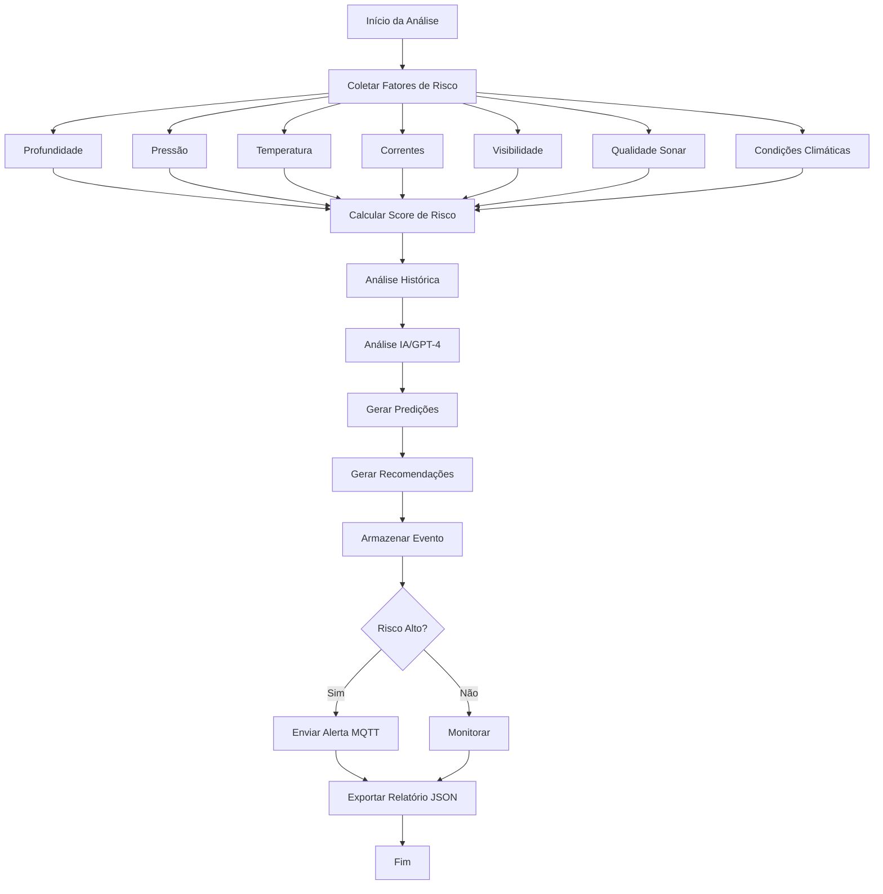

# 🔬 Módulo: Deep Risk AI

## 📌 Objetivo
Sistema de análise de risco com IA para operações em águas profundas, capaz de avaliar múltiplos fatores oceanográficos, prever riscos, gerar recomendações inteligentes e manter histórico de eventos para análise preditiva dentro do ecossistema Nautilus One.

## 📁 Estrutura de Arquivos
- `index.tsx` — UI principal do módulo e lógica de interface
- `services/deepRiskAIService.ts` — serviço de análise de risco com IA
- `components/` — componentes especializados para visualização
- `types/` — definições TypeScript de fatores e scores de risco
- `validation/` — validação de dados oceanográficos

## 🔗 Integrações

### Supabase
Tabelas envolvidas:
- `deep_risk_events` — histórico de análises de risco
- `risk_recommendations` — recomendações geradas pela IA
- `oceanographic_data` — dados históricos oceanográficos
- `incident_logs` — integração com logs de incidentes

### MQTT
Tópicos relevantes:
- `nautilus/sensors/depth` — dados de profundidade
- `nautilus/sensors/pressure` — dados de pressão
- `nautilus/sensors/temperature` — temperatura da água
- `nautilus/sensors/currents` — correntes marinhas
- `nautilus/risk/alerts` — alertas de risco crítico

### IA
- **OpenAI GPT-4**: Análise contextual e geração de recomendações
- **ONNX Runtime**: Modelos de ML para análise preditiva de riscos
- **Analytics Core**: Integração com motor de analytics para análise histórica
- **Forecast Data**: Integração com dados de previsão meteorológica

## 🔄 Fluxo Operacional



## 🧪 Testes

### Unitários
✅ **Sim** - Cobertura de cálculo de risco e análise

Localização: `__tests__/deep-risk-ai/`

Principais testes:
- `deepRiskAIService.test.ts` — testes do serviço de análise
- `riskCalculation.test.ts` — testes de cálculo de score
- `historicalAnalysis.test.ts` — testes de análise histórica

### E2E
🚧 **Em andamento** - Testes de integração com sensores em desenvolvimento

### Mocks
✅ **Disponíveis** em `services/deepRiskAIService.ts`
- Dados oceanográficos simulados
- Histórico de eventos de risco
- Respostas de IA mockadas

## 📋 Status Atual

- [x] Estrutura criada (PATCH 433)
- [x] Integração com analytics-core
- [x] Integração com incident logs
- [x] Integração com forecast data
- [x] Lógica de IA conectada (GPT-4)
- [x] UI funcional com dashboard em tempo real
- [x] Análise multi-fator implementada
- [x] Sistema de recomendações ativo
- [x] Análise preditiva com detecção de tendências
- [x] Exportação de relatórios JSON
- [x] Event logging e tracking
- [ ] Integração MQTT completa
- [ ] Testes E2E finalizados
- [ ] Modelos ONNX otimizados

## 🎯 Tipos Exportados

### Principais Interfaces
```typescript
// Fatores de risco oceanográficos
interface RiskFactors {
  depth: number;           // metros
  pressure: number;        // bar
  temperature: number;     // celsius
  current: number;         // knots
  visibility: number;      // metros
  sonarQuality: number;    // 0-100
  windSpeed: number;       // knots
  waveHeight: number;      // metros
}

// Score de risco calculado
interface RiskScore {
  overall: number;         // 0-100
  category: "Low" | "Medium" | "High" | "Critical";
  factors: {
    depth: number;
    pressure: number;
    environmental: number;
    operational: number;
  };
  timestamp: Date;
}

// Recomendações geradas por IA
interface RiskRecommendation {
  id: string;
  priority: "low" | "medium" | "high" | "critical";
  category: string;
  recommendation: string;
  reasoning: string;
  timestamp: Date;
}
```

## 🔧 Uso Básico

```typescript
import { deepRiskAIService } from '@/modules/deep-risk-ai/services/deepRiskAIService';

// Analisar risco com fatores oceanográficos
const riskScore = await deepRiskAIService.analyzeRisk({
  depth: 100,
  pressure: 11,
  temperature: 8,
  current: 1.5,
  visibility: 12,
  sonarQuality: 85,
  windSpeed: 15,
  waveHeight: 2
});

// Obter recomendações
const recommendations = await deepRiskAIService.getRecommendations(riskScore);

// Obter histórico de eventos
const history = await deepRiskAIService.getRiskEventHistory(20);

// Análise preditiva
const prediction = await deepRiskAIService.predictRiskTrend(riskScore);
```

## 📊 Dashboards Disponíveis

- **Real-Time Risk Dashboard**: Visualização em tempo real de scores
- **Historical Trends**: Análise de tendências históricas
- **Predictive Analysis**: Predições baseadas em ML
- **Recommendations Panel**: Painel de recomendações priorizadas
- **Event History**: Histórico completo de eventos de risco

---

**Versão**: PATCH 433  
**Última Atualização**: 2025-10-30  
**Status**: 🟢 Ativo e Funcional
