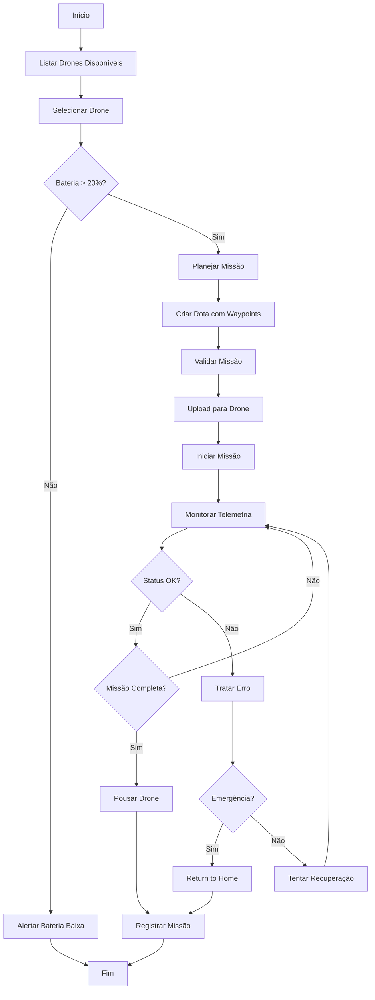

# 🔬 Módulo: Drone Commander

## 📌 Objetivo
Sistema de controle e coordenação de UAVs (Unmanned Aerial Vehicles) para operações aéreas autônomas, incluindo planejamento de missões, upload de rotas, telemetria em tempo real e gestão de frotas de drones dentro do ecossistema Nautilus One.

## 📁 Estrutura de Arquivos
- `droneCommander.ts` — lógica central de comando e controle de drones
- `missionUploader.ts` — sistema de upload e validação de missões
- `droneTelemetryStream.tsx` — componente de telemetria em tempo real
- `services/` — serviços de comunicação e controle
- `simulator/` — simulador de drones para testes
- `types/` — definições TypeScript de rotas, comandos e status
- `validation/` — validação de missões e comandos
- `components/` — componentes UI especializados
- `index.ts` — exports públicos do módulo

## 🔗 Integrações

### Supabase
Tabelas envolvidas:
- `drones` — registro de drones disponíveis
- `drone_missions` — missões planejadas e executadas
- `drone_telemetry` — dados de telemetria históricos
- `drone_waypoints` — waypoints e rotas de missões

### MQTT
Tópicos relevantes:
- `nautilus/drones/+/telemetry` — telemetria de cada drone
- `nautilus/drones/+/command` — envio de comandos
- `nautilus/drones/+/status` — status operacional
- `nautilus/drones/missions/upload` — upload de missões
- `nautilus/drones/fleet/coordination` — coordenação de frota

### IA
- **Route Optimization**: Otimização de rotas com IA
- **Collision Avoidance**: Sistema de prevenção de colisões
- **Battery Management**: Gestão inteligente de bateria
- **Mission Planning**: Planejamento autônomo de missões

## 🔄 Fluxo Operacional



## 🧪 Testes

### Unitários
✅ **Sim** - Cobertura de comandos e validação de missões

Localização: `__tests__/drone-commander/`

Principais testes:
- `droneCommander.test.ts` — testes de comando e controle
- `missionUploader.test.ts` — testes de upload de missões
- `droneSimulator.test.ts` — testes do simulador

### E2E
🚧 **Em andamento** - Testes de missões completas em desenvolvimento

### Mocks
✅ **Disponíveis** em `simulator/droneSimulator.ts`
- Simulador completo de drones
- Telemetria mockada realista
- Resposta a comandos simulada
- Cenários de falha e recuperação

## 📋 Status Atual

- [x] Estrutura criada (PATCH 172.0)
- [x] Sistema de comando implementado
- [x] Upload de missões funcional
- [x] Telemetria em tempo real
- [x] Simulador de drones ativo
- [x] Validação de missões implementada
- [x] UI de controle funcional
- [x] Integração com coordination-ai
- [ ] Integração MQTT completa
- [ ] Testes E2E finalizados
- [ ] Sistema de collision avoidance
- [ ] IA de route optimization ativa

## 🎯 Tipos Exportados

### Principais Interfaces
```typescript
// Posição do drone
interface DronePosition {
  lat: number;
  lng: number;
  altitude: number;
  heading: number;
}

// Waypoint de missão
interface DroneWaypoint {
  lat: number;
  lng: number;
  altitude: number;
  action?: "hover" | "photo" | "video";
  duration?: number;
}

// Rota completa
interface DroneRoute {
  id: string;
  waypoints: DroneWaypoint[];
  totalDistance: number;
  estimatedDuration: number;
}

// Status do drone
interface DroneStatus {
  id: string;
  name: string;
  battery: number;
  status: "idle" | "flying" | "charging" | "maintenance";
  position: DronePosition;
  signal: number;
}

// Comando de drone
interface DroneCommand {
  type: "takeoff" | "land" | "goto" | "rth" | "pause" | "resume";
  params?: any;
}

// Resultado de comando
interface DroneCommandResult {
  success: boolean;
  message: string;
  timestamp: Date;
}

// Metadados de missão
interface MissionMetadata {
  name: string;
  description?: string;
  priority: "low" | "medium" | "high";
  estimatedDuration: number;
}

// Configuração de missão
interface MissionConfig {
  maxAltitude: number;
  maxSpeed: number;
  returnOnLowBattery: boolean;
  batteryThreshold: number;
}

// Missão completa
interface Mission {
  id: string;
  droneId: string;
  route: DroneRoute;
  metadata: MissionMetadata;
  config: MissionConfig;
  status: "planned" | "uploaded" | "executing" | "completed" | "failed";
}
```

## 🔧 Uso Básico

```typescript
import { droneCommander, missionUploader } from '@/modules/drone-commander';

// Listar drones disponíveis
const drones = droneCommander.listDrones();

// Enviar comando
const result = await droneCommander.sendCommand(droneId, {
  type: "takeoff",
  params: { altitude: 50 }
});

// Criar e validar missão
const mission = {
  droneId: "drone-001",
  route: {
    waypoints: [
      { lat: -23.5505, lng: -46.6333, altitude: 50 },
      { lat: -23.5515, lng: -46.6343, altitude: 50 }
    ]
  },
  metadata: {
    name: "Patrulha Área Alpha",
    priority: "high",
    estimatedDuration: 1800
  }
};

const validation = missionUploader.validateMission(mission);
if (validation.valid) {
  const upload = await missionUploader.uploadMission(mission);
}

// Monitorar telemetria
import { DroneTelemetryStream } from '@/modules/drone-commander';
// Usar componente React para visualização em tempo real
```

## 🚁 Funcionalidades Principais

- **Fleet Management**: Gestão completa de frota de drones
- **Mission Planning**: Planejamento de missões com waypoints
- **Real-Time Telemetry**: Telemetria e posicionamento em tempo real
- **Command & Control**: Envio de comandos diretos aos drones
- **Safety Features**: Return-to-home, low battery alerts
- **Mission Upload**: Validação e upload de rotas
- **Simulation Mode**: Teste de missões sem drones reais

---

**Versão**: PATCH 172.0  
**Última Atualização**: 2025-10-30  
**Status**: 🟢 Ativo e Funcional
