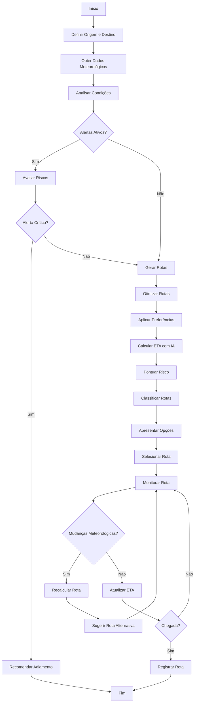

# 🔬 Módulo: Navigation Copilot

## 📌 Objetivo
Copiloto de navegação com IA para otimização de rotas marítimas, integração com dados meteorológicos, análise de riscos de navegação e geração de ETAs inteligentes dentro do ecossistema Nautilus One. Fornece assistência completa para tomada de decisão em navegação offshore.

## 📁 Estrutura de Arquivos
- `index.ts` — lógica central de navegação e otimização de rotas
- `NavigationCopilotPage.tsx` — UI principal do copiloto
- `exports.ts` — exports públicos adicionais
- `services/` — serviços de navegação e integração com APIs externas
- `components/` — componentes especializados de navegação
- `validation/` — validação de rotas e coordenadas

## 🔗 Integrações

### Supabase
Tabelas envolvidas:
- `navigation_routes` — rotas planejadas e históricas
- `navigation_waypoints` — waypoints de navegação
- `weather_alerts` — alertas meteorológicos para rotas
- `navigation_logs` — logs de decisões do copiloto

### APIs Externas
- **OpenWeather API**: Dados meteorológicos em tempo real
- **Mapbox API**: Cartografia e cálculo de rotas
- **Marine Weather Services**: Previsões específicas para navegação

### MQTT
Tópicos relevantes:
- `nautilus/navigation/route/current` — rota atual
- `nautilus/navigation/weather/alerts` — alertas meteorológicos
- `nautilus/navigation/eta/update` — atualizações de ETA
- `nautilus/navigation/optimization` — sugestões de otimização

### IA
- **Route Optimization**: Otimização baseada em múltiplos fatores
- **Weather Impact Analysis**: Análise de impacto meteorológico
- **Fuel Efficiency AI**: Cálculo de eficiência de combustível
- **Risk Scoring**: Pontuação de risco de rotas
- **ETA Prediction**: Predição inteligente de tempo de chegada

## 🔄 Fluxo Operacional



## 🧪 Testes

### Unitários
✅ **Sim** - Cobertura de cálculo de rotas e análise meteorológica

Localização: `__tests__/navigation-copilot/`

Principais testes:
- `navigationCopilot.test.ts` — testes de lógica de navegação
- `routeOptimization.test.ts` — testes de otimização
- `weatherIntegration.test.ts` — testes de integração meteorológica

### E2E
🚧 **Em andamento** - Testes de navegação completa em desenvolvimento

### Mocks
✅ **Disponíveis** em `index.ts`
- Dados meteorológicos mockados
- Rotas de exemplo
- Alertas meteorológicos simulados
- Cálculos de ETA mockados

## 📋 Status Atual

- [x] Estrutura criada (PATCH 164.0)
- [x] Integração com OpenWeather API
- [x] Integração com Mapbox API
- [x] Otimização de rotas implementada
- [x] Sistema de alertas meteorológicos
- [x] Cálculo de ETA com IA
- [x] Score de risco de rotas
- [x] UI funcional do copiloto
- [x] Preferências de navegação
- [ ] Integração MQTT completa
- [ ] Testes E2E finalizados
- [ ] Análise de fuel efficiency ativa
- [ ] Integração com AIS (Automatic Identification System)

## 🎯 Tipos Exportados

### Principais Interfaces
```typescript
// Coordenadas geográficas
interface Coordinates {
  lat: number;
  lng: number;
}

// Ponto de rota com dados de navegação
interface RoutePoint extends Coordinates {
  timestamp?: number;
  speed?: number;
  heading?: number;
}

// Dados meteorológicos
interface WeatherData {
  location: Coordinates;
  temperature: number;
  windSpeed: number;
  windDirection: number;
  waveHeight?: number;
  visibility: number;
  conditions: string;
  severity: "safe" | "caution" | "danger";
  forecast?: WeatherForecast[];
}

// Previsão meteorológica
interface WeatherForecast {
  timestamp: number;
  temperature: number;
  windSpeed: number;
  conditions: string;
  severity: "safe" | "caution" | "danger";
}

// Rota de navegação completa
interface NavigationRoute {
  id: string;
  origin: Coordinates;
  destination: Coordinates;
  waypoints: RoutePoint[];
  distance: number;          // em milhas náuticas
  estimatedDuration: number;  // em horas
  etaWithAI: string;
  weatherAlerts: WeatherAlert[];
  riskScore: number;          // 0-100
  recommended: boolean;
}

// Alerta meteorológico
interface WeatherAlert {
  id: string;
  location: Coordinates;
  type: "storm" | "high_winds" | "poor_visibility" | "high_waves";
  severity: "low" | "medium" | "high" | "critical";
  description: string;
  validUntil: number;
}

// Opções de otimização
interface RouteOptimizationOptions {
  avoidStorms?: boolean;
  maxWindSpeed?: number;
  maxWaveHeight?: number;
  preferShorterDistance?: boolean;
  considerFuelEfficiency?: boolean;
}
```

## 🔧 Uso Básico

```typescript
import { NavigationCopilot } from '@/modules/navigation-copilot';

const copilot = new NavigationCopilot();

// Obter dados meteorológicos para uma localização
const weather = await copilot.getWeatherData({
  lat: -23.5505,
  lng: -46.6333
});

// Calcular rota otimizada
const routes = await copilot.calculateRoute(
  { lat: -23.5505, lng: -46.6333 },  // origem
  { lat: -22.9068, lng: -43.1729 },  // destino
  {
    avoidStorms: true,
    maxWindSpeed: 25,
    considerFuelEfficiency: true
  }
);

// Selecionar rota recomendada
const recommendedRoute = routes.find(r => r.recommended);

// Monitorar rota e obter atualizações de ETA
const currentETA = copilot.updateETA(recommendedRoute, currentPosition);
```

## 🌊 Funcionalidades Principais

- **Weather Integration**: Integração completa com serviços meteorológicos
- **Route Optimization**: Múltiplos algoritmos de otimização
- **Risk Assessment**: Avaliação de risco em tempo real
- **Smart ETA**: Cálculo de ETA considerando condições atuais
- **Alternative Routes**: Geração de rotas alternativas
- **Weather Alerts**: Sistema de alertas meteorológicos
- **Fuel Efficiency**: Cálculo de eficiência de combustível
- **Real-Time Updates**: Atualizações em tempo real durante navegação

---

**Versão**: PATCH 164.0  
**Última Atualização**: 2025-10-30  
**Status**: 🟢 Ativo e Funcional
