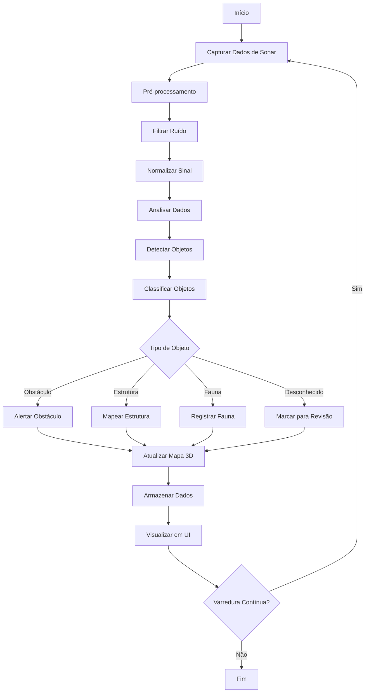

# 🔬 Módulo: Ocean Sonar

## 📌 Objetivo
Sistema de processamento e análise de dados de sonar oceanográfico para detecção de objetos subaquáticos, mapeamento do fundo marinho, identificação de obstáculos e geração de mapas 3D dentro do ecossistema Nautilus One. Fornece visualização em tempo real e análise histórica de dados de sonar.

## 📁 Estrutura de Arquivos
- `index.tsx` — UI principal do módulo e processamento de dados
- `services/` — serviços de processamento de sonar e análise
- `validation/` — validação de dados de sonar e parâmetros

## 🔗 Integrações

### Supabase
Tabelas envolvidas:
- `sonar_readings` — leituras de sonar em tempo real
- `sonar_objects` — objetos detectados
- `sonar_maps` — mapas gerados do fundo marinho
- `sonar_history` — histórico de varreduras

### MQTT
Tópicos relevantes:
- `nautilus/sonar/raw` — dados brutos de sonar
- `nautilus/sonar/processed` — dados processados
- `nautilus/sonar/detections` — objetos detectados
- `nautilus/sonar/alerts` — alertas de obstáculos

### IA
- **Object Detection**: Detecção automática de objetos
- **Pattern Recognition**: Reconhecimento de padrões no fundo marinho
- **3D Reconstruction**: Reconstrução 3D do ambiente
- **Anomaly Detection**: Detecção de anomalias e obstáculos

## 🔄 Fluxo Operacional



## 🧪 Testes

### Unitários
✅ **Sim** - Cobertura de processamento e análise de dados

Localização: `__tests__/ocean-sonar/`

Principais testes:
- `sonarProcessing.test.ts` — testes de processamento de dados
- `objectDetection.test.ts` — testes de detecção de objetos
- `dataValidation.test.ts` — testes de validação

### E2E
🚧 **Em andamento** - Testes de integração completa em desenvolvimento

### Mocks
✅ **Disponíveis** em `services/sonar-service.ts`
- Dados de sonar simulados
- Objetos detectados mockados
- Mapas de fundo marinho de exemplo

## 📋 Status Atual

- [x] Estrutura criada (PATCH 174.0)
- [x] Processamento de dados brutos
- [x] Filtro de ruído implementado
- [x] Normalização de sinal
- [x] Detecção de objetos básica
- [x] UI de visualização funcional
- [x] Armazenamento de histórico
- [ ] Classificação de objetos com IA
- [ ] Reconstrução 3D completa
- [ ] Integração MQTT completa
- [ ] Testes E2E finalizados
- [ ] Sistema de alertas em tempo real

## 🎯 Tipos Exportados

### Principais Interfaces
```typescript
// Leitura de sonar
interface SonarReading {
  id: string;
  timestamp: Date;
  frequency: number;        // Hz
  range: number;            // metros
  bearing: number;          // graus
  intensity: number;        // dB
  depth: number;            // metros
  quality: number;          // 0-100
}

// Objeto detectado
interface DetectedObject {
  id: string;
  position: {
    x: number;
    y: number;
    z: number;
  };
  size: {
    width: number;
    height: number;
    depth: number;
  };
  type: "obstacle" | "structure" | "fauna" | "unknown";
  confidence: number;       // 0-100
  timestamp: Date;
}

// Mapa de sonar
interface SonarMap {
  id: string;
  area: {
    minLat: number;
    maxLat: number;
    minLng: number;
    maxLng: number;
  };
  resolution: number;       // metros
  data: number[][][];       // grid 3D de intensidades
  objects: DetectedObject[];
  timestamp: Date;
}

// Parâmetros de varredura
interface ScanParameters {
  frequency: number;
  range: number;
  resolution: number;
  scanRate: number;         // Hz
  mode: "sector" | "full" | "directional";
}
```

## 🔧 Uso Básico

```typescript
import { OceanSonar } from '@/modules/ocean-sonar';

// Iniciar varredura de sonar
const sonar = new OceanSonar();
await sonar.startScan({
  frequency: 200000,
  range: 500,
  resolution: 0.5,
  scanRate: 10,
  mode: "sector"
});

// Processar leitura
const reading = await sonar.processReading(rawData);

// Detectar objetos
const objects = await sonar.detectObjects(reading);

// Gerar mapa 3D
const map = await sonar.generate3DMap(readings, area);

// Obter objetos em área específica
const nearbyObjects = await sonar.getObjectsInArea({
  minLat: -23.55,
  maxLat: -23.50,
  minLng: -46.65,
  maxLng: -46.60
});
```

## 🌊 Funcionalidades Principais

- **Real-Time Processing**: Processamento em tempo real de dados de sonar
- **Object Detection**: Detecção automática de objetos subaquáticos
- **3D Mapping**: Geração de mapas 3D do fundo marinho
- **Noise Filtering**: Filtros avançados de ruído
- **Historical Analysis**: Análise de dados históricos
- **Obstacle Alerts**: Alertas automáticos de obstáculos
- **Multi-Frequency**: Suporte a múltiplas frequências
- **Data Visualization**: Visualização avançada de dados

---

**Versão**: PATCH 174.0  
**Última Atualização**: 2025-10-30  
**Status**: 🟢 Ativo e Funcional
