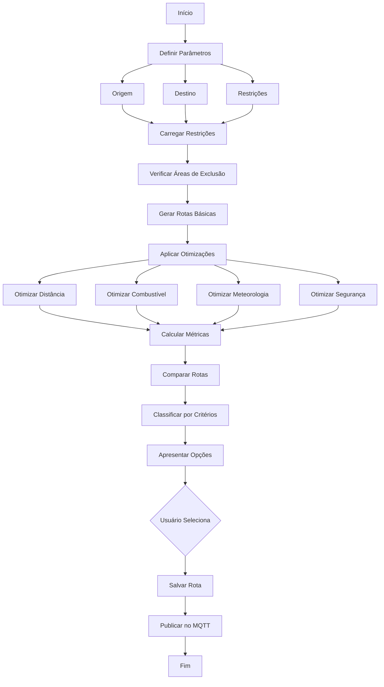

# 🔬 Módulo: Route Planner

## 📌 Objetivo
Sistema avançado de planejamento de rotas marítimas com otimização multi-critério, considerando fatores como distância, combustível, condições meteorológicas, restrições de navegação e áreas de exclusão dentro do ecossistema Nautilus One. Fornece múltiplas alternativas de rotas e análise comparativa.

## 📁 Estrutura de Arquivos
- `index.tsx` — UI principal do planejador de rotas
- `services/` — serviços de cálculo e otimização de rotas
- `components/` — componentes especializados de visualização
- `validation/` — validação de parâmetros e restrições

## 🔗 Integrações

### Supabase
Tabelas envolvidas:
- `planned_routes` — rotas planejadas e salvas
- `route_waypoints` — waypoints detalhados de rotas
- `route_restrictions` — restrições e áreas de exclusão
- `route_comparisons` — comparações históricas de rotas

### MQTT
Tópicos relevantes:
- `nautilus/routes/new` — novas rotas planejadas
- `nautilus/routes/updated` — atualizações de rotas
- `nautilus/routes/selected` — rota selecionada
- `nautilus/routes/optimization` — solicitações de otimização

### IA
- **Multi-Objective Optimization**: Otimização multi-objetivo com algoritmos genéticos
- **Weather Impact Prediction**: Predição de impacto meteorológico
- **Fuel Consumption AI**: Estimativa inteligente de consumo
- **Risk Analysis**: Análise de risco de rotas alternativas

## 🔄 Fluxo Operacional



## 🧪 Testes

### Unitários
✅ **Sim** - Cobertura de algoritmos de otimização

Localização: `__tests__/route-planner/`

Principais testes:
- `routeOptimization.test.ts` — testes de otimização
- `routeValidation.test.ts` — testes de validação
- `routeComparison.test.ts` — testes de comparação

### E2E
🚧 **Em andamento** - Testes de planejamento completo em desenvolvimento

### Mocks
✅ **Disponíveis** em `services/route-service.ts`
- Rotas de exemplo
- Restrições mockadas
- Métricas de comparação simuladas

## 📋 Status Atual

- [x] Estrutura criada
- [x] Geração de rotas básicas
- [x] Sistema de restrições implementado
- [x] Áreas de exclusão funcionais
- [x] UI de visualização de rotas
- [x] Comparação de rotas implementada
- [x] Salvamento de rotas
- [ ] Otimização multi-objetivo completa
- [ ] IA de consumo de combustível ativa
- [ ] Integração MQTT completa
- [ ] Testes E2E finalizados
- [ ] Integração com navigation-copilot

## 🎯 Tipos Exportados

### Principais Interfaces
```typescript
// Parâmetros de planejamento
interface RoutePlanningParams {
  origin: Coordinates;
  destination: Coordinates;
  vesselType: string;
  maxSpeed: number;
  departureTime: Date;
  constraints?: RouteConstraints;
}

// Restrições de rota
interface RouteConstraints {
  maxDistance?: number;
  maxDuration?: number;
  avoidAreas?: ExclusionZone[];
  requiredWaypoints?: Coordinates[];
  maxWaveHeight?: number;
  maxWindSpeed?: number;
}

// Zona de exclusão
interface ExclusionZone {
  id: string;
  name: string;
  area: Polygon;
  type: "military" | "restricted" | "shallow" | "environmental";
  active: boolean;
}

// Rota planejada
interface PlannedRoute {
  id: string;
  origin: Coordinates;
  destination: Coordinates;
  waypoints: RouteWaypoint[];
  metrics: RouteMetrics;
  optimizationGoal: "distance" | "fuel" | "time" | "safety";
  created: Date;
}

// Waypoint de rota
interface RouteWaypoint {
  position: Coordinates;
  eta: Date;
  speed: number;
  heading: number;
  distance: number;        // distância acumulada
  fuelConsumed: number;    // combustível acumulado
}

// Métricas de rota
interface RouteMetrics {
  totalDistance: number;       // milhas náuticas
  estimatedDuration: number;   // horas
  fuelConsumption: number;     // litros
  averageSpeed: number;        // knots
  riskScore: number;           // 0-100
  weatherScore: number;        // 0-100
}

// Comparação de rotas
interface RouteComparison {
  routes: PlannedRoute[];
  criteria: string[];
  bestByDistance: string;      // route id
  bestByTime: string;
  bestByFuel: string;
  bestBySafety: string;
}
```

## 🔧 Uso Básico

```typescript
import { RoutePlanner } from '@/modules/route-planner';

const planner = new RoutePlanner();

// Planejar múltiplas rotas
const routes = await planner.planRoutes({
  origin: { lat: -23.5505, lng: -46.6333 },
  destination: { lat: -22.9068, lng: -43.1729 },
  vesselType: "cargo",
  maxSpeed: 15,
  departureTime: new Date(),
  constraints: {
    maxWaveHeight: 3,
    avoidAreas: excludedZones
  }
});

// Comparar rotas
const comparison = planner.compareRoutes(routes, [
  "distance",
  "fuel",
  "time",
  "safety"
]);

// Selecionar melhor rota por critério
const bestRoute = comparison.routes.find(
  r => r.id === comparison.bestByFuel
);

// Salvar rota selecionada
await planner.saveRoute(bestRoute);
```

## 🗺️ Funcionalidades Principais

- **Multi-Route Planning**: Geração de múltiplas alternativas de rota
- **Constraint Management**: Gestão de restrições e áreas de exclusão
- **Optimization Algorithms**: Múltiplos algoritmos de otimização
- **Comparative Analysis**: Análise comparativa detalhada
- **Fuel Estimation**: Estimativa precisa de consumo de combustível
- **Safety Scoring**: Pontuação de segurança de rotas
- **Waypoint Management**: Gestão detalhada de waypoints
- **Historical Routes**: Acesso a rotas históricas

---

**Versão**: 1.0.0  
**Última Atualização**: 2025-10-30  
**Status**: 🟢 Ativo e Funcional
