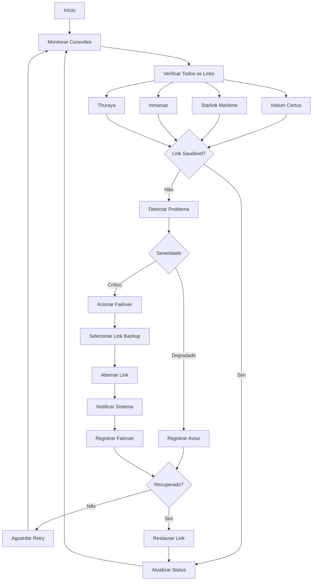

# 🔬 Módulo: SATCOM

## 📌 Objetivo
Sistema de monitoramento e gerenciamento de comunicações via satélite (Iridium, Starlink, Inmarsat, Thuraya) para operações offshore, com redundância automática, detecção de falhas, sistema de fallback inteligente e logging completo de conectividade dentro do ecossistema Nautilus One.

## 📁 Estrutura de Arquivos
- `index.tsx` — UI principal do dashboard SATCOM
- `satcom-status.ts` — monitoramento de status de conexões
- `linkFallbackManager.ts` — gestão de fallback e redundância
- `alertHandler.ts` — tratamento de alertas de conectividade
- `watchdog-integration.ts` — integração com sistema watchdog
- `simulator.ts` — simulador de condições de satélite
- `services/failover-service.ts` — serviço de failover automático
- `services/ping-service.ts` — serviço de ping e diagnóstico
- `hooks/useSatcomMonitor.ts` — hook React para monitoramento
- `components/` — componentes especializados de UI
- `validation/` — validação de parâmetros de comunicação

## 🔗 Integrações

### Supabase
Tabelas envolvidas:
- `satcom_connections` — status de conexões satelitais
- `satcom_failover_logs` — logs de eventos de failover
- `satcom_communication_logs` — histórico de comunicações
- `satcom_alerts` — alertas de conectividade

### MQTT
Tópicos relevantes:
- `nautilus/satcom/+/status` — status de cada link satelital
- `nautilus/satcom/+/signal` — força de sinal
- `nautilus/satcom/failover` — eventos de failover
- `nautilus/satcom/alerts` — alertas críticos
- `nautilus/satcom/ping` — resultados de ping

### IA
- **Predictive Failover**: Predição de falhas antes que ocorram
- **Link Quality Analysis**: Análise de qualidade de links
- **Optimal Provider Selection**: Seleção inteligente de provedor
- **Bandwidth Optimization**: Otimização de uso de banda

## 🔄 Fluxo Operacional



## 🧪 Testes

### Unitários
✅ **Sim** - Cobertura de lógica de failover e alertas

Localização: `__tests__/satcom/`

Principais testes:
- `satcomStatus.test.ts` — testes de monitoramento
- `linkFallbackManager.test.ts` — testes de failover
- `alertHandler.test.ts` — testes de alertas

### E2E
🚧 **Em andamento** - Testes de failover completo em desenvolvimento

### Mocks
✅ **Disponíveis** em `simulator.ts`
- Simulador completo de condições satelitais
- Cenários de falha e recuperação
- Dados de latência e bandwidth

## 📋 Status Atual

- [x] Estrutura criada (PATCH 171.0)
- [x] Monitoramento de múltiplos provedores
- [x] Sistema de failover automático (PATCH 420.0)
- [x] Gestão de redundância
- [x] Sistema de alertas implementado
- [x] Integração com watchdog (PATCH 442)
- [x] Logging de failover completo
- [x] Terminal de comunicação interativo
- [x] Painel de diagnóstico (PATCH 476)
- [x] Serviço de ping e conectividade
- [x] UI funcional e interativa
- [ ] Integração MQTT completa
- [ ] Testes E2E finalizados
- [ ] IA de predição de falhas ativa
- [ ] Otimização de bandwidth ativa

## 🎯 Tipos Exportados

### Principais Interfaces
```typescript
// Conexão SATCOM
interface SatcomConnection {
  id: string;
  name: string;
  provider: "Iridium" | "Starlink" | "Inmarsat" | "Thuraya";
  status: "connected" | "degraded" | "disconnected";
  signalStrength: number;    // 0-100
  latency: number;           // ms
  bandwidth: number;         // kbps
  lastSeen: string;
}

// Status de saúde
interface SatcomHealthStatus {
  overall: "healthy" | "degraded" | "critical";
  activeConnections: number;
  primaryLink: string;
  backupLinks: string[];
  lastFailover?: Date;
}

// Política de fallback
interface FallbackPolicy {
  primaryProvider: string;
  backupProviders: string[];
  autoSwitch: boolean;
  switchThreshold: number;
  retryInterval: number;     // segundos
}

// Evento de failover
interface FallbackEvent {
  id: string;
  timestamp: Date;
  fromProvider: string;
  toProvider: string;
  reason: string;
  duration: number;          // ms
  success: boolean;
}

// Log de comunicação
interface CommunicationLog {
  id: string;
  timestamp: Date;
  provider: string;
  type: "data" | "voice" | "position";
  size: number;              // bytes
  latency: number;           // ms
  success: boolean;
}

// Resultado de ping
interface PingResult {
  provider: string;
  latency: number;           // ms
  packetLoss: number;        // 0-100
  timestamp: Date;
  success: boolean;
}

// Configuração de alerta
interface AlertConfig {
  enabled: boolean;
  thresholds: {
    signalStrength: number;
    latency: number;
    packetLoss: number;
  };
  notificationChannels: string[];
}
```

## 🔧 Uso Básico

```typescript
import { 
  satcomStatusMonitor, 
  linkFallbackManager,
  alertHandler 
} from '@/modules/satcom';

// Obter status atual de todas as conexões
const status = satcomStatusMonitor.getCurrentStatus();

// Configurar política de fallback
linkFallbackManager.setPolicy({
  primaryProvider: "Starlink",
  backupProviders: ["Iridium", "Inmarsat"],
  autoSwitch: true,
  switchThreshold: 30,
  retryInterval: 60
});

// Configurar alertas
alertHandler.configure({
  enabled: true,
  thresholds: {
    signalStrength: 30,
    latency: 1000,
    packetLoss: 10
  },
  notificationChannels: ["email", "mqtt"]
});

// Forçar failover manual
await linkFallbackManager.forceSwitchTo("Iridium");

// Testar conectividade
const pingResult = await satcomPingService.ping("Starlink");
```

## 📡 Funcionalidades Principais

- **Multi-Provider Support**: Suporte a múltiplos provedores satelitais
- **Automatic Failover**: Failover automático e transparente
- **Redundancy Management**: Gestão inteligente de redundância
- **Real-Time Monitoring**: Monitoramento em tempo real de todos os links
- **Alert System**: Sistema completo de alertas configuráveis
- **Communication Logging**: Log detalhado de todas as comunicações
- **Diagnostic Tools**: Ferramentas de diagnóstico e ping
- **Interactive Terminal**: Terminal interativo para testes
- **Historical Analysis**: Análise histórica de conectividade
- **Watchdog Integration**: Integração com sistema de monitoramento

---

**Versão**: PATCH 476  
**Última Atualização**: 2025-10-30  
**Status**: 🟢 Ativo e Funcional
