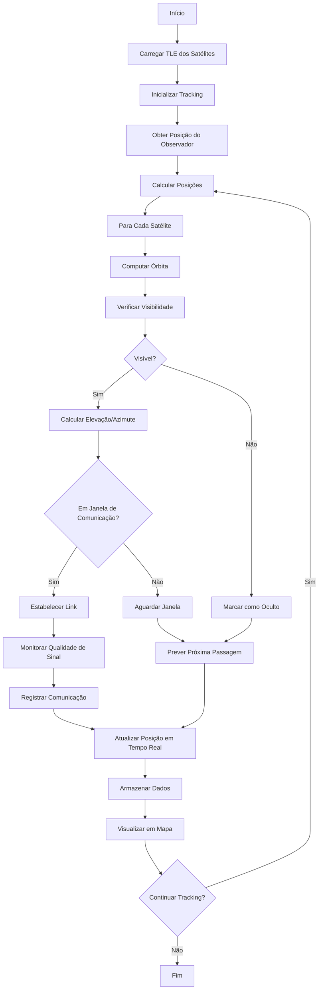

# 🔬 Módulo: Satellite Tracker

## 📌 Objetivo
Sistema de rastreamento de satélites e veículos via satélite em tempo real, fornecendo posicionamento preciso, comunicações satelitais, status de conectividade e visualização de órbitas dentro do ecossistema Nautilus One. Integra-se com SATCOM para gestão completa de comunicações espaciais.

## 📁 Estrutura de Arquivos
- `SatelliteTracker.tsx` — componente de rastreamento básico
- `SatelliteTrackerEnhanced.tsx` — versão aprimorada com features avançadas
- `services/` — serviços de tracking e cálculo orbital
- `components/` — componentes especializados de visualização

## 🔗 Integrações

### Supabase
Tabelas envolvidas:
- `satellite_positions` — posições históricas de satélites
- `satellite_passes` — passagens previstas de satélites
- `satellite_communications` — histórico de comunicações
- `tracked_satellites` — lista de satélites rastreados

### APIs Externas
- **N2YO API**: Dados de órbitas e posições de satélites
- **Space-Track.org**: TLE (Two-Line Elements) atualizados
- **CelesTrak**: Dados orbitais e predições

### MQTT
Tópicos relevantes:
- `nautilus/satellite/+/position` — posição de cada satélite
- `nautilus/satellite/+/visibility` — visibilidade de satélites
- `nautilus/satellite/passes` — próximas passagens
- `nautilus/satellite/communications` — eventos de comunicação

### IA
- **Pass Prediction**: Predição de melhores janelas de comunicação
- **Orbit Optimization**: Otimização de tracking de múltiplos satélites
- **Signal Quality Prediction**: Predição de qualidade de sinal

## 🔄 Fluxo Operacional



## 🧪 Testes

### Unitários
✅ **Sim** - Cobertura de cálculos orbitais

Localização: `__tests__/satellite/`

Principais testes:
- `orbitalCalculations.test.ts` — testes de cálculos orbitais
- `visibilityPrediction.test.ts` — testes de predição de visibilidade
- `satelliteTracking.test.ts` — testes de tracking

### E2E
🚧 **Em andamento** - Testes de tracking completo em desenvolvimento

### Mocks
✅ **Disponíveis** em `services/satellite-service.ts`
- TLEs de exemplo
- Posições orbitais mockadas
- Predições de passagens simuladas

## 📋 Status Atual

- [x] Estrutura criada
- [x] Tracking básico de satélites
- [x] Cálculo de órbitas
- [x] Predição de visibilidade
- [x] Versão enhanced com features avançadas
- [x] UI de visualização funcional
- [x] Integração com APIs externas
- [ ] Predição de janelas de comunicação com IA
- [ ] Integração MQTT completa
- [ ] Testes E2E finalizados
- [ ] Visualização 3D de órbitas
- [ ] Multi-satellite tracking otimizado

## 🎯 Tipos Exportados

### Principais Interfaces
```typescript
// Satélite rastreado
interface TrackedSatellite {
  id: string;
  name: string;
  noradId: number;
  type: "communication" | "navigation" | "earth_observation" | "other";
  tle: TwoLineElement;
  active: boolean;
}

// TLE (Two-Line Element)
interface TwoLineElement {
  line1: string;
  line2: string;
  epochYear: number;
  epochDay: number;
  updated: Date;
}

// Posição do satélite
interface SatellitePosition {
  satelliteId: string;
  timestamp: Date;
  latitude: number;
  longitude: number;
  altitude: number;        // km
  velocity: number;        // km/s
  azimuth: number;         // graus
  elevation: number;       // graus
  range: number;           // km
  visible: boolean;
}

// Passagem prevista
interface SatellitePass {
  satelliteId: string;
  startTime: Date;
  endTime: Date;
  maxElevation: number;    // graus
  duration: number;        // segundos
  quality: "excellent" | "good" | "fair" | "poor";
}

// Posição do observador
interface ObserverPosition {
  latitude: number;
  longitude: number;
  altitude: number;        // metros
  timestamp: Date;
}

// Evento de comunicação
interface SatelliteCommunication {
  id: string;
  satelliteId: string;
  timestamp: Date;
  duration: number;        // segundos
  dataTransferred: number; // bytes
  signalQuality: number;   // 0-100
  elevation: number;       // graus no momento
  success: boolean;
}
```

## 🔧 Uso Básico

```typescript
import { SatelliteTrackerEnhanced } from '@/modules/satellite';

// Componente React para visualização
<SatelliteTrackerEnhanced
  observerPosition={{
    latitude: -23.5505,
    longitude: -46.6333,
    altitude: 0
  }}
  trackedSatellites={[
    { id: "ISS", noradId: 25544, name: "ISS" },
    { id: "STARLINK-1", noradId: 44713, name: "Starlink-1007" }
  ]}
/>

// API programática
import { satelliteService } from '@/modules/satellite/services';

// Calcular posição atual
const position = await satelliteService.calculatePosition(
  satelliteId,
  observerPosition
);

// Prever próximas passagens
const passes = await satelliteService.predictPasses(
  satelliteId,
  observerPosition,
  72 // próximas 72 horas
);

// Verificar visibilidade
const isVisible = satelliteService.isVisible(
  satellitePosition,
  observerPosition
);
```

## 🛰️ Funcionalidades Principais

- **Real-Time Tracking**: Rastreamento em tempo real de múltiplos satélites
- **Orbit Calculation**: Cálculo preciso de órbitas usando TLEs
- **Visibility Prediction**: Predição de visibilidade e passagens
- **Communication Windows**: Identificação de janelas de comunicação
- **Visual Tracking**: Visualização em mapa 2D
- **Historical Data**: Acesso a dados históricos de posições
- **Multi-Satellite**: Suporte a múltiplos satélites simultâneos
- **Signal Quality**: Estimativa de qualidade de sinal
- **Pass Prediction**: Predição de melhores passagens
- **Integration with SATCOM**: Integração com módulo SATCOM

---

**Versão**: 1.0.0  
**Última Atualização**: 2025-10-30  
**Status**: 🟢 Ativo e Funcional
