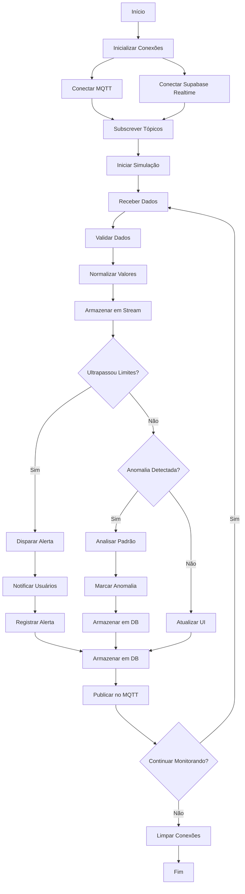

# 🔬 Módulo: Sensors Hub

## 📌 Objetivo
Hub centralizado de sensores IoT para coleta, normalização, visualização e análise de dados de múltiplos tipos de sensores (temperatura, pressão, umidade, etc.) com detecção de anomalias, alertas configuráveis e integração MQTT/Realtime dentro do ecossistema Nautilus One.

## 📁 Estrutura de Arquivos
- `index.tsx` — UI principal do hub de sensores
- `sensorStream.ts` — stream de dados de sensores em tempo real
- `sensorRegistry.ts` — registro e configuração de sensores
- `services/sensor-simulator.ts` — simulador de sensores para testes
- `services/sensor-data-service.ts` — serviço de armazenamento e análise
- `services/sensor-realtime-service.ts` — serviço de conexão MQTT/Realtime
- `components/SensorAlerts.tsx` — componente de alertas
- `components/SensorPanel.tsx` — painel individual de sensor
- `components/SensorHistory.tsx` — histórico de dados
- `components/AlertConfigModal.tsx` — modal de configuração de alertas
- `types/` — definições TypeScript de sensores e dados
- `validation/` — validação de dados de sensores

## 🔗 Integrações

### Supabase
Tabelas envolvidas:
- `sensor_data` — dados históricos de sensores
- `sensor_configs` — configurações de sensores
- `sensor_alerts` — alertas configurados e disparados
- `sensor_anomalies` — anomalias detectadas

### Supabase Realtime
Canais subscritos:
- `sensor_data` — dados em tempo real
- `sensor_alerts` — alertas em tempo real

### MQTT
Tópicos relevantes:
- `nautilus/sensors/+/data` — dados de cada sensor
- `nautilus/sensors/+/status` — status de sensores
- `nautilus/sensors/alerts` — alertas de anomalias
- `nautilus/sensors/config` — configurações de sensores

### IA
- **Anomaly Detection**: Detecção automática de anomalias usando ML
- **Pattern Recognition**: Reconhecimento de padrões em séries temporais
- **Predictive Analysis**: Análise preditiva de falhas de sensores
- **Data Normalization**: Normalização inteligente de dados

## 🔄 Fluxo Operacional



## 🧪 Testes

### Unitários
✅ **Sim** - Cobertura de normalização e detecção de anomalias

Localização: `__tests__/sensors-hub/`

Principais testes:
- `sensorStream.test.ts` — testes de stream de dados
- `sensorRegistry.test.ts` — testes de registro
- `anomalyDetection.test.ts` — testes de detecção de anomalias
- `dataValidation.test.ts` — testes de validação

### E2E
🚧 **Em andamento** - Testes de integração completa em desenvolvimento

### Mocks
✅ **Disponíveis** em `services/sensor-simulator.ts`
- Simulador completo de sensores
- Dados realistas com variação temporal
- Cenários de anomalias e falhas

## 📋 Status Atual

- [x] Estrutura criada (PATCH 174.0)
- [x] Stream de dados em tempo real
- [x] Registro de sensores implementado
- [x] Normalização de dados (PATCH 441)
- [x] Detecção de anomalias
- [x] Sistema de alertas configuráveis (PATCH 461)
- [x] Integração MQTT implementada
- [x] Integração Supabase Realtime
- [x] UI funcional com visualizações
- [x] Histórico de dados
- [x] Simulador de sensores ativo
- [ ] IA de análise preditiva completa
- [ ] Testes E2E finalizados
- [ ] Dashboard de análise avançada
- [ ] Integração com deep-risk-ai

## 🎯 Tipos Exportados

### Principais Interfaces
```typescript
// Dados do sensor
interface SensorData {
  sensorId: string;
  timestamp: Date;
  value: number;
  unit: string;
  normalized: number;       // valor normalizado 0-100
  quality: number;          // qualidade do dado 0-100
}

// Configuração de sensor
interface SensorConfig {
  id: string;
  name: string;
  type: "temperature" | "pressure" | "humidity" | "depth" | "custom";
  unit: string;
  minValue: number;
  maxValue: number;
  normalRange: {
    min: number;
    max: number;
  };
  alertThresholds: {
    low: number;
    high: number;
  };
  active: boolean;
}

// Alerta de sensor
interface SensorAlert {
  id: string;
  sensorId: string;
  type: "threshold" | "anomaly" | "offline";
  severity: "low" | "medium" | "high" | "critical";
  message: string;
  value?: number;
  threshold?: number;
  timestamp: Date;
  acknowledged: boolean;
}

// Anomalia detectada
interface SensorAnomaly {
  id: string;
  sensorId: string;
  timestamp: Date;
  value: number;
  expectedRange: {
    min: number;
    max: number;
  };
  deviation: number;
  confidence: number;       // 0-100
  pattern?: string;
}

// Status do sensor
interface SensorStatus {
  sensorId: string;
  online: boolean;
  lastSeen: Date;
  dataRate: number;         // leituras por segundo
  health: number;           // 0-100
  alerts: number;           // número de alertas ativos
}
```

## 🔧 Uso Básico

```typescript
import { sensorStream, sensorRegistry, sensorSimulator } from '@/modules/sensors-hub';

// Registrar novo sensor
sensorRegistry.register({
  id: "temp-001",
  name: "Temperature Sensor 1",
  type: "temperature",
  unit: "°C",
  minValue: -20,
  maxValue: 50,
  normalRange: { min: 15, max: 30 },
  alertThresholds: { low: 10, high: 35 },
  active: true
});

// Iniciar simulação
sensorSimulator.start([
  { id: "temp-001", type: "temperature", updateInterval: 1000 }
]);

// Obter últimos dados
const latestData = sensorStream.getLatest("temp-001");

// Obter histórico
const history = sensorStream.getHistory("temp-001", 100); // últimas 100 leituras

// Listar sensores ativos
const activeSensors = sensorStream.listActiveSensors();

// Configurar alerta
import { sensorDataService } from '@/modules/sensors-hub/services';

await sensorDataService.configureAlert({
  sensorId: "temp-001",
  type: "threshold",
  thresholds: { low: 10, high: 35 },
  enabled: true
});

// Detectar anomalias
const anomalies = await sensorDataService.detectAnomalies("temp-001", latestData);
```

## 📊 Funcionalidades Principais

- **Real-Time Monitoring**: Monitoramento em tempo real de todos os sensores
- **Data Normalization**: Normalização automática de valores
- **Anomaly Detection**: Detecção inteligente de anomalias
- **Configurable Alerts**: Alertas totalmente configuráveis
- **MQTT Integration**: Integração completa com MQTT
- **Supabase Realtime**: Dados em tempo real via Supabase
- **Historical Data**: Armazenamento e visualização de histórico
- **Sensor Simulation**: Simulador para testes e desenvolvimento
- **Multi-Sensor Support**: Suporte a múltiplos tipos de sensores
- **Visual Dashboards**: Dashboards visuais para análise

---

**Versão**: PATCH 461  
**Última Atualização**: 2025-10-30  
**Status**: 🟢 Ativo e Funcional
