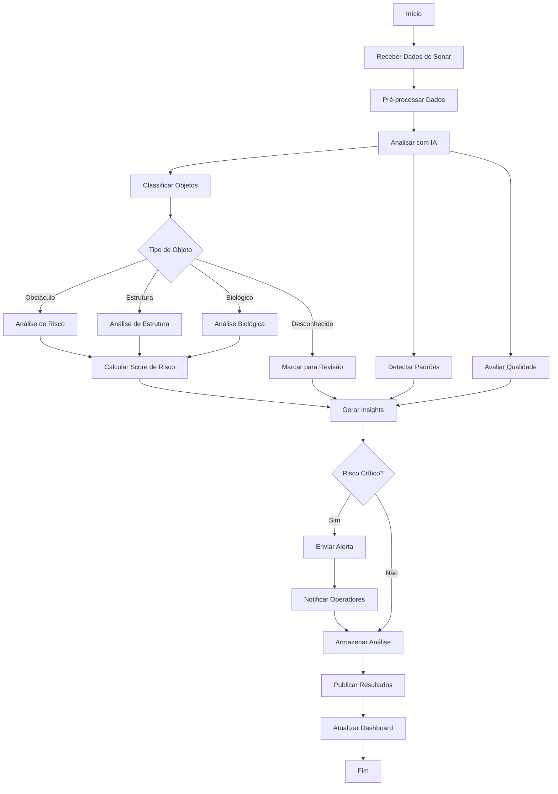

# 🔬 Módulo: Sonar AI

## 📌 Objetivo
Sistema de análise inteligente de dados de sonar com IA para interpretação de riscos, classificação de objetos detectados, análise de dados brutos e geração de insights operacionais dentro do ecossistema Nautilus One. Complementa o módulo Ocean Sonar com capacidades de inteligência artificial.

## 📁 Estrutura de Arquivos
- `index.tsx` — UI principal do módulo com dashboards
- `dataAnalyzer.ts` — análise e processamento de dados de sonar
- `riskInterpreter.ts` — interpretação de riscos baseada em dados
- `sonar-service.ts` — serviço principal de integração
- `services/` — serviços especializados de IA
- `components/` — componentes de visualização
- `validation/` — validação de dados e parâmetros

## 🔗 Integrações

### Supabase
Tabelas envolvidas:
- `sonar_ai_analysis` — análises realizadas pela IA
- `sonar_risk_assessments` — avaliações de risco
- `sonar_classifications` — classificações de objetos
- `sonar_insights` — insights gerados

### MQTT
Tópicos relevantes:
- `nautilus/sonar/raw` — dados brutos para análise
- `nautilus/sonar/ai/analysis` — resultados de análises
- `nautilus/sonar/ai/risk` — avaliações de risco
- `nautilus/sonar/ai/insights` — insights gerados

### IA
- **OpenAI GPT-4**: Análise contextual e geração de insights
- **ONNX Runtime**: Modelos de ML para classificação de objetos
- **Pattern Recognition**: Reconhecimento de padrões em dados de sonar
- **Risk Scoring**: Pontuação inteligente de riscos

## 🔄 Fluxo Operacional



## 🧪 Testes

### Unitários
✅ **Sim** - Cobertura de análise e classificação

Localização: `__tests__/sonar-ai/`

Principais testes:
- `dataAnalyzer.test.ts` — testes de análise de dados
- `riskInterpreter.test.ts` — testes de interpretação de risco
- `objectClassification.test.ts` — testes de classificação

### E2E
🚧 **Em andamento** - Testes de pipeline completo em desenvolvimento

### Mocks
✅ **Disponíveis** em `sonar-service.ts`
- Dados de sonar mockados
- Classificações de exemplo
- Análises de risco simuladas

## 📋 Status Atual

- [x] Estrutura criada
- [x] Análise de dados implementada
- [x] Interpretação de riscos funcional
- [x] Serviço de sonar integrado
- [x] UI de dashboard implementada
- [x] Visualizações de dados
- [ ] Integração completa com OpenAI
- [ ] Modelos ONNX otimizados
- [ ] Integração MQTT completa
- [ ] Testes E2E finalizados
- [ ] Classificação automática com ML ativa
- [ ] Integração com ocean-sonar completa

## 🎯 Tipos Exportados

### Principais Interfaces
```typescript
// Análise de dados de sonar
interface SonarAnalysis {
  id: string;
  timestamp: Date;
  dataSource: string;
  objectsDetected: number;
  averageQuality: number;
  riskScore: number;
  insights: string[];
  recommendations: string[];
}

// Objeto classificado
interface ClassifiedObject {
  id: string;
  position: {
    x: number;
    y: number;
    z: number;
  };
  type: "obstacle" | "structure" | "biological" | "unknown";
  subtype?: string;
  confidence: number;       // 0-100
  size: {
    width: number;
    height: number;
    depth: number;
  };
  characteristics: string[];
  riskLevel: "low" | "medium" | "high" | "critical";
}

// Avaliação de risco
interface RiskAssessment {
  id: string;
  timestamp: Date;
  overallRisk: number;      // 0-100
  category: "Low" | "Medium" | "High" | "Critical";
  factors: {
    proximity: number;
    size: number;
    movement: number;
    environmental: number;
  };
  recommendations: RiskRecommendation[];
}

// Recomendação de risco
interface RiskRecommendation {
  priority: "low" | "medium" | "high" | "critical";
  category: string;
  action: string;
  reasoning: string;
}

// Insight gerado
interface SonarInsight {
  id: string;
  type: "pattern" | "anomaly" | "trend" | "alert";
  description: string;
  confidence: number;
  timestamp: Date;
  actionable: boolean;
  relatedObjects: string[];
}

// Padrão detectado
interface DetectedPattern {
  id: string;
  type: string;
  frequency: number;
  locations: Array<{x: number, y: number, z: number}>;
  significance: "low" | "medium" | "high";
  description: string;
}
```

## 🔧 Uso Básico

```typescript
import { dataAnalyzer, riskInterpreter } from '@/modules/sonar-ai';

// Analisar dados de sonar
const analysis = await dataAnalyzer.analyze(sonarData, {
  enableML: true,
  detectionThreshold: 0.7,
  includePatterns: true
});

// Interpretar riscos
const riskAssessment = await riskInterpreter.assessRisk(analysis, {
  operationalContext: "deep_sea_operation",
  vesselType: "offshore_supply",
  currentDepth: 150
});

// Classificar objeto específico
const classification = await dataAnalyzer.classifyObject(objectData);

// Gerar insights
const insights = await dataAnalyzer.generateInsights(analysis, {
  includeRecommendations: true,
  aiEnhanced: true
});

// Obter recomendações de risco
const recommendations = riskInterpreter.getRecommendations(riskAssessment);
```

## 🤖 Funcionalidades Principais

- **AI-Powered Analysis**: Análise aprimorada com IA
- **Object Classification**: Classificação automática de objetos detectados
- **Risk Interpretation**: Interpretação inteligente de riscos
- **Pattern Recognition**: Reconhecimento de padrões em dados
- **Insight Generation**: Geração automática de insights operacionais
- **Quality Assessment**: Avaliação de qualidade de dados
- **Real-Time Processing**: Processamento em tempo real
- **Historical Analysis**: Análise de dados históricos
- **Contextual Understanding**: Compreensão contextual com GPT-4
- **Actionable Recommendations**: Recomendações acionáveis

## 🔗 Integração com Outros Módulos

- **Ocean Sonar**: Recebe dados brutos para análise
- **Deep Risk AI**: Compartilha avaliações de risco
- **Coordination AI**: Fornece insights para coordenação
- **Mission Engine**: Alimenta planejamento de missões

---

**Versão**: 1.0.0  
**Última Atualização**: 2025-10-30  
**Status**: 🟢 Ativo e Funcional
