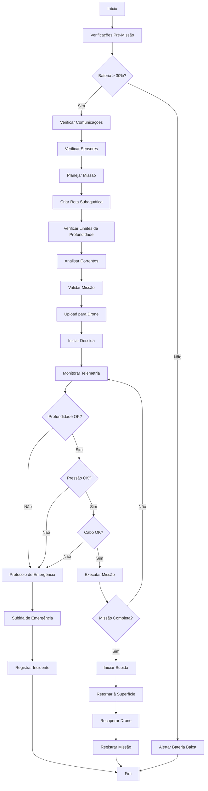

# 🔬 Módulo: Underwater Drone

## 📌 Objetivo
Sistema de controle e coordenação de ROVs/AUVs (Remotely Operated Vehicles / Autonomous Underwater Vehicles) para operações subaquáticas autônomas, incluindo planejamento de missões, upload de rotas, telemetria em tempo real e gestão de frotas de drones submarinos dentro do ecossistema Nautilus One.

## 📁 Estrutura de Arquivos
- `index.tsx` — UI principal do módulo de controle
- `droneSubCore.ts` — lógica central de comando e controle de ROVs/AUVs
- `missionUploadSub.ts` — sistema de upload e validação de missões submarinas
- `telemetrySub.ts` — telemetria subaquática em tempo real
- `services/` — serviços de comunicação e controle
- `components/` — componentes UI especializados
- `validation/` — validação de missões e comandos submarinos

## 🔗 Integrações

### Supabase
Tabelas envolvidas:
- `underwater_drones` — registro de ROVs/AUVs disponíveis
- `underwater_missions` — missões planejadas e executadas
- `underwater_telemetry` — dados de telemetria históricos
- `underwater_waypoints` — waypoints subaquáticos
- `dive_logs` — logs de mergulhos e operações

### MQTT
Tópicos relevantes:
- `nautilus/underwater/+/telemetry` — telemetria de cada drone
- `nautilus/underwater/+/command` — envio de comandos
- `nautilus/underwater/+/status` — status operacional
- `nautilus/underwater/missions/upload` — upload de missões
- `nautilus/underwater/emergency` — alertas de emergência
- `nautilus/underwater/fleet/coordination` — coordenação de frota

### IA
- **Route Optimization**: Otimização de rotas considerando correntes
- **Obstacle Avoidance**: Sistema de prevenção de colisões subaquáticas
- **Battery Management**: Gestão inteligente de bateria e autonomia
- **Mission Planning**: Planejamento autônomo de missões
- **Environmental Adaptation**: Adaptação a condições ambientais

## 🔄 Fluxo Operacional



## 🧪 Testes

### Unitários
✅ **Sim** - Cobertura de comandos e validação de missões

Localização: `__tests__/underwater-drone/`

Principais testes:
- `droneSubCore.test.ts` — testes de comando e controle
- `missionUploadSub.test.ts` — testes de upload de missões
- `telemetrySub.test.ts` — testes de telemetria
- `emergencyProcedures.test.ts` — testes de procedimentos de emergência

### E2E
🚧 **Em andamento** - Testes de missões completas em desenvolvimento

### Mocks
✅ **Disponíveis** em `services/underwater-simulator.ts`
- Simulador completo de ROVs/AUVs
- Telemetria subaquática mockada
- Resposta a comandos simulada
- Cenários de emergência

## 📋 Status Atual

- [x] Estrutura criada
- [x] Sistema de comando implementado
- [x] Upload de missões subaquáticas funcional
- [x] Telemetria em tempo real
- [x] Validação de missões implementada
- [x] UI de controle funcional
- [x] Protocolos de segurança implementados
- [x] Sistema de emergência ativo
- [ ] Simulador de drones submarinos
- [ ] Integração MQTT completa
- [ ] Testes E2E finalizados
- [ ] Sistema de obstacle avoidance
- [ ] IA de route optimization ativa
- [ ] Integração com sonar-ai

## 🎯 Tipos Exportados

### Principais Interfaces
```typescript
// Drone submarino
interface UnderwaterDrone {
  id: string;
  name: string;
  type: "ROV" | "AUV";
  maxDepth: number;         // metros
  battery: number;          // 0-100
  tetherLength?: number;    // metros (apenas ROV)
  status: "idle" | "diving" | "mission" | "ascending" | "maintenance";
  position: UnderwaterPosition;
}

// Posição subaquática
interface UnderwaterPosition {
  lat: number;
  lng: number;
  depth: number;            // metros
  heading: number;          // graus
  pitch: number;            // graus
  roll: number;             // graus
  altitude: number;         // distância do fundo
}

// Telemetria subaquática
interface UnderwaterTelemetry {
  droneId: string;
  timestamp: Date;
  position: UnderwaterPosition;
  pressure: number;         // bar
  temperature: number;      // celsius
  battery: number;          // 0-100
  speed: number;            // m/s
  heading: number;
  sensors: {
    sonar: number;          // qualidade 0-100
    cameras: boolean[];
    lights: boolean[];
    manipulators?: boolean[];
  };
  communications: {
    signal: number;         // 0-100
    latency: number;        // ms
    bandwidth: number;      // kbps
  };
}

// Missão subaquática
interface UnderwaterMission {
  id: string;
  droneId: string;
  type: "inspection" | "survey" | "sampling" | "installation";
  route: UnderwaterRoute;
  maxDepth: number;
  estimatedDuration: number; // minutos
  safetyParameters: SafetyParameters;
  status: "planned" | "uploaded" | "executing" | "completed" | "aborted";
}

// Rota subaquática
interface UnderwaterRoute {
  id: string;
  waypoints: UnderwaterWaypoint[];
  totalDistance: number;
  maxDepth: number;
  estimatedDuration: number;
}

// Waypoint subaquático
interface UnderwaterWaypoint {
  lat: number;
  lng: number;
  depth: number;
  action?: "hover" | "survey" | "sample" | "photo" | "video";
  duration?: number;        // segundos
  heading?: number;
}

// Parâmetros de segurança
interface SafetyParameters {
  maxDepth: number;
  maxPressure: number;
  minBattery: number;
  maxCurrent: number;       // m/s
  emergencyAscendDepth: number;
  communicationTimeout: number; // segundos
}

// Evento de emergência
interface EmergencyEvent {
  id: string;
  droneId: string;
  timestamp: Date;
  type: "pressure" | "battery" | "communication" | "collision" | "tether" | "system";
  severity: "warning" | "critical";
  action: "abort" | "ascend" | "hold" | "surface";
  resolved: boolean;
}
```

## 🔧 Uso Básico

```typescript
import { droneSubCore, missionUploadSub } from '@/modules/underwater-drone';

// Listar drones submarinos disponíveis
const drones = droneSubCore.listDrones();

// Criar missão subaquática
const mission = {
  droneId: "rov-001",
  type: "inspection",
  route: {
    waypoints: [
      { lat: -23.5505, lng: -46.6333, depth: 10, action: "hover" },
      { lat: -23.5510, lng: -46.6335, depth: 50, action: "survey" },
      { lat: -23.5515, lng: -46.6340, depth: 100, action: "photo" }
    ]
  },
  maxDepth: 150,
  safetyParameters: {
    maxDepth: 150,
    maxPressure: 16,
    minBattery: 30,
    maxCurrent: 2,
    emergencyAscendDepth: 20,
    communicationTimeout: 30
  }
};

// Validar e fazer upload
const validation = missionUploadSub.validateMission(mission);
if (validation.valid) {
  await missionUploadSub.uploadMission(mission);
}

// Enviar comando
await droneSubCore.sendCommand(droneId, {
  type: "descend",
  params: { targetDepth: 50, speed: 0.5 }
});

// Monitorar telemetria
import { TelemetrySub } from '@/modules/underwater-drone';
// Usar componente React para visualização
```

## 🌊 Funcionalidades Principais

- **ROV/AUV Control**: Controle completo de veículos remotos e autônomos
- **Depth Management**: Gestão precisa de profundidade
- **Safety Protocols**: Protocolos de segurança abrangentes
- **Emergency Procedures**: Procedimentos automáticos de emergência
- **Real-Time Telemetry**: Telemetria subaquática em tempo real
- **Mission Planning**: Planejamento especializado para missões subaquáticas
- **Current Analysis**: Análise de correntes para otimização de rota
- **Pressure Monitoring**: Monitoramento contínuo de pressão
- **Communication Management**: Gestão de comunicações subaquáticas
- **Tether Management**: Gestão de cabo umbilical (ROVs)

## ⚠️ Protocolos de Segurança

- **Automatic Ascend**: Subida automática em situações críticas
- **Battery Monitoring**: Monitoramento rigoroso de bateria
- **Pressure Limits**: Limites rígidos de pressão
- **Communication Watchdog**: Watchdog de comunicação
- **Collision Avoidance**: Prevenção de colisões
- **Emergency Surface**: Procedimento de emersão de emergência

---

**Versão**: 1.0.0  
**Última Atualização**: 2025-10-30  
**Status**: 🟢 Ativo e Funcional
