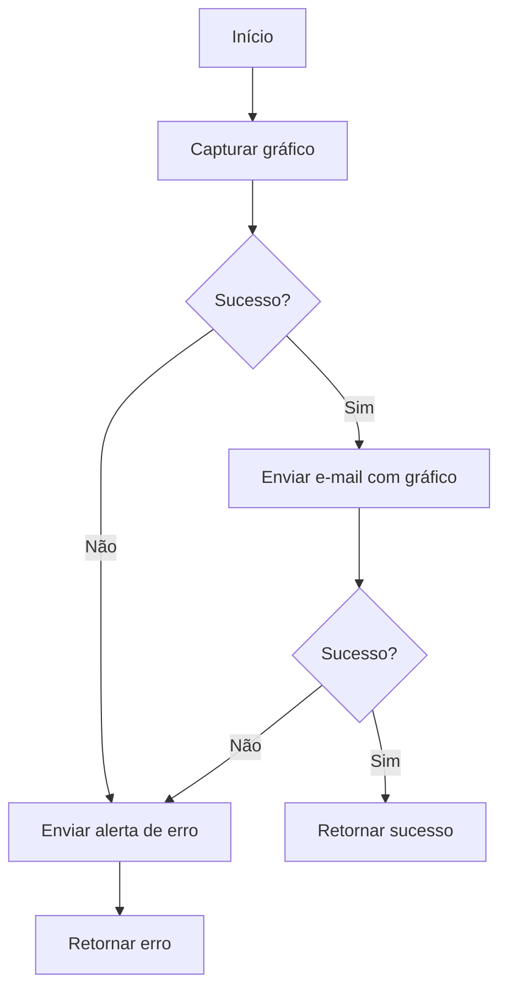

# Daily Restore Report Edge Function

## 📋 Visão Geral

Esta Edge Function do Supabase envia automaticamente um relatório diário por e-mail contendo um gráfico das operações de restauração de documentos. Em caso de falha durante o processo, um e-mail de alerta é enviado automaticamente para o administrador via SendGrid.

## ✨ Funcionalidades

- ✅ **Geração automática de gráfico**: Captura o gráfico do dashboard de restaurações
- ✅ **Envio por e-mail**: Envia o relatório como anexo via e-mail
- ✅ **Notificação de erro**: Alerta automático via SendGrid em caso de falha
- ✅ **Detalhes de erro**: Mensagens claras sobre o tipo de falha ocorrida
- ✅ **Logs estruturados**: Registra todas as operações para debug

## 🔧 Configuração

### Variáveis de Ambiente Necessárias

Configure estas variáveis no Supabase Dashboard → Project Settings → Edge Functions → Environment Variables:

```bash
# Supabase (obrigatórias)
SUPABASE_URL=https://seu-projeto.supabase.co
SUPABASE_SERVICE_ROLE_KEY=seu_service_role_key
SUPABASE_ANON_KEY=seu_anon_key

# SendGrid (obrigatório para alertas de erro)
SENDGRID_API_KEY=SG.seu_sendgrid_api_key

# Configuração de e-mail (opcionais)
ADMIN_EMAIL=admin@empresa.com        # E-mail do administrador (padrão: admin@empresa.com)
SITE_URL=https://seu-site.com        # URL do site (padrão: SUPABASE_URL)

# Configuração de SMTP para envio de relatórios (se usando send-chart-report)
EMAIL_HOST=smtp.gmail.com
EMAIL_PORT=587
EMAIL_USER=seu@email.com
EMAIL_PASS=sua_senha_de_aplicativo
EMAIL_FROM=noreply@nautilusone.com
EMAIL_TO=admin@empresa.com
```

### Deploy da Função

```bash
# Login no Supabase
supabase login

# Link com o projeto
supabase link --project-ref seu-project-ref

# Deploy da função
supabase functions deploy daily-restore-report

# Configurar secrets
supabase secrets set SENDGRID_API_KEY=SG.seu_api_key
supabase secrets set ADMIN_EMAIL=admin@empresa.com
```

## 📡 Endpoint

```
POST /functions/v1/daily-restore-report
```

Esta função é projetada para ser executada automaticamente via cron job ou pg_cron no Supabase.

## 🔄 Fluxo de Execução



## 📧 Notificações de Erro

### Tipos de Erro Detectados

1. **Falha ao capturar gráfico**
   - Subject: "❌ Falha no envio de relatório"
   - Detalhes: Status HTTP e mensagem de erro

2. **Falha no envio de e-mail**
   - Subject: "❌ Falha no envio de relatório"
   - Detalhes: Resposta da API de e-mail

3. **Erro crítico geral**
   - Subject: "❌ Erro crítico na função Edge"
   - Detalhes: Stack trace completo do erro

### Exemplo de E-mail de Alerta

```
De: alerts@nautilusone.com (Nautilus One)
Para: admin@empresa.com
Assunto: ❌ Erro crítico na função Edge

Erro ao gerar ou enviar gráfico:

Error: Erro ao capturar gráfico: 500 - Internal Server Error

Stack: Error: Erro ao capturar gráfico...
    at serve (file:///...)
```

## ⚙️ Agendamento Automático

### Usando pg_cron (Recomendado)

Execute no SQL Editor do Supabase:

```sql
-- Ativar extensão pg_cron
CREATE EXTENSION IF NOT EXISTS pg_cron;

-- Agendar execução diária às 8h (horário UTC)
SELECT cron.schedule(
  'daily-restore-report-job',
  '0 8 * * *',  -- Cron expression: todos os dias às 8h UTC
  $$
  SELECT
    net.http_post(
      url := 'https://seu-projeto.supabase.co/functions/v1/daily-restore-report',
      headers := jsonb_build_object(
        'Content-Type', 'application/json',
        'Authorization', 'Bearer ' || current_setting('app.settings.service_role_key')
      ),
      body := '{}'::jsonb
    ) AS request_id;
  $$
);

-- Verificar jobs agendados
SELECT * FROM cron.job;

-- Remover job (se necessário)
SELECT cron.unschedule('daily-restore-report-job');
```

### Usando Serviços Externos

Você também pode usar serviços como:

- **GitHub Actions**: Workflow com schedule
- **Vercel Cron**: Para projetos no Vercel
- **Zapier/Make**: Automação de processos
- **AWS EventBridge**: Para infraestrutura AWS

Exemplo com curl:

```bash
curl -X POST \
  https://seu-projeto.supabase.co/functions/v1/daily-restore-report \
  -H "Authorization: Bearer seu_anon_key" \
  -H "Content-Type: application/json"
```

## 🧪 Testes

### Teste Manual

```bash
# Via CLI do Supabase
supabase functions invoke daily-restore-report

# Via curl
curl -X POST \
  https://seu-projeto.supabase.co/functions/v1/daily-restore-report \
  -H "Authorization: Bearer seu_anon_key" \
  -H "Content-Type: application/json"
```

### Resposta de Sucesso

```json
{
  "success": true,
  "message": "✅ Envio automático de relatório realizado com sucesso",
  "timestamp": "2025-10-11T18:30:00.000Z"
}
```

### Resposta de Erro

```json
{
  "error": "Falha geral no processo de envio automático",
  "details": "Error: Erro ao capturar gráfico: 500 - Internal Server Error",
  "timestamp": "2025-10-11T18:30:00.000Z"
}
```

## 📊 Monitoramento

### Verificar Logs

```bash
# Via CLI
supabase functions logs daily-restore-report

# No Dashboard
Supabase Dashboard → Edge Functions → daily-restore-report → Logs
```

### Métricas Importantes

- **Taxa de sucesso**: Porcentagem de execuções bem-sucedidas
- **Tempo de execução**: Duração típica da função
- **Erros**: Tipos e frequência de erros
- **E-mails de alerta**: Quantidade de alertas enviados

## 🔒 Segurança

### Boas Práticas Implementadas

- ✅ **Service Role Key**: Usa chave de serviço para operações privilegiadas
- ✅ **Secrets Management**: Credenciais em variáveis de ambiente
- ✅ **Error Handling**: Tratamento robusto de erros
- ✅ **Logging**: Registros estruturados para auditoria
- ✅ **Alertas**: Notificação imediata de falhas

### Considerações de Segurança

- ⚠️ **Não exponha publicamente**: Esta função deve ser chamada apenas por sistemas confiáveis
- ⚠️ **Rate limiting**: Considere adicionar limitação de taxa
- ⚠️ **Validação de origem**: Valide a origem das requisições em produção

## 🔗 Dependências

Esta função depende de:

1. **send-chart-report**: Edge Function para envio de e-mails
2. **generate-chart-image**: API para geração de imagem do gráfico
3. **SendGrid**: Serviço de e-mail para alertas
4. **Restore Dashboard**: Dashboard de restaurações de documentos

## 🐛 Troubleshooting

### Erro: "SENDGRID_API_KEY is required"

**Solução**: Configure a chave da API do SendGrid

```bash
supabase secrets set SENDGRID_API_KEY=SG.sua_chave
```

### Erro: "Erro ao capturar gráfico: 404"

**Solução**: Verifique se a função `generate-chart-image` existe e está funcionando

```bash
# Verificar se a função existe
supabase functions list

# Testar a função
supabase functions invoke generate-chart-image
```

### Erro: "Erro ao enviar e-mail"

**Solução**: Verifique a configuração da função `send-chart-report`

```bash
# Verificar secrets
supabase secrets list

# Testar envio de e-mail
supabase functions invoke send-chart-report --data '{"imageBase64":"data:image/png;base64,test","toEmail":"test@example.com"}'
```

### Alerta de erro não recebido

**Solução**: Verifique a configuração do SendGrid

1. Confirme que `SENDGRID_API_KEY` está configurado
2. Verifique se o domínio `alerts@nautilusone.com` está verificado no SendGrid
3. Verifique se o e-mail não está na caixa de spam
4. Confira os logs do SendGrid

## 📝 Notas de Implementação

### Diferenças do Código Original

Este código foi adaptado do exemplo fornecido com as seguintes melhorias:

1. **Configurabilidade**: URLs e e-mails configuráveis via variáveis de ambiente
2. **Error Handling**: Tratamento mais robusto de erros
3. **Logging**: Logs mais detalhados para debug
4. **Estrutura JSON**: Respostas estruturadas em JSON
5. **Headers**: Headers apropriados nas requisições

### Recursos Adicionados

- ✅ **ADMIN_EMAIL configurável**: Não mais hardcoded
- ✅ **SITE_URL configurável**: Suporta diferentes ambientes
- ✅ **Logs estruturados**: Melhor rastreabilidade
- ✅ **Try-catch no sendErrorAlert**: Não falha se o alerta falhar
- ✅ **Timestamps nas respostas**: Rastreamento temporal

## 🚀 Próximos Passos

### Funcionalidades Futuras

- [ ] Suporte a múltiplos destinatários
- [ ] Configuração de horário via parâmetro
- [ ] Personalização do template de e-mail
- [ ] Métricas e estatísticas no e-mail
- [ ] Suporte a diferentes tipos de gráficos
- [ ] Integração com Slack/Teams para alertas
- [ ] Dashboard de monitoramento

### Melhorias Sugeridas

- [ ] Adicionar retry logic para falhas temporárias
- [ ] Implementar circuit breaker pattern
- [ ] Adicionar cache para gráficos
- [ ] Suporte a múltiplos idiomas nos alertas
- [ ] Webhook para notificações de status

## 📚 Documentação Relacionada

- [Supabase Edge Functions](https://supabase.com/docs/guides/functions)
- [SendGrid API](https://docs.sendgrid.com/api-reference/mail-send/mail-send)
- [pg_cron Documentation](https://github.com/citusdata/pg_cron)
- [Deno Documentation](https://deno.land/manual)

## 🆘 Suporte

Para problemas ou dúvidas:

1. Verifique os logs no Supabase Dashboard
2. Consulte esta documentação
3. Verifique as variáveis de ambiente
4. Teste as dependências individualmente

---

**Status**: ✅ Implementado e pronto para deploy  
**Versão**: 1.0.0  
**Data**: 2025-10-11  
**Autor**: Travel HR Buddy Team
